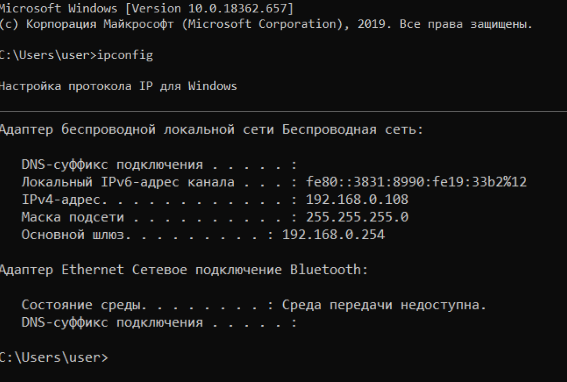

# Лабораторная работа № 2 «Изучение программных средств тестирования и определения параметров настройки в компьютерных сетях»

**Цель работы:** приобретение знаний и практических навыков в использовании программного обеспечения для настройки и тестирования компьютерной сети.

**Материалы, оборудование, программное обеспечение:** лаборатория, оснащенная персональными компьютерами, объединенными в локальную сеть с доступом в Интернет, утилиты сканирования беспроводных сетей.

**Критерии положительной оценки:** выполнение типовых заданий, оформление отчета по работе, ответы на вопросы для самопроверки.

## Планируемое время выполнения:

- Аудиторное время выполнения (под руководством преподавателя): 6 часов.
- Время самостоятельной подготовки: 2 часа.

## Теоретическое введение

Для тестирования параметров (маршрут и скорость передачи данных) соединения с глобальной сетью Интернет, а также проверки правильности сетевых настроек имеется большое количество программных средств. Например, в операционной системе MS Windows – это встроенные компьютерные программы – утилиты, которые позволяют оценить надежность соединения и ряд других важных параметров.

## Контрольные вопросы для самопроверки

# Контрольные вопросы (Лабораторная работа №2)

## 1. Какой формат имени сетевого ресурса может использоваться при обращении к нему?

При обращении к сетевым ресурсам в операционных системах семейства Windows используется формат **UNC (Universal Naming Convention)**. UNC-имя позволяет однозначно идентифицировать сетевой ресурс, такой как файловый сервер или принтер, в локальной сети .

**Структура UNC-имени:**
```
\\server\share\file_path
```

**Компоненты UNC-имени:**
- `server` — имя компьютера в сети, на котором размещен ресурс
- `share` — имя сетевой папки (общего ресурса), опубликованной на сервере
- `file_path` — опциональный путь к конкретному файлу или подпапке внутри общего ресурса

**Примеры использования:**
- `\\fileserver\documents` — доступ к общей папке "documents" на сервере "fileserver"
- `\\192.168.1.10\shared` — доступ к ресурсу по IP-адресу сервера
- `\\printer01\hp_laserjet` — доступ к сетевому принтеру

UNC-имена поддерживаются не только в Windows, но и в других операционных системах через технологии типа Samba .

---

## 2. Какой протокол необходим для работы с утилитой ping? Найти описание и характеристики протокола.

Утилита `ping` использует протокол **ICMP (Internet Control Message Protocol)**.

### Описание протокола ICMP

ICMP — это один из основных протоколов стека TCP/IP, работающий на сетевом уровне (уровень 3 модели OSI). Он предназначен для передачи диагностических сообщений и сообщений об ошибках при обмене данными в IP-сетях .

Протокол определён в документе **RFC 792** (сентябрь 1981 года) и является неотъемлемой частью IP-протокола. ICMP должен быть реализован на каждом IP-модуле .

### Характеристики протокола ICMP

| Характеристика | Описание |
|----------------|----------|
| **Номер протокола в IP-заголовке** | 1  |
| **Типы сообщений** | Echo Request (8), Echo Reply (0), Destination Unreachable (3), Time Exceeded (11) и другие  |
| **Надёжность** | ICMP является ненадёжным протоколом, не гарантирует доставку сообщений |
| **Инкапсуляция** | ICMP-сообщения инкапсулируются непосредственно в IP-дейтаграммы |
| **Основное назначение** | Передача диагностических сообщений и уведомлений об ошибках |
| **Известные утилиты** | ping (Echo Request/Reply), traceroute/tracert (Time Exceeded) |

### Принцип работы ping с использованием ICMP

Утилита `ping` работает следующим образом :
1. Отправляет ICMP-сообщение типа **Echo Request** (запрос эха) на целевой узел
2. Целевой узел при корректной работе отвечает ICMP-сообщением типа **Echo Reply** (эхо-ответ)
3. По времени между отправкой запроса и получением ответа вычисляется задержка (RTT)
4. Статистика позволяет оценить доступность узла и качество соединения

---

## 3. Зачем используется параметр all в утилите ipconfig?

Параметр `/all` в утилите `ipconfig` используется для отображения **полной конфигурации TCP/IP** для всех сетевых адаптеров компьютера .

### Сравнение `ipconfig` и `ipconfig /all`

| Команда | Отображаемая информация |
|---------|------------------------|
| `ipconfig` | Базовая информация: IPv4-адрес, маска подсети, основной шлюз |
| `ipconfig /all` | Расширенная информация (всё, что в базовой + дополнительные данные) |

### Дополнительная информация, выводимая с ключом `/all` :

- **Physical Address (MAC-адрес)** — аппаратный адрес сетевого адаптера
- **DHCP Enabled** — включен ли протокол динамической настройки узла
- **DHCP Server** — адрес DHCP-сервера
- **Lease Obtained / Lease Expires** — время получения и истечения аренды IP-адреса
- **DNS Servers** — адреса DNS-серверов
- **Description** — полное описание модели сетевого адаптера
- **Host Name** — имя компьютера в сети

### Практическое применение 

- **Диагностика сетевых проблем** — позволяет проверить, получил ли компьютер IP-адрес от DHCP-сервера
- **Поиск MAC-адреса** — необходим для настройки фильтрации в безопасности сети
- **Проверка DNS-настроек** — выявление некорректной конфигурации DNS-серверов
- **Анализ DHCP-аренды** — контроль времени обновления IP-адреса

---

## 4. Каким образом утилиты ping и tracert осуществляют прослеживание маршрутов пакетов к заданному узлу?

Утилиты `ping` и `tracert` используют разные механизмы для работы с маршрутами.

### Принцип работы `tracert` (трассировка маршрута)

`tracert` использует поле **TTL (Time to Live)** в IP-заголовке и ICMP-сообщения об ошибках .

**Алгоритм работы tracert:**

| Шаг | Действие |
|-----|----------|
| 1 | Отправляется пакет с TTL = 1 |
| 2 | Первый маршрутизатор уменьшает TTL до 0 и отбрасывает пакет |
| 3 | Маршрутизатор возвращает ICMP-сообщение "Time Exceeded" (TTL expired) |
| 4 | Отправляется пакет с TTL = 2 |
| 5 | Процесс повторяется, TTL увеличивается на 1 на каждом шаге |
| 6 | Когда пакет достигает целевого узла, возвращается "Port Unreachable" |
| 7 | Трассировка завершена — получен полный список маршрутизаторов |

```
Схема работы:
[Компьютер] → TTL=1 → [Router 1] → TTL=0 → возврат Time Exceeded
[Компьютер] → TTL=2 → [Router 1] → [Router 2] → TTL=0 → возврат Time Exceeded
[Компьютер] → TTL=3 → [Router 1] → [Router 2] → [Целевой узел] → возврат Port Unreachable
```

### Принцип работы `ping` для определения маршрута

Стандартная утилита `ping` **не предназначена** для трассировки маршрута. Она:
- Проверяет только **доступность** конечного узла
- Показывает **общее время** прохождения пакета туда и обратно (RTT)
- Не отображает промежуточные узлы

**Расширенная возможность ping** (ключ `-r`):
- Позволяет записать маршрут в поле "Record Route" IP-заголовка
- Ограничен максимальным количеством записываемых узлов (обычно до 9)

### Сравнительная таблица

| Характеристика | `ping` | `tracert` |
|----------------|--------|-----------|
| Основное назначение | Проверка доступности узла | Определение пути к узлу |
| Показывает промежуточные узлы | Нет (только с -r) | Да |
| Используемый механизм | Echo Request / Echo Reply | TTL + Time Exceeded |
| Информация о задержках | Общая RTT | Задержка на каждом hop |

---

## 5. Можно ли утилитой tracert задать максимальное число ретрансляций?

**Да, можно.** Утилита `tracert` позволяет задать максимальное количество ретрансляций (hop'ов) с помощью параметра `/h` .

### Синтаксис команды

```cmd
tracert /h <maximumhops> <целевой_узел>
```

### Параметры

| Параметр | Описание |
|----------|----------|
| `/h <maximumhops>` | Задаёт максимальное количество прыжков (hop'ов) для поиска целевого узла |
| Значение по умолчанию | 30 hop'ов  |

### Пример использования

```cmd
tracert /h 15 yandex.ru
```

Данная команда выполнит трассировку до узла `yandex.ru`, но не будет продолжать поиск после 15-го прыжка, даже если целевой узел не достигнут.

### Другие полезные параметры tracert 

| Параметр | Описание |
|----------|----------|
| `/d` | Отключает разрешение IP-адресов в имена (ускоряет трассировку) |
| `/w <timeout>` | Задаёт таймаут ожидания ответа в миллисекундах |
| `/4` | Принудительно использует IPv4 |
| `/6` | Принудительно использует IPv6 |

---

## 6. Что такое localhost?

**Localhost** — это стандартное сетевое имя (hostname), которое ссылается на **текущий локальный компьютер**, с которого осуществляется обращение .

### Основные характеристики localhost

| Характеристика | Описание |
|----------------|----------|
| **IPv4-адрес** | 127.0.0.1  |
| **IPv6-адрес** | ::1  |
| **Диапазон IPv4** | 127.0.0.0/8 (более 16 миллионов адресов зарезервировано для loopback)  |
| **Способ резолвинга** | Файл `hosts` (стандартная запись: `127.0.0.1 localhost`) |

### Что такое loopback-интерфейс?

Loopback (петлевой интерфейс) — это виртуальный сетевой интерфейс, который:
- Не требует физического сетевого оборудования
- Направляет отправленные пакеты обратно на тот же компьютер
- Позволяет тестировать сетевое ПО без реального подключения к сети

### Практическое применение

**1. Тестирование стека TCP/IP**
```cmd
ping 127.0.0.1
```
Если эта команда выполняется успешно, значит стек протоколов TCP/IP на компьютере работает корректно .

**2. Локальная разработка и тестирование**
- Веб-разработчики запускают локальный сервер по адресу `http://localhost`
- Позволяет тестировать сайты и приложения без публикации в интернете
- Доступно только с текущего компьютера

**3. Запуск сетевых сервисов без физической сети**
- Базы данных, серверы приложений, прокси-серверы могут работать через loopback
- Обеспечивает изоляцию от внешней сети

### Запись в файле hosts

```
127.0.0.1    localhost
::1          localhost
```

Эти строки обеспечивают разрешение имени `localhost` в соответствующие IP-адреса .


## Задания к лабораторной работе

Студент получает типовые задания на выполнение работы.

1. Ознакомиться с функциональными возможностями программного обеспечения для администрирования и тестирования компьютерной сети.
2. Выполнить рассмотрение сетевых утилит.
3. Полученные результаты занести в отчет по лабораторной работе.

### Задание 1

Определить IP-адрес локального (своего) компьютера, подключенного к сети.

Для определения IP-адреса своего компьютера в операционной системе MS Windows необходимо воспользоваться утилитой IPCONFIG. Для запуска данной программы необходимо выполнить команду `ipconfig` в режиме командной строки. При выполнении данной команды на экране монитора компьютера будет выведена основная конфигурация TCP/IP для всех сетевых адаптеров (см. рис. 2.1).

.

*[Рис. 2.1. Настройки протокола IP для операционной системы Windows]*

Для получения более полной информации выполните команду `ipconfig /all`.

### Задание 2

Определить имя узла компьютера в локальной сети.

Для определения имени узла компьютера в локальной сети необходимо использовать утилиту HOSTNAME. После выполнения команды `hostname` в режиме командной строки на экран монитора выводится информация об имени узла компьютера в локальной сети (см. рис. 2.2.).

.

*[Рис. 2.2. Имя узла компьютера в локальной сети]*

### Задание 3

Определить скорость передачи информации в компьютерной сети и наличие связи с узлом.

Проверить наличие пути до заданного узла и определить временные характеристики этого пути можно, используя утилиту PING, которая тестирует сетевое соединение путем посылки ICMP-пакетов типа «запрос эха», на которые получатель отвечает ICMP-пакетом типа «эхо-ответ». Утилите PING достаточно указать IP-адрес или DNS-имя, однако имеется ряд ключей, позволяющих более тонко управлять ее работой (перечень выводится на экран без указания в утилите IP-адреса или DNS-имени). Утилита PING выводит результат каждого запроса/ответа на отдельной строке, а перед завершением работы выдает статистику: минимальное, максимальное и среднее время передачи пакета, количество и долю потерянных пакетов. Фактически PING является основной утилитой при тестировании сетевых соединений.

При использовании утилиты PING совместно с ключом `-t` можно для тестирования скорости передачи информации отправлять в сеть неограниченное число пакетов. Например, при выполнении в командной строке команды `ping –t ip_address` (ключ –t отделяется пробелом от команды ping, ip_address – IP-адрес (или DNS-имя) компьютера, который используется для тестирования связи), будет происходить постоянная отправка пакетов и можно обнаружить ситуацию, при которой появляется или пропадает связь.

Если ответ не пришел в течение определенного времени, то считается, что между двумя устройствами отсутствует линия связи. Если в командной строке ввести команду `ping 127.0.0.1` (127.0.0.1 — IP-адрес специального сетевого интерфейса в сетевом протоколе TCP/IP и обозначает, то же самое сетевое устройство (компьютер), с которого осуществляется отправка сетевого пакета или установление соединения). Использование адреса 127.0.0.1 позволяет устанавливать соединение и передавать информацию для программ-серверов, работающим на том же компьютере, что и программа-клиент, независимо от конфигурации аппаратных сетевых средств компьютера.

Это дает возможность протестировать корректность работы самой утилиты (см. рис. 2.3).

.

*[Рис. 2.3. Тест на корректность работы утилиты]*

Для проверки наличия связи с узлом KLGTU.RU введем команду `ping klgtu.ru` (см. рис. 2.4).

.

*[Рис. 2.4. Тест проверки связи с узлом KLGTU.RU]*

.

*[Рис. 2.5. Тест проверки связи с узлом YANDEX.RU]*

.

*[Рис. 2.6. Тест проверки связи с узлом MICROSOFT.COM]*

### Задание 4

Определить маршрут пакетов до заданного узла и получить временные характеристики для каждого промежуточного маршрутизатора на этом пути.

Выявлять последовательность маршрутизаторов, через которые проходит IP-пакет на пути к пункту своего назначения и время задержки на каждом из них позволяет утилита TRACERT. Для выполнения утилиты необходимо указать IP-адрес или DNS-имя конечного узла. Более тонко управлять ее работой позволяют ключи (перечень выводится на экран без указания в утилите IP-адреса или DNS-имени). Утилита, как и ранее описанная PING, отправляет серию пакетов ICMP с разными значениями TTL (Time to live). В вычислительной технике и компьютерных сетях — предельный период времени или число итераций, или переходов, за который набор данных (пакет) может существовать до своего исчезновения.

Для каждого пакета на экране отображается величина интервала времени между отправкой пакета и получением ответа. Символ «*» означает, что ответ на данный пакет не был получен. Если узел не отвечает, то при превышении интервала ожидания ответа выдается сообщение «Превышен интервал ожидания для запроса». Интервал ожидания ответа может быть изменен с помощью ключа `–w` команды TRACERT. Для трассировки маршрута до узла KLGTU.RU выполним команду `tracert klgtu.ru` (см. рис. 2.7).

.

*[Рис. 2.7. Трассировка маршрута до узла KLGTU.RU]*

.

*[Рис. 2.8. Трассировка маршрута до узла YANDEX.RU]*

### Задание 5

Определить соответствие локального IP-адреса, физическому (аппаратному) адресу в локальной сети.

Возможность просматривать и изменять ARP-таблицу, в которой хранятся пары «MAC-адрес - IP-адрес» для тех узлов, с которыми в недавнем происходил обмен данными, дает утилита ARP. Эта таблица формируется автоматически при работе сетевого узла, но администратор сети может вносить в нее записи вручную.

Узел, собирающийся отправить сообщение другому узлу, должен предварительно узнать MAC адрес получателя сообщения. Для решения данной задачи узел применяет технологию ARP, отправляя запрос узлам своей локальной сети. Данный ARP запрос содержит IP адрес получателя. Из всех узлов, получивших данный запрос, отвечает лишь тот, у кого соответствующий IP адрес. В своем ответе (ARP отклике) этот узел сообщает свой MAC адрес. И лишь после этого первый узел сможет отправить ему свое сообщение. Компьютеры чаще всего отправляют свои сообщения маршрутизатору и, следовательно, в своих ARP запросах они указывают адрес основного шлюза. Для уменьшения ARP трафика компьютеры хранят в своей памяти таблицу с IP и MAC адресами тех устройств, с которыми они в последнее время обменивались сообщениями. Управление работой утилиты возможно с помощью ключей (перечень выводится на экран командой `arp`). Утилита ARP с ключом `-a` позволяет вывести на экран всю ARP-таблицу. Выполним команду `arp -a` (см. рис. 2.9).

.

*[Рис. 2.9. ARP-таблица соответствия адресов]*

В данном случае мы видим, что у основного шлюза (192.168.0.254) MAC адрес равен 90-f6-52-7f-3c-cc.

### Задание 6

Wireless Network Watcher - бесплатная утилита, которая сканирует беспроводные сети и отображает список всех подключенных в данный момент компьютеров и устройств. Для каждого обнаруженного устройства отображается такая информация, как IP- и MAC-адрес, название компании производителя и имя компьютера или устройства. Скопируем утилиту на свой компьютер (прилагается к методическим указаниям) и выполним команду WNetWatcher.exe (см. рис. 2.10). Дополнительная информация (в столбцах, которые не показаны на рисунке) содержит сведения о времени и числе обнаружений устройства в сети, его активности в настоящий момент времени. Используя ранее изученную сетевую утилиту PING определить скорость передачи информации в компьютерной сети и наличие связи с подключенными устройствами (узлами) беспроводной сети (см. рис. 2.11).

.

*[Рис. 2.10. Результат сканирования беспроводной сети]*

.

*[Рис. 2.11. Тест проверки связи с узлом беспроводной сети]*

### Задание 7

WifiInfoView - небольшая бесплатная утилита, которая сканирует ближайшие беспроводные сети, и отображает массу полезной информации, как например имя сети (SSID), MAC-адрес, тип PHY (802.11 g/n), мощность и качество сигнала, используемая частота, номер канала, максимальная скорость, модель маршрутизатора, наличие или отсутствие пароля и многое другое. В нижней панели главного окна WifiInfoView отображается полученная информация, которая представлена в шестнадцатеричном формате. Также присутствует возможность группировать обнаруженные беспроводные сети по номеру канала, модели маршрутизатора, типу PHY или максимальной скорости. Скопируем утилиту на свой компьютер (прилагается к методическим указаниям) и выполним команду WifiInfoView.exe (см. рис. 2.12). Дополнительная информация отображается в столбцах, которые не показаны на рисунке.

.

*[Рис. 2.12. WifiInfoView]*

### Задание 8

.
2ip.ru — это многофункциональный интернет-сервис, предлагающий посетителям огромный набор самых разнообразных инструментов для проверки и диагностики любых параметров подключения к сети Интернет, в том числе и для диагностики компьютерной сети (рис. 2.13). Основная специализация портала — определение IP-адреса, однако со временем здесь появились десятки полезных инструментов, недоступных больше нигде.

.

*[Рис. 2.13. Информация с сайта 2ip.ru]*

В меню «Тесты», которых в настоящий момент 32 шт., можно увидеть их список с коротким описанием. Все они могут пригодиться обычному пользователю и касаются, в основном, характеристик соединения его компьютера или мобильного гаджета с ресурсами Интернет.

В меню «Сервисы» предоставляются инструменты, которые пригодятся непосредственно при разработке веб-сайтов и построении стратегии их продвижения.

При изучении интернет-сервисов сайта 2ip.ru предлагается получить сведения о своем компьютере и информацию о сайте (выбирается самостоятельно).

## Требования к отчету и защите

В отчете указываются название, цель работы. Описание выполненных лабораторных заданий с результатами в виде скриншотов и выводами по каждому заданию.

На защите проверяются приобретенные знания теоретического и практического материала по ответам на контрольные вопросы для самопроверки.
