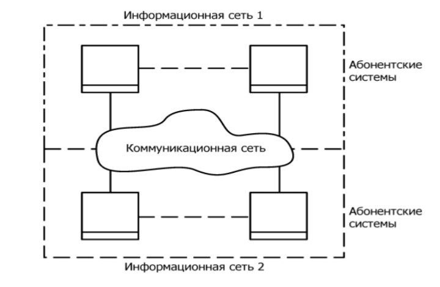
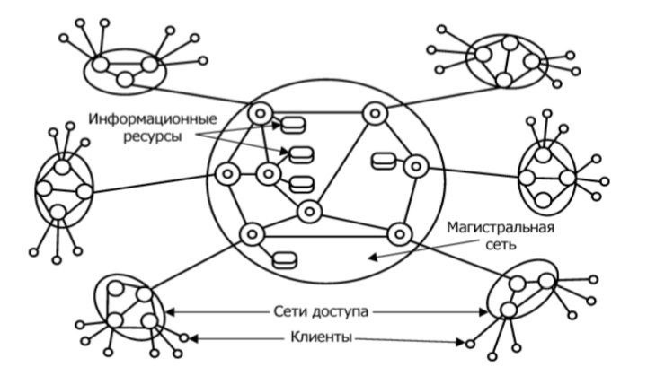
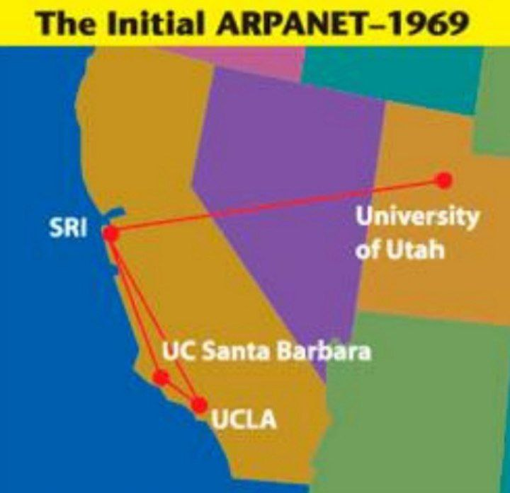
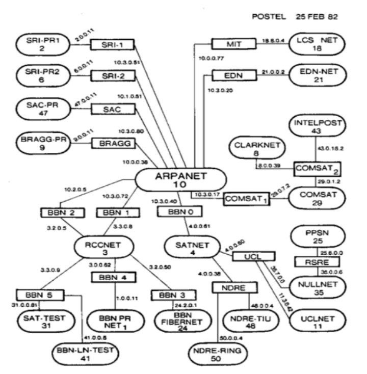
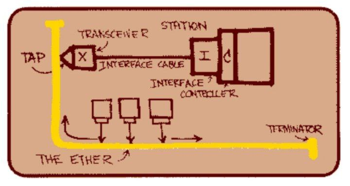

# КОМП. СЕТЬ 0_0
### Навигация:
- [Лекция № 1. Введение]( #лекция--1-введение"ичо")
- [Лекция № 2. Сетевые модели и протоколы](#лекция--2-Сетевые-модели-и-протоколы)
- [ГЛАВА 13 Адресация в стеке протоколов TCP/IP](#ГЛАВ-13-Адресация-в-стеке-протоколов-TCP/IP)
- [ГЛАВА 14 Протокол межсетевого взаимодействия IP](#ГЛАВА-14-Протокол-межсетевого-взаимодействия-IP)
- [Лабораторная работа №1](./LAB/1.md)
- [Лабораторная работа №2](./LAB/2.md)
- [Лабораторная работа №3](./LAB/3.md)
- [НЕТ](/. "ичо")

    -----------
    -----------
    -----------
    -----------
    -----------

## Лекция № 1. Введение

### Основные понятия дисциплины

```Сеть (Network)``` – взаимодействующая совокупность ```объектов
(узлов, nodes)```.

```Компьютерная сеть``` или сеть передачи данных (Computer Network) –
это совокупность связанных между собой компьютеров, телекоммуникационного оборудования и программного обеспечения, обеспечивающая информационный обмен между компьютерами в сети.

```Узел``` компьютерной сети – хост или конечная система.
Конечные системы соединяются между собой при помощи линий
связи и коммутаторов пакетов.

```Пакеты ```– отдельные порции информации, передаваемые по сети.

#### Состав компьютерной сети:

* Компьютеры, соответствующие назначению компьютерной сети;
* Коммуникационное оборудование;
* Сетевые операционные системы (NOS – Network Operation
System);
* Сетевые приложения.

```Телекоммуникации``` – (греч. tele – вдаль, далеко и лат. communicatio –
общение) – это передача и прием любой информации (звука, изображения,
данных, текста) на расстояние по различным электромагнитным системам.

```Телекоммуникационная сеть``` – это система технических средств, посредством которой осуществляются телекоммуникации.
Телекоммуникационную сеть условно принято разделять на коммуникационную сеть и информационную сеть (см. рис. 1.1).

```Коммуникационная сеть``` – предназначена для передачи данных.
```Информационная сеть``` – предназначена для обработки, хранения и
передачи данных и создается подключением к коммуникационной сети абонентских систем.

*Рисунок 1.1 – Структура телекоммуникационной сети*

.

#### К телекоммуникационным сетям относятся:

* Компьютерные сети (передача данных);
* Телефонные сети (передача голосовой информации);
* Радиосети (передача голосовой информации – широковещательные услуги);
* Телеграфные сети (передача текстовых сообщений);
* Телевизионные сети и т.д.

#### Телекоммуникационные сети

*Рисунок 1.2 – Состав телекоммуникационной сети*

.

#### Состав телекоммуникационных сетей (см. рис. 1.2):

* сети доступа (access network);
* магистральная сеть или магистраль (core network или
backbone);
* информационные центры или центры управления сервисами
(data centers или service control point).

```Сеть доступа``` – нижний уровень ТС, к которому подключаются «конечные узлы» – оборудование пользователей.
Магистральная сеть – объединяет СД и выполняет транзит трафика
по высокоскоростным каналам.

```Информационные центры ```– собственные информационные ресурсы
сети на основе которых выполняется обслуживание пользователей.

#### Классификации сетей:

* По территориальному признаку
* По масштабу производственного объединения
* По технологии передачи
* По принципу организации обмена данными между абонентами
* По типу среды передачи данных
* По принципу организации иерархии компьютеров и т.д.
Классификация сетей по территориальному признаку:
* Локальные сети (ЛС, LAN – Local Area Network);
7
* Глобальные сети (ГС, WAN – Wide Area Network);
* Региональные (городские) сети (MAN, Metropolitan Area
Network).

```Локальная сеть``` – сеть ЭВМ, включающая в себя узлы, расположенные в пределах одного помещения, здания или небольшой территории, позволяющая обмениваться данными и совместно использовать различные
устройства.

##### Примеры:

 компьютерная сеть в отдельной лаборатории университета,
локальная сеть главного корпуса университета, а также сеть, расположенная
в главном корпусе университета и корпусе худграфа.


```Глобальные сети ```– сети, объединяющие территориально рассредоточенные компьютеры, возможно находящиеся в различных городах и странах.


##### Примеры:

 глобальная сеть Интернет, сеть Fido и др.

```Региональные (городские) сети``` – сети, предназначенные для обслуживания территории района, крупного города или региона.


##### Пример:

 городские сети определенного провайдера интернет-услуг,
например, МТС.

#### Классификация по масштабу производственного подразделения:

* Сети отделов (рабочих групп);
* Сети кампусов (от англ campus – университет, территория
университета) а также домовые сети, объединяющие несколько домов;
* Корпоративные сети (сети масштаба предприятия – enterprise
wide networks).

#### Классификация по технологии передачи данных:

Вещание (или один – ко многим) использует broadcast или, по-другому, основана на разделяемых каналах передачи данных (shared channel);

```Соединение точка``` – точка (point-to-point) – передача данных ведется
между двумя абонентами.

#### Классификация по принципу организации обмена данными между абонентами:

##### Сети на основе коммутации:

* Каналов;
* Пакетов;
* Сообщений (промежуточный вариант).

```Коммутация``` – технология выбора направления и организации передачи данных в сетях, имеющих несколько альтернативных маршрутов, по
которым может производиться обмен информацией между двумя узлами.

При этом передаваемые по сети информационные потоки называются
сетевым трафиком (от англ. traffic – движение).

#### Классификация по типу среды передачи данных:

* Проводные (wired) (коаксиальный кабель, витая пара, оптоволоконные линии);
* Беспроводные (wireless) (радиочастоты, инфракрасный диапазон).
Классификация по принципу организации иерархии компьютеров:
* Одноранговые (Peer-to-Peer Network);
* Клиент-серверные (с выделенным сервером, Dedicated Server
Network).
* Глобальные сети (ГС, WAN – Wide Area Network);
* Региональные (городские) сети (MAN, Metropolitan Area
Network).

```Локальная сеть``` – сеть ЭВМ, включающая в себя узлы, расположенные в пределах одного помещения, здания или небольшой территории, позволяющая обмениваться данными и совместно использовать различные
устройства.

##### Примеры:
 компьютерная сеть в отдельной лаборатории университета,
локальная сеть главного корпуса университета, а также сеть, расположенная
в главном корпусе университета и корпусе худграфа.

```Глобальные сети``` – сети, объединяющие территориально рассредоточенные компьютеры, возможно находящиеся в различных городах и странах.
Примеры: глобальная сеть Интернет, сеть Fido и др.

```Региональные (городские) сети ```– сети, предназначенные для обслуживания территории района, крупного города или региона.
Пример: городские сети определенного провайдера интернет-услуг,
например, МТС.

##### Классификация по масштабу производственного подразделения:
* Сети отделов (рабочих групп);
* Сети кампусов (от англ campus – университет, территория
университета) а также домовые сети, объединяющие не-
сколько домов;
* Корпоративные сети (сети масштаба предприятия – enterprise
wide networks).

##### Классификация по технологии передачи данных:

Вещание (или один – ко многим) использует broadcast или, по-дру-
гому, основана на разделяемых каналах передачи данных (shared channel);
Соединение точка – точка (point-to-point) – передача данных ведется
между двумя абонентами.

##### Классификация по принципу организации обмена данными между абонентами:

##### Сети на основе коммутации:

* Каналов;
* Пакетов;
* Сообщений (промежуточный вариант).

```Коммутация``` – технология выбора направления и организации передачи данных в сетях, имеющих несколько альтернативных маршрутов, по
которым может производиться обмен информацией между двумя узлами.
При этом передаваемые по сети информационные потоки называются
сетевым трафиком (от англ. traffic – движение).

##### Классификация по типу среды передачи данных

* Проводные (wired) (коаксиальный кабель, витая пара, оптоволо-
конные линии);
* Беспроводные (wireless) (радиочастоты, инфракрасный диапа-
зон).

Классификация по принципу организации иерархии компьютеров:

* Одноранговые (Peer-to-Peer Network);
* Клиент-серверные (с выделенным сервером, Dedicated Server
Network).

```Сервер (от англ. server – служащий, служитель)``` – компьютер или про-
грамма, предоставляющая услуги другим компьютерам или программам,
обычно называемым клиентами.

```Клиент``` – это компьютер или программа, запрашивающая некоторые
услуги.

```Распределенная программа``` – это программа, состоящая из нескольких взаимодействующих частей, причем каждая часть может выполняться
и, как правило, выполняется на отдельном компьютере.

##### Основное назначение компьютерных сетей

* Обеспечение доступа к разделяемым ресурсам;
* Межперсональная коммуникация.

```Разделяемый (сетевой) ресурс (network share)``` – это устройство или
информация, к которой возможен удалённый доступ с другого компьютера
(обычно в ЛС или интранет), как к локальному ресурсу.

##### Услуги доступа к ресурсам:

* Удаленный доступ (Remote Login);
* Передача файлов (File Transfer);
* Удаленный вызов процедур (RPC – Remote procedure call);
* Совместное использование устройств.

##### Услуги межперсональной коммуникации:

* Электронная почта (e-mail) 1:1
* Списки рассылки (news group) 1:n
* Телеконференции n:n
* Системы электронных бюллетеней (BBS – Bulletin Board
System)
* Видеоконференции и т.д.

#### История сетей
60-е – DARPA ведет проект по объединению двух удаленных мейнфрей-
мов, первые глобальные связи компьютеров, эксперименты с пакетными се-
тями, начало передачи голоса по телефонным сетям в цифровой форме.

1969 год – ARPA (Advanced Research Project Agency) мин.обороны
США инициировала работы по объединению в единую сеть суперкомпью-
теров оборонных и научно-исследовательских центров – сеть ARPANET
(см. рис. 1.3–1.4)

*Рисунок 1.3 – Начало развития ARPANET*



*Рисунок 1.4 – Сеть ARPANETв 1982 году*




Начало 70-х – появление первых нестандартных локальных сетей.

1971 г. – инженер BBN Рей Томлинсон написал первую программу
для работы с электронной почтой.

1973 г. – Роберт Меткалф (Xerox) предложил идею и название сетевой
технологии – Ethernet (см. рис. 1.5).

1974 год – Винтон Серф и Роберт Кан разработали протокол управле-
ния передачей TCP.

1978/79 – разработка эталонной модели OSI

*Рисунок 1.5 – Один из набросков сети Ethernet Роберта Меткалфа*



Начало 1980-х – создание стека протоколов TCP/IP, рассчитанного на
независимость компьютера и сети. Развертывание его на всех узлах
ARPANET-сетей и создание сети Интернет в современном виде.

2 ноября 1988 года – червь Морриса (т.н. великий червь) поразил около 6000 узлов ARPANET и практически вывел из строя сеть. Как один из результатов была организована CERT (computer emergency response team).

Середина 80-х – разработка стандартных технологии локальных сетей
(1980 – Ethernet, 1985 – Token Ring, 1985 – FDDI).

Конец 1980-х – начало 1990-х – замена ARPANET на NSFNet – сеть
национального научного фонда NSF (National Science Foundation).

1991–1992 год – изобретение в CERN Тимом Бернерс-Ли с коллегами
технологии World Wide Web.

1994 – создание протокола PPP

1995 – замена сети NFSNet более современной коммерческой опорной
сетью и появление поставщиков услуг Интернета (ISP, Internet Service Providers). Переход к современному статусу сети Интернет

## Лекция № 2. Сетевые модели и протоколы

Протокол и стек протоколов (см. рис. 2.1)


Коммуникационный протокол – формализованный набор правил
взаимодействия узлов сети;

Стек протоколов – иерархически организованный набор протоколов,
достаточный для взаимодействия узлов в сети.

```Эталонная модель OSI``` (Open System Interconnection)
Разработана в начале 80-х ISO как международный стандарт архитектуры компьютерной сети.

Определяет уровни взаимодействия в сетях с коммутацией пакетов,
стандартные названия уровней и функции, которые должен выполнять каждый уровень.

##### Уровни OSI (см. рис. 2.2)

1. Прикладной     <==== Верхний 
2. Представления данных
3. Сеансовый
4. Транспортный
5. Сетевой
6. Канальный
7. Физический     <==== Нижний


Рисунок 2.2 – Модель OSI

```Физический уровень (physical layer)```

Функция: передача потока битов по физическим каналам связи
(например, витая пара).

Реализуется на всех устройствах, подключенных к сети.
Пример протокола: спецификация 100Base-T4 стандарта Ethernet

```Канальный уровень (data link layer)```

Первый из уровней, который работает в режиме коммутации пакетов.

PDU (Protocol Data Unit) носит название кадр (frame).

Функции:

для LAN: обеспечить доставку кадра между любыми узлами сети;

для WAN: обеспечить доставку кадра между двумя соседними узлами,
соединенными индивидуальной линией связи. (PPP, HDLC).

Поддержание интерфейсов с физическим и сетевым уровнями.

Задачи:

* Обнаружение и коррекция ошибок;
* Проверка доступности среды передачи данных (иногда выделяют в отдельный подуровень – управления доступом к среде
(Media Access Control, MAC)

Реализуется компьютерами (адаптер+драйвер), мостами, коммутаторами и маршрутизаторами.

Сетевой уровень (network layer)

Служит для образования составной сети или межсетевого взаимодействия (internetworking)

Реализуется группой протоколов и маршрутизаторами.

Функции:

* Физическое объединение сетей;
* PDU сетевого уровня – пакет
* 
Задачи:

* Связь между транспортным и канальным уровнями;
* определение маршрута;
  
Пример протоколов: IP, IPX, RIP, BGP

Транспортный уровень (transport layer)

Обеспечивает верхним уровням стека передачу данных с нужной степенью надежности.

OSI определяет 5 классов транспортного сервиса: от 0 (низший) до 4
(высший).

Все протоколы с транспортного уровня и выше реализуются ПО сете-
вых узлов.

PDU (Protocol Data Unit, единица данных протокола) – сегмент или
дейтаграмма (датаграмма).

Задачи:

* Реализация транспортного соединения;
* Мультиплексирование/демультиплексирование нескольких
транспортных соединений в одном сетевом;
* Управление потоком.
  
Пример: TCP, UDP

Сеансовый уровень (session layer)

Обеспечивает управление взаимодействием сторон и предоставляет
средства синхронизации сеанса

Пример: SSH

Уровень представления данных (presentation layer)

Обеспечивает представление передаваемой информации не меняя ее
содержания.

Задачи:

* Отображение данных (из локальной формы в сетевую);
* Шифрование/дешифрование данных (пример – SSL – Secure
Socket Layer);
* Сжатие данных.
  
Прикладной уровень (application layer)

Набор протоколов, с помощью которых пользователи сети получают
доступ к разделяемым ресурсам, а также организуют совместную работу.

PDU – сообщение (message).

Примеры: FTP, SMB, NCP.

Модель DoD (или модель межсетевых связей)

Четырехуровневая модель сетевого взаимодействия, разработанная
Министерством обороны США (Department of Defense).

Практической реализацией этой модели является стек протоколов
TCP/IP, поэтому она также называется моделью TCP/IP.

Уровни модели:

1. Уровень приложений (объединяет функциональность прикладного
уровня, уровня представления данных и сеансового из модели OSI);

3. Транспортный уровень (примерно соответствует транспортному
уровню модели OSI).

4. Межсетевой (Internet) (соответствует сетевому уровню OSI).

5. Уровень доступа к сети (объединяет функциональность канального
и физического уровней OSI).

#### Стандартные стеки коммуникационных протоколов:
* OSI
* TCP/IP
* IPX/SPX
* NetBIOS/SMB
* DECnet
* SNA

# ГЛАВА 13 Адресация в стеке протоколов TCP/IP

Одним из достоинств технологии TCP/IP является гибкость и масштабируемость системы адресации, что позволяет ей достаточно просто включать в составную сеть сети разных технологий и разного масштаба. Основными задачами адресации являются следующие:

*   Согласованное использование адресов различного типа. Эта задача включает отображение адресов разных типов друг на друга, например сетевого IP-адреса на локальный, доменного имени — на IP-адрес.
*   Обеспечение уникальности адресов. В зависимости от типа адреса требуется обеспечивать однозначность адресации в пределах компьютера, подсети, корпоративной сети или Интернета.
*   Конфигурирование сетевых интерфейсов и сетевых приложений.

Каждая из перечисленных задач имеет достаточно простое решение для сети, число узлов которой не превосходит нескольких десятков. Например, для отображения символьного доменного имени на IP-адрес достаточно поддерживать на каждом хосте таблицу всех символьных имен, используемых в сети, и соответствующих им IP-адресов. Столь же просто «вручную» присвоить всем интерфейсам в небольшой сети уникальные адреса. Однако в крупных сетях эти же задачи усложняются настолько, что требуют принципиально иных решений.

Ключевым словом, которое характеризует принятый в TCP/IP подход к решению этих проблем, является **масштабируемость**. Процедуры, предлагаемые TCP/IP для назначения, отображения и конфигурирования адресов, одинаково хорошо работают в сетях разного масштаба. В этой главе, наряду с собственно схемой образования IP-адресов, мы познакомимся с наиболее популярными масштабируемыми средствами поддержки адресации в сетях TCP/IP: технологией бесклассовой междоменной маршрутизации, системой доменных имен, протоколом динамического конфигурирования хостов.

> **ПРИМЕЧАНИЕ**
> В этой главе речь идет о системе адресации, используемой в четвертой версии протокола IPv4, которая существенно отличается от системы адресации в версии IPv6. Особенности IPv6 рассматриваются в главе 17.

### Структура стека протоколов TCP/IP

Сегодня стек TCP/IP широко используется как в глобальных, так и в локальных сетях. Стек имеет иерархическую, четырехуровневую структуру (рис. 13.1).

**Прикладной уровень** стека TCP/IP соответствует трем верхним уровням модели OSI: прикладному, представления и сеансовому. Он объединяет сервисы, предоставляемые стеком TCP/IP пользовательским приложениям. К ним относятся протокол передачи файлов (File Transfer Protocol, FTP), протокол эмуляции терминала telnet, простой протокол передачи почты (Simple Mail Transfer Protocol, SMTP), протокол передачи гипертекста (Hypertext Transfer Protocol, HTTP) и многие другие. Протоколы прикладного уровня развертываются на хостах¹.

> ¹ В Интернете (а значит, и в стеке протоколов TCP/IP) конечный узел традиционно называют хостом, а маршрутизатор — шлюзом. Далее мы будем использовать пары терминов «конечный узел» — «хост» и «маршрутизатор» — «шлюз» как синонимы, чтобы отдать дань уважения традиционной терминологии Интернета и в то же время не отказываться от современных терминов.

**Транспортный уровень** стека TCP/IP может предоставлять вышележащему уровню два типа сервиса:

*   гарантированную доставку обеспечивает протокол управления передачей (Transmission Control Protocol, TCP);
*   доставку по возможности, или с максимальными усилиями, обеспечивает протокол пользовательских дейтаграмм (User Datagram Protocol, UDP).

Чтобы обеспечить надежную доставку данных, протокол TCP предусматривает установление логического соединения. Это позволяет нумеровать пакеты, подтверждать их прием квитанциями, организовывать в случае потери повторные передачи, распознавать и уничтожать дубликаты, доставлять прикладному уровню пакеты в том порядке, в котором они были отправлены. Благодаря этому протоколу объекты на хосте-отправителе и хосте-получателе могут поддерживать обмен данными в дуплексном режиме. TCP дает возможность без ошибок доставить сформированный на одном из компьютеров поток байтов на любой другой компьютер, входящий в составную сеть.

Второй протокол этого уровня, UDP, является простейшим дейтаграммным протоколом, используемым, если задача надежного обмена данными либо вообще не ставится, либо решается средствами более высокого уровня — прикладным уровнем или пользовательскими приложениями.

В функции протоколов TCP и UDP входит также исполнение роли связующего звена между прилегающими к транспортному уровню прикладным и сетевым уровнями. От прикладного протокола транспортный уровень принимает задание на передачу данных с тем или иным качеством прикладному уровню-получателю. Нижележащий сетевой уровень протоколы TCP и UDP рассматривают как своего рода инструмент, пусть и не очень надежный, но способный перемещать пакет в свободном и рискованном путешествии по составной сети. Программные модули, реализующие протоколы TCP и UDP, подобно модулям протоколов прикладного уровня, устанавливаются на хостах.

**Сетевой уровень**, называемый также уровнем Интернета, является стержнем всей архитектуры TCP/IP. Протоколы сетевого уровня поддерживают интерфейс с вышележащим транспортным уровнем, получая от него запросы на передачу данных по составной сети, а также с нижележащим уровнем сетевых интерфейсов, о функциях которого мы расскажем далее.

Основным протоколом сетевого уровня является межсетевой протокол (Internet Protocol, IP). В его задачу входит продвижение пакета между сетями — от одного маршрутизатора к другому до тех пор, пока пакет не попадет в сеть назначения. В отличие от протоколов прикладного и транспортного уровней, протокол IP развертывается не только на хостах, но и на всех маршрутизаторах. Протокол IP — это дейтаграммный протокол, работающий без установления соединений по принципу доставки с максимальными усилиями. Такой тип сетевого сервиса называют также «ненадежным».

К сетевому уровню TCP/IP часто относят протоколы, выполняющие вспомогательные функции по отношению к IP. Это прежде всего протоколы маршрутизации RIP и OSPF, предназначенные для изучения топологии сети, определения маршрутов и составления таблиц маршрутизации, на основании которых протокол IP перемещает пакеты в нужном направлении. По этой же причине к сетевому уровню могут быть отнесены протокол межсетевых управляющих сообщений (Internet Control Message Protocol, ICMP), предназначенный для передачи маршрутизатором источнику сведений об ошибках, возникших при передаче пакета, и некоторые другие протоколы.

> Идеологическим отличием архитектуры стека TCP/IP от многоуровневой архитектуры других стеков является интерпретация функций самого нижнего уровня — уровня сетевых интерфейсов.

Напомним, нижние уровни модели OSI (канальный и физический) реализуют разнообразный набор функций: доступ к среде передачи, формирование кадров, согласование величин электрических сигналов, кодирование, синхронизация, усиление. Конкретные реализации этих функций составляют суть протоколов физического и канального уровней, таких, например, как Ethernet и PPP. У нижнего уровня стека TCP/IP задача существенно проще — он отвечает только за организацию взаимодействия с подсетями нижележащих технологий, входящими в составную сеть.

> Любая коммуникационная среда, которая позволяет двум или более IP-узлам непосредственно взаимодействовать друг с другом без промежуточных маршрутизаторов, рассматривается протоколом IP как одна линия связи (Link), как если бы эти узлы были связаны отрезком кабеля. В простейшем случае такая коммуникационная среда может действительно представлять собой отдельную физическую линию связи с работающим на ней протоколом канального уровня, например Ethernet или PPP. Более сложным случаем является локальная сеть, построенная на коммутаторах. Но поскольку она также является доменом широковещания, то для протокола IP эта коммутируемая среда неотличима от физической линии связи.

Подчеркнем, что если локальная сеть разбита на виртуальные локальные сети VLAN для протокола IP, то она представляет собой уже несколько линий связи, по числу VLAN, так как широковещание ограничивается пределами отдельной VLAN. В том случае, когда коммуникационная среда, работающая под IP, не поддерживает широковещание, она рассматривается не как одна линия связи, а как набор отдельных линий связи, например, MPLS является такой средой и отдельные логические каналы MPLS рассматриваются протоколом IP как отдельные связи¹. Задачу организации интерфейса между технологией TCP/IP и любой другой технологией промежуточной сети упрощенно можно свести к двум задачам:

*   упаковка (инкапсуляция) IP-пакета в единицу передаваемых данных промежуточной сети;
*   преобразование сетевых IP-адресов в адреса технологии данной промежуточной сети.

> ¹ Об использовании термина Link на физическом уровне см. главу 6.

Такой гибкий подход упрощает решение проблемы расширения набора поддерживаемых технологий. При появлении новой популярной технологии она быстро включается в стек TCP/IP путем разработки соответствующего стандарта, определяющего метод инкапсуляции IP-пакетов в ее кадры (например, спецификация RFC 1577, определяющая работу протокола IP через сети ATM, появилась в 1994 году, вскоре после принятия основных стандартов ATM). Так как для каждой вновь появляющейся технологии разрабатываются собственные интерфейсные средства, функции этого уровня нельзя определить раз и навсегда, и именно поэтому нижний уровень стека TCP/IP не регламентируется.

Каждый коммуникационный протокол оперирует некоторой единицей передаваемых данных. Названия этих единиц иногда закрепляются стандартом, а чаще просто определяются традицией. В стеке TCP/IP за многие годы его существования образовалась устоявшаяся терминология в этой области (рис. 13.2).

Потоком данных, информационным потоком или просто потоком называют данные, поступающие от приложений на вход протоколов транспортного уровня — TCP и UDP. Протокол TCP «нарезает» из потока данных сегменты. Единицу данных протокола UDP часто называют дейтаграммой. Дейтаграмма — это общее название для единиц данных, которыми оперируют протоколы без установления соединений. К таким протоколам относится и протокол IP, поэтому его единицу данных иногда тоже называют дейтаграммой, хотя чаще используется другой термин — пакет.

В стеке TCP/IP единицы данных любых технологий, в которые упаковываются IP-пакеты для последующей передачи через сети составной сети, принято называть кадрами или фреймами. При этом не имеет значения, какое название используется для этой единицы данных в технологии составляющей сети. Для TCP/IP фреймом является и кадр Ethernet, и ячейка ATM, и пакет X.25 в тех случаях, когда они выступают в качестве контейнера, в котором IP-пакет переносится через составную сеть.

### Типы адресов стека TCP/IP

Для идентификации сетевых интерфейсов используются три типа адресов:

*   локальные (аппаратные) адреса;
*   сетевые адреса (IP-адреса);
*   символьные (доменные) имена.

В разных сетевых технологиях в общем случае используются собственные системы адресации, предназначенные исключительно для обеспечения связи собственных узлов. Но как только некоторая сеть объединяется с другими сетями в составную, функциональность этих адресов расширяется, они становятся необходимым элементом вышележащей объединяющей технологии — в данном случае технологии TCP/IP. Роль, которую играют эти адреса в TCP/IP, не зависит от того, какая именно технология применяется в подсети, поэтому они имеют общее название — локальные (аппаратные) адреса. Например, если в составную сеть включена подсеть Ethernet, то локальными адресами сетевых интерфейсов этой сети для технологии TCP/IP будут соответственно MAC-адреса, а если подсеть ATM — то номера виртуальных каналов.

> **ПРИМЕЧАНИЕ**
> Слово «локальный» в контексте TCP/IP означает «действующий не во всей составной сети, а лишь в пределах подсети». Именно в таком смысле понимаются здесь термины: «локальная технология» (технология, на основе которой построена подсеть), «локальный адрес» (адрес, применяемый некоторой локальной технологией для адресации узлов в пределах подсети). Напомним, что в качестве подсети («локальной сети») может выступать и LAN, и WAN. Следовательно, говоря о подсети, мы задействуем слово «локальная» не как характеристику технологии, лежащей в основе этой подсети, а как указание на роль, которую играет эта подсеть в архитектуре составной сети. Сложности могут возникнуть и при интерпретации определения «аппаратный». В данном случае термин «аппаратный» подчеркивает концептуальное представление разработчиков стека TCP/IP о подсети как о некотором вспомогательном аппаратном средстве, единственной функцией которого является перемещение IP-пакета через подсеть до ближайшего шлюза.

Чтобы технология TCP/IP могла решать свою задачу объединения сетей, ей необходима собственная глобальная система адресации, позволяющая универсальным и однозначным способом идентифицировать любой интерфейс составной сети. Очевидным решением является нумерация всех подсетей составной сети, а затем нумерация сетевых интерфейсов в пределах каждой из этих подсетей. Пара, состоящая из номера сети и номера узла¹, отвечает поставленным условиям и может служить в качестве сетевого адреса, или IP-адреса. Сетевой адрес представляет собой набор чисел, например 192.45.66.17.

> ¹ Напомним, для сокращения часто говорят «узел», а не «сетевой интерфейс узла».

Числовое представление сетевого адреса достаточно эффективно для программных и аппаратных средств. Однако пользователи обычно предпочитают работать с более удобными символьными именами компьютеров. Именно с символьными именами вы имеете дело, когда задаете веб-браузеру адрес доступа к тому или иному сайту Интернета. Символьные имена в пределах составной сети строятся по иерархическому признаку. Примером доменного имени может служить имя base2.sales.zil.ru. Символьные имена называют также доменными именами или DNS-именами.

> Между локальным адресом, доменным именем и IP-адресом, относящимся к одному и тому же сетевому интерфейсу, нет функциональной зависимости, поэтому единственный путь получить отображение адреса одного типа в адрес другого типа — это построить таблицу соответствия.

В общем случае сетевой интерфейс может иметь несколько локальных адресов, сетевых адресов, доменных имен.

### Формат IP-адреса

В заголовке IP-пакета предусмотрены поля для хранения IP-адреса отправителя и IP-адреса получателя. Каждое из этих полей имеет фиксированную длину 4 байта (32 бита). Как уже было сказано, IP-адрес состоит из двух логических частей — номера сети и номера узла в сети. Наиболее распространенная форма представления IP-адреса — запись в виде четырех чисел, представляющих значения каждого байта в десятичной форме и разделенных точками, например:

`128.10.2.30`

Этот же адрес может быть представлен в двоичном формате:

`10000000 00001010 00000010 00011110`

В шестнадцатеричном формате тот же адрес имеет следующий вид:

`80.0А.02.1D`

Запись адреса не предусматривает специального разграничительного знака между номером сети и номером узла. Вместе с тем при передаче пакета по сети часто возникает необходимость разделить адрес на эти две части. Например, маршрутизация, как правило, осуществляется на основании номера сети, поэтому каждый маршрутизатор, получая пакет, должен прочитать из соответствующего поля заголовка адрес назначения и выделить из него номер сети. Каким образом маршрутизаторы определяют, какая часть из 32 бит, отведенных под IP-адрес, относится к номеру сети, а какая — к номеру узла?

Можно предложить несколько вариантов решения этой проблемы.

Простейший из них состоит в использовании фиксированной границы. При этом все 32-битное поле адреса заранее делится на две части не обязательно равной, но фиксированной длины, в одной из которых всегда будет размещаться номер сети, в другой — номер узла. Решение очень простое, но хорошее ли? Поскольку поле, которое отводится для хранения номера узла, имеет фиксированную длину, все сети будут иметь одинаковое максимальное число узлов. Если, например, под номер сети отвести один первый байт, то все адресное пространство распадется на сравнительно небольшое (2⁸) число сетей огромного размера (2²⁴ узлов). Если границу передвинуть дальше вправо, то сетей станет больше, но все равно все они будут одинакового размера. Очевидно, что такой жесткий подход не позволяет дифференцированно удовлетворять потребности отдельных предприятий и организаций. Именно поэтому он не нашел применения, хотя и использовался на начальном этапе существования технологии TCP/IP.

Второй подход (RFC 950, RFC 1518) основан на применении маски, которая позволяет максимально гибко устанавливать границу между номером сети и номером узла. При таком подходе адресное пространство можно использовать для создания множества сетей разного размера.

> Маска — это число, применяемое в паре с IP-адресом, причем двоичная запись маски содержит непрерывную последовательность единиц в тех разрядах, которые должны в IP-адресе интерпретироваться как номер сети. Граница между последовательностями единиц и нулей в маске соответствует границе между номером сети и номером узла в IP-адресе.

Например, если маска, связываемая с некоторым IP-адресом, имеет вид `11111111111100000000000000000000`, то номеру сети соответствуют 10 старших разрядов в двоичном представлении данного IP-адреса. И наконец, способ (RFC 791), основанный на классах адресов, представляет собой компромисс по отношению к двум предыдущим: размеры сетей хотя и не могут быть произвольными, как при использовании масок, но и не должны быть одинаковыми, как при установлении фиксированных границ. Вводится пять классов адресов: A, B, C, D, E. Три из них — A, B и C — предназначены для адресации сетей, а два — D и E — имеют специальное назначение. Для каждого класса сетевых адресов определено собственное положение границы между номером сети и номером узла.

#### Классы IP-адресов

Признаками, на основании которых IP-адрес относят к тому или иному классу, являются значения нескольких первых битов адреса (рис. 13.3).

В табл. 13.1 приведены диапазоны адресов и максимальное число сетей и узлов, соответствующих каждому классу.

**Таблица 13.1. Классы IР-адресов**

| Класс | Первые биты | Наименьший номер сети | Наибольший номер сети | Максимальное число узлов в сети |
| :--- | :--- | :--- | :--- | :--- |
| A | 0 | 1.0.0.0 (0 — не используется) | 126.0.0.0 (127 — зарезервирован) | 2²⁴, поле 3 байта |
| B | 10 | 128.0.0.0 | 191.255.0.0 | 2¹⁶, поле 2 байта |
| C | 110 | 192.0.0.0 | 223.255.255.0 | 2⁸, поле 1 байт |
| D | 1110 | 224.0.0.0 | 239.255.255.255 | Групповые адреса |
| E | 11110 | 240.0.0.0 | 247.255.255.255 | Зарезервировано |

Исходя из приведенной структуры адресов и информации из таблицы можно сделать несколько очевидных выводов. Сетей класса А сравнительно немного, зато количество узлов в них очень большое и может достигать 2²⁴, что равно 16 777 216 узлов. Сетей класса В больше, чем сетей класса А, но их размеры меньше, а максимальное количество узлов в сетях класса В составляет 2¹⁶ (65 536). Сетей класса С больше всего, но они характеризуются самым маленьким максимально возможным количеством узлов, всего 2⁸ (256).

Адреса классов A, B и C используются для идентификации отдельных сетевых интерфейсов, то есть являются индивидуальными адресами (unicast address). Групповые адреса (multicast address), принадлежащие классу D, не делятся на номер сети и номер узла и обрабатываются маршрутизатором особым образом. Один групповой адрес идентифицирует группу сетевых интерфейсов, в общем случае принадлежащих разным сетям. Адрес класса D начинается с последовательности 1110, а в младших адресах содержит номер (идентификатор) группы.

Основное назначение групповых адресов — распространение информации по схеме «один-ко-многим». Интерфейс, входящий в группу, получает наряду с обычным индивидуальным IP-адресом также групповой адрес. Групповые адреса предназначены для экономичного распространения в Интернете или большой корпоративной сети аудио- или видеопрограмм, адресованных сразу большой аудитории слушателей или зрителей. Если групповой адрес помещен в поле адреса назначения IP-пакета, то данный пакет должен быть доставлен сразу нескольким узлам, которые образуют группу с номером, указанным в поле адреса. Один и тот же узел может входить в несколько групп, узел может в любое время присоединиться либо выйти из группы. Члены группы могут распределяться по различным сетям, находящимся друг от друга на произвольно большом расстоянии.

Номера групп могут быть временными, назначаемыми только на время некоторого события (конференции), или постоянными (well known), централизованно закрепленными за типичными группами устройств. Например, адреса 224.0.0.1 и 224.0.0.2 приписаны всем хостам и маршрутизаторам локальной сети соответственно. Так, если хост посылает пакет с адресом назначения 224.0.0.1, то он должен быть доставлен всем хостам в его локальной сети¹.

> ¹ О групповых адресах читайте также в разделе «Типы адресов IPv6» главы 17 и в разделе « Групповое вещание» главы 16.

Если же адрес начинается с последовательности 11110, то это значит, что данный адрес относится к классу Е. Адреса этого класса зарезервированы для будущих применений.

Чтобы получить из IP-адреса номер сети и номер узла, требуется не только разделить адрес на две соответствующие части, но и дополнить каждую из них нулями до полных четырех байтов. Возьмем, например, адрес класса В 129.64.134.5. Первые два байта идентифицируют сеть, а последующие два — узел. Таким образом, номером сети является адрес 129.64.0.0, а номером узла — адрес 0.0.134.5.

#### Особые IP-адреса

В TCP/IP существуют ограничения при назначении IP-адресов, а именно: номера сетей и номера узлов не могут состоять из одних двоичных нулей или единиц. Отсюда следует, что максимальное количество узлов, приведенное в табл. 13.1 для сетей каждого класса, должно быть уменьшено на 2. Например, в адресах класса С под номер узла отводится 8 бит, которые позволяют задать 256 номеров: от 0 до 255. Однако в действительности максимальное число узлов в сети класса С не может превышать 254, так как адреса 0 и 255 запрещены для адресации сетевых интерфейсов. Из этих же соображений следует, что конечный узел не может иметь адрес типа 98.255.255.255, поскольку номер узла в этом адресе класса А состоит из одних двоичных единиц.

Введя эти ограничения, разработчики технологии TCP/IP получили возможность расширить функциональность системы адресации следующим образом:

*   Если IР-адрес состоит только из двоичных нулей, то он называется неопределенным адресом и обозначает адрес того узла, который сгенерировал этот пакет. Адрес такого вида в особых случаях помещается в заголовок IP-пакета, в поле адреса отправителя.
*   Если в поле номера сети стоят только нули, то по умолчанию считается, что узел назначения принадлежит той же самой сети, что и узел, который отправил пакет. Такой адрес также может быть использован только в качестве адреса отправителя.
*   Если все двоичные разряды IP-адреса равны 1, то пакет с таким адресом назначения должен рассылаться всем узлам, находящимся в той же сети, что и источник этого пакета. Такой адрес называется ограниченным широковещательным (limited broadcast). Ограниченность в данном случае означает, что пакет не выйдет за границы данной подсети ни при каких условиях.
*   Если в поле адреса назначения в разрядах, соответствующих номеру узла, стоят только единицы, то пакет, имеющий такой адрес, рассылается всем узлам сети, номер которой указан в адресе назначения. Например, пакет с адресом 192.190.21.255 будет направлен всем узлам сети 192.190.21.0. Такой тип адреса называется широковещательным (broadcast).

> **ВНИМАНИЕ**
> В протоколе IP нет понятия «широковещание» в том смысле, в котором оно используется в протоколах канального уровня локальных сетей, когда данные должны быть доставлены абсолютно всем узлам сети. Как ограниченный, так и обычный варианты широковещательной рассылки имеют пределы распространения в составной сети: они ограничены либо сетью, которой принадлежит источник пакета, либо сетью, номер которой указан в адресе назначения. Поэтому деление сети с помощью маршрутизаторов на части локализует широковещательный шторм пределами одной из подсетей просто потому, что нет способа адресовать пакет одновременно всем узлам всех сетей составной сети.

Особый смысл имеет IP-адрес, первый октет которого равен 127. Этот адрес является внутренним адресом стека протоколов компьютера (или маршрутизатора). Он используется для тестирования программ, а также для организации работы клиентской и серверной частей приложения, установленных на одном компьютере. Обе программные части данного приложения спроектированы в расчете на то, что они будут обмениваться сообщениями по сети. Но какой же IP-адрес они должны использовать для этого? Адрес сетевого интерфейса компьютера, на котором они установлены? Но это приводит к избыточным передачам пакетов в сеть. Экономичным решением является применение внутреннего адреса 127.0.0.0. В IP-сети запрещается присваивать сетевым интерфейсам IP-адреса, начинающиеся со значения 127. Когда программа посылает данные по IP-адресу 127.х.х.х, то данные не передаются в сеть, а возвращаются модулям верхнего уровня этого же компьютера как только что принятые. Маршрут перемещения данных образует «петлю», поэтому этот адрес называется адресом обратной петли (loopback).

#### Использование масок при IP-адресации

Снабжая каждый IP-адрес маской, можно отказаться от понятий классов адресов и сделать систему адресации более гибкой.

Пусть, например, для IP-адреса `129.64.134.5` (`0000001.01000000.10000110.00000101`) указана маска `255.255.128.0` (`11111111.11111111.10000000.00000000`).

Если игнорировать маску и интерпретировать адрес 129.64.134.5 на основе классов, то номером сети является 129.64.0.0, а номером узла — 0.0.134.5 (поскольку адрес относится к классу В). Если же использовать маску, то 17 последовательных двоичных единиц в маске 255.255.128.0, «наложенные» на IP-адрес 129.64.134.5, делят его на две части:

*   номер сети: 10000001.01000000.1;
*   номер узла: 0000110.00000101.

В десятичной форме записи номера сети и узла, дополненные нулями до 32 бит, выглядят соответственно как 129.64.128.0 и 0.0.6.5.

Наложение маски можно интерпретировать как выполнение операции логического умножения, называемой также операцией И (AND). Так, в данном примере номер сети является результатом операции

`0000001.01000000.10000110.00000101 AND 11111111.11111111.10000000.00000000`.

Помимо десятичной и двоичной формы представления маски используются и другие форматы. Например, удобно записывать маску в шестнадцатеричном коде: `FF.FF.00.00` — маска для адресов класса В. Еще чаще встречается запись с префиксом `185.23.44.206/26` — данная запись говорит о том, что маска для этого адреса содержит 26 единиц. В табл. 13.2 приведены маски для стандартных классов сетей, записанные в разных форматах.

**Таблица 13.2. Маски для стандартных классов сетей**

| Класс адресов | Десятичная форма | Двоичная форма | Шестнадцатеричная форма | Префикс |
| :--- | :--- | :--- | :--- | :--- |
| A | 255.0.0.0 | 11111111. 00000000. 00000000. 00000000 | FF.00.00.00 | /8 |
| B | 255.255.0.0 | 11111111. 11111111. 00000000. 00000000 | FF.FF.00.00 | /16 |
| C | 255.255.255.0 | 11111111. 11111111. 11111111. 00000000 | FF.FF.FF.00 | /24 |

### Порядок назначения IP-адресов

По определению схема IP-адресации должна обеспечивать уникальность нумерации сетей, а также уникальность нумерации узлов в пределах каждой из сетей. Следовательно, процедуры назначения номеров как сетям, так и узлам сетей должны быть централизованными. Рекомендуемый порядок назначения IP-адресов дается в спецификации RFC 2050.

#### Централизованное распределение адресов

Когда дело касается сети, являющейся частью Интернета, уникальность нумерации может быть обеспечена только усилиями специально созданных для этого центральных органов. Такие централизованно распределяемые адреса называются глобальными/публичными адресами.

В небольшой же автономной IP-сети условие уникальности номеров сетей и узлов может быть обеспечено «вручную» сетевым администратором. В этом случае в распоряжении администратора имеется все адресное пространство, ограниченное лишь разрядностью IP-адресов, так как совпадение IP-адресов в не связанных между собой сетях не вызовет никаких отрицательных последствий. Администратор может выбирать адреса произвольным образом, соблюдая лишь синтаксические правила и учитывая ограничения на особые адреса.

Но при таком подходе исключена возможность в будущем подсоединить данную сеть к Интернету. Действительно, произвольно выбранные адреса данной сети могут совпасть с централизованно назначенными адресами других сетей, подключенных к Интернету. Чтобы избежать коллизий, связанных с такого рода совпадениями, в стандартах Интернета определено несколько диапазонов так называемых частных адресов, рекомендуемых для автономного использования:

*   в классе А — сеть 10.0.0.0;
*   в классе В — диапазон из 16 номеров сетей (172.16.0.0–172.31.0.0);
*   в классе С — диапазон из 255 сетей (192.168.0.0–192.168.255.0).

Эти адреса, исключенные из множества централизованно распределяемых, составляют огромное адресное пространство, достаточное для нумерации узлов автономных сетей практически любых размеров. Заметим также, что частные адреса, как и при произвольном выборе адресов, в разных автономных сетях могут совпадать. В то же время с помощью специальных технологий можно избежать коллизий при подключении автономных сетей к Интернету.

> В больших сетях, подобных Интернету, уникальность сетевых адресов гарантируется централизованной иерархически организованной системой их распределения. Номер сети может быть назначен только по рекомендации специального подразделения Интернета. Главным органом регистрации глобальных адресов в Интернете с 1998 года является неправительственная некоммерческая организация ICANN (Internet Corporation for Assigned Names and Numbers).

Эта организация координирует работу региональных отделов, деятельность которых охватывает большие географические площади: ARIN — Америка, RIPE (Европа), APNIC (Азия и Тихоокеанский регион). Региональные отделы выделяют блоки адресов сетей крупным поставщикам услуг, а те, в свою очередь, распределяют их между своими клиентами, среди которых могут быть и более мелкие поставщики.

Проблемой централизованного распределения адресов является их дефицит. Уже сравнительно давно очень трудно получить адрес класса В и невозможно — адрес класса А. Надо отметить, что дефицит обусловлен не только ростом количества узлов и сетей, но и тем, что имеющееся адресное пространство используется нерационально.

Для смягчения проблемы дефицита адресов разработчики стека TCP/IP предлагают разные подходы. Принципиальным решением является переход на новую версию протокола IP — протокол IPv6, в котором проблемы дефицита адресов не существует. Но и текущая версия протокола IP (IPv4) поддерживает технологии, направленные на более экономное расходование IP-адресов, такие, например, как NAT и CIDR.

Суть технологии трансляции сетевых адресов NAT (см. главу 28) состоит в следующем. Пусть предприятие получило от поставщика услуг небольшое число дефицитных публичных IP-адресов, которых явно недостаточно для нумерации всех узлов сети. В таком случае администраторы сети могут использовать для адресации практически неисчерпаемый пул частных адресов. Чтобы исключить коллизии, на маршрутизаторе, связывающем сеть предприятия с внешней сетью, устанавливается программное обеспечение, динамически отображающее (транслирующее) частные адреса на набор имеющихся в наличии публичных адресов, присвоенных внешнему интерфейсу маршрутизатора предприятия.

#### Технология бесклассовой маршрутизации CIDR

Технология бесклассовой междоменной маршрутизации (Classless Inter-Domain Routing, CIDR) основана¹ на использовании масок для более гибкого распределения адресов и более эффективной маршрутизации. Она допускает произвольное разделение IP-адреса на поля для нумерации сети и узлов. При такой системе адресации клиенту может быть выдан пул адресов, более точно соответствующий его запросу, чем это происходит при адресации, основанной на классах адресов.

> ¹ Технология CIDR описана в документах RFC 1517 — RFC 1520.

Например, если клиенту A (рис. 13.4) требуется всего 13 адресов, то вместо выделения ему сети стандартного класса С (класса с наименьшим числом узлов — 256) ему может быть назначен пул адресов `193.20.30.0/28`. Эта запись интерпретируется следующим образом: «сеть, не принадлежащая ни к какому стандартному классу, номер которой содержится в 28 старших двоичных разрядах IP-адреса 193.20.30.0, имеющая 4-битовое поле для нумерации 16 узлов». Все это вполне удовлетворяет требованиям клиента A. Очевидно, что такой вариант намного более экономичен, чем раздача сетей стандартных классов «целиком».

Определение пула адресов в виде пары IP-адрес/маска возможно только при выполнении нескольких условий. Прежде всего адресное пространство, из которого организация, распределяющая адреса, «нарезает» адресные пулы для заказчиков, должно быть непрерывным. При таком условии все адреса имеют общий префикс — одинаковую последовательность цифр в старших разрядах адреса.

Пусть, например, как показано на рис. 13.4, провайдер располагает адресами в диапазоне 193.20.0.0–193.23.255.255 или в двоичной записи:
`1100 0001.0001 0100.0000 0000.0000 0000–1100 0001.0001 0111.1111 1111.1111 1111`.

Здесь префикс провайдера имеет длину 14 разрядов — `1100 0001.0001 01`, что можно записать в виде `193.20.0.0/14`. Префикс обычно интерпретируется как номер подсети.

Назначение адресов в виде IP-адрес/маска корректно лишь в случае, если поле для адресации узлов, полученное применением маски к IP-адресу, содержит только нули. Например, определение пула адресов в виде 193.20.0.0/12 ошибочно, так как в поле номера сети (в 20 младших битах) содержится не нулевое значение 0100.0000 0000.0000 0000. В то же время префикс может оканчиваться нулями, например, определение пула 193.20.0.0/25, в котором префикс имеет значение `1100 0001.0001 0100.0000 0000.0`, вполне корректно.

Итак, для обобщенного представления пула адресов в виде IP-адрес/n справедливы следующие утверждения:

*   значением префикса (номера сети) являются n старших двоичных разрядов IP-адреса;
*   поле для адресации узлов состоит из (32 – n) младших двоичных разрядов IP-адреса;
*   первый по порядку номер узла должен состоять только из нулей;
*   количество адресов в пуле равно 2⁽³²⁻ⁿ⁾.

Благодаря CIDR провайдер получает возможность «нарезать» блоки из выделенного ему адресного пространства в соответствии с действительными требованиями каждого клиента (в главе 14 мы обсудим, как технология CIDR помогает не только экономно расходовать адреса, но и эффективнее осуществлять маршрутизацию).

### Отображение IP-адресов на локальные адреса

Одной из главных задач, ставившихся при создании протокола IP, являлось обеспечение совместной согласованной работы сети, состоящей из подсетей, в общем случае использующих разные сетевые технологии. При перемещении IP-пакета по составной сети взаимодействие технологии TCP/IP с локальными технологиями подсетей происходит многократно. На каждом маршрутизаторе протокол IP определяет, какому следующему маршрутизатору в этой сети надо направить пакет. В результате решения этой задачи протоколу IP становится известен IP-адрес интерфейса следующего маршрутизатора (или конечного узла, если эта сеть является сетью назначения). Чтобы локальная технология сети смогла доставить пакет следующему маршрутизатору, необходимо:

*   упаковать пакет в кадр соответствующего для данной сети формата (например, Ethernet);
*   снабдить данный кадр локальным адресом следующего маршрутизатора.

Решением этих задач занимается уровень сетевых интерфейсов стека TCP/IP.

Итак, никакой функциональной зависимости между локальным адресом и его IP-адресом не существует, следовательно, единственный способ установления соответствия — ведение таблиц. В результате конфигурирования сети каждый интерфейс «знает» свои IP-адрес и локальный адрес, что можно рассматривать как таблицу, состоящую из одной строки. Проблема состоит в том, как организовать обмен имеющейся информацией между узлами сети.

#### Протокол ARP

Для определения локального адреса по IP-адресу используется протокол разрешения адресов (Address Resolution Protocol, ARP). ARP реализуется различным образом в зависимости от того, работает ли он в локальной сети (Ethernet, Wi-Fi) с возможностью широковещания или же в глобальной сети (MPLS, ATM), которые, как правило, не поддерживают широковещательный доступ.

Рассмотрим работу протокола ARP в локальных сетях с широковещанием.

На рис. 13.5 показан фрагмент IP-сети, включающий две сети — Ethernet1 (из трех конечных узлов — А, В и С) и Ethernet2 (из двух конечных узлов — D и E). Сети подключены соответственно к интерфейсам 1 и 2 маршрутизатора. Каждый сетевой интерфейс имеет IP-адрес и MAC-адрес. Пусть в какой-то момент IP-модуль узла С направляет пакет узлу D. Протокол IP узла С определил IP-адрес интерфейса следующего маршрутизатора — это IP1. Теперь, прежде чем упаковать пакет в кадр Ethernet и направить его маршрутизатору, необходимо определить соответствующий MAC-адрес. Для решения этой задачи протокол IP обращается к протоколу ARP.

Протокол ARP поддерживает на каждом интерфейсе сетевого адаптера или маршрутизатора отдельную ARP-таблицу, в которой в ходе функционирования сети накапливается информация о соответствии между IP-адресами и MAC-адресами других интерфейсов данной сети. Первоначально, при включении компьютера или маршрутизатора в сеть, все его ARP-таблицы пусты.

**1.** На первом шаге происходит передача от протокола IP протоколу ARP примерно такого сообщения: «Какой MAC-адрес имеет интерфейс с адресом IP1?»

**2.** Работа протокола ARP начинается с просмотра собственной ARP-таблицы. Предположим, что среди содержащихся в ней записей отсутствует запрашиваемый IP-адрес.

**3.** В этом случае протокол ARP формирует ARP-запрос, вкладывает его в кадр протокола Ethernet и широковещательно рассылает. Заметим, что зона распространения ARP-запроса ограничивается сетью Ethernet1, так как на пути широковещательных кадров барьером стоит маршрутизатор.

**4.** Все интерфейсы сети Ethernet1 получают ARP-запрос и направляют его «своему» протоколу ARP. ARP сравнивает указанный в запросе адрес IP1 с IP-адресом собственного интерфейса.

**5.** Протокол ARP, который констатировал совпадение (в данном случае это ARP интерфейса 1 маршрутизатора), формирует ARP-ответ, в котором маршрутизатор указывает локальный адрес MAC1, соответствующий адресу IP1 своего интерфейса, и отправляет его запрашивающему узлу (в данном примере узлу С).

На рис. 13.6 показан кадр Ethernet с вложенным в него ARP-сообщением. ARP-запросы и ARP-ответы имеют один и тот же формат. В табл. 13.3 в качестве примера приведены значения полей реального ARP-запроса, переданного по сети Ethernet1.

**Таблица 13.3. Пример ARP-запроса**

| Поле | Значение |
| :--- | :--- |
| Тип сети | 1 (0x1) |
| Тип протокола | 2048 (0x800) |
| Длина локального адреса | 6 (0x6) |
| Длина сетевого адреса | 4 (0x4) |
| Операция | 1 (0x1) |
| Локальный адрес отправителя | 008048EB7E60 |
| Сетевой адрес отправителя | 194.85.135.75 |
| Локальный (искомый) адрес получателя | 000000000000 |
| Сетевой адрес получателя | 194.85.135.65 |

В поле типа сети для сетей Ethernet указывается значение 1. Поле типа протокола позволяет использовать протокол ARP не только с протоколом IP, но и с другими сетевыми протоколами. Для IP значение этого поля равно 0х0800. Длина локального адреса для протокола Ethernet равна 6 байт, а длина IP-адреса — 4 байта. В поле операции для ARP-запросов указывается значение 1, для ARP-ответов — значение 2. Из запроса видно, что в сети Ethernet узел с IP-адресом 194.85.135.75 пытается определить, какой MAC-адрес имеет другой узел той же сети, сетевой адрес которого 194.85.135.65. Поле искомого локального адреса заполнено нулями.

> ¹ Символы 0x означают, что за ними следует число, записанное в шестнадцатеричном формате.

Ответ присылает узел, опознавший свой IP-адрес. Если в сети нет интерфейса с искомым IP-адресом, то ARP-ответа не будет. Протокол IP уничтожает IP-пакеты, направляемые по этому адресу. В табл. 13.4 показаны значения полей ARP-ответа, который мог бы поступить на приведенный в табл. 13.3 ARP-запрос.

**Таблица 13.4. Пример ARP-ответа**

| Поле | Значение |
| :--- | :--- |
| Тип сети | 1 (0x1) |
| Тип протокола | 2048 (0x800) |
| Длина локального адреса | 6 (0x6) |
| Длина сетевого адреса | 4 (0x4) |
| Операция | 2 (0x1) |
| Локальный адрес отправителя | 00E0F77F1920 |
| Сетевой адрес отправителя | 194.85.135.65 |
| Локальный (искомый) адрес получателя | 008048EB7E60 |
| Сетевой адрес получателя | 194.85.135.75 |

В результате обмена ARP-сообщениями модуль IP, пославший запрос с интерфейса, имеющего адрес 194.85.135.75, определил, что IP-адресу 194.85.135.65 соответствует MAC-адрес 00E0F77F1920. Теперь операция упаковки IP-пакета в кадр Ethernet может быть успешно завершена.

Чтобы уменьшить число ARP-обращений, запись о найденном соответствии между IP-адресом и MAC-адресом сохраняется в ARP-таблице соответствующего интерфейса. Эта запись в ARP-таблице появляется автоматически, спустя несколько миллисекунд после того, как модуль ARP проанализирует ARP-ответ.

Протокол ARP, получив запрос, прежде всего просматривает свою ARP-таблицу и делает широковещательный запрос только в том случае, если в таблице нет записи о запрошенном адресе. ARP-таблица пополняется не только за счет поступающих на данный интерфейс ARP-ответов, но и в результате извлечения полезной информации из широковещательных ARP-запросов. Действительно, в каждом запросе, как это видно из таблиц 13.3 и 13.4, содержатся IP- и MAC-адреса отправителя. Все интерфейсы, получившие этот запрос, могут поместить информацию о соответствии локального и сетевого адресов отправителя в собственную ARP-таблицу. В частности, все узлы, получившие ARP-запрос (см. табл. 13.3), могут пополнить свою ARP-таблицу записью:

`194.85.135.75 — 008048EB7E60`

Таким образом, ARP-таблица, в которую в ходе работы сети были добавлены две упомянутые нами записи, может иметь вид (табл. 13.5).

**Таблица 13.5. Пример ARP-таблицы**

| IP-адрес | MAC-адрес | Тип записи |
| :--- | :--- | :--- |
| 194.85.135.65 | 00E0F77F1920 | Динамический |
| 194.85.135.75 | 008048EB7E60 | Динамический |
| 194.85.60.21 | 008048EB7567 | Статический |

В ARP-таблицах существуют два типа записей: динамические и статические. Статические записи создаются вручную с помощью утилиты arp и не имеют срока устаревания, точнее, они существуют до тех пор, пока компьютер или маршрутизатор остается включенным. Динамические записи должны периодически обновляться. Если запись не обновлялась в течение определенного времени (порядка нескольких минут), то она исключается из таблицы. Таким образом, в ARP-таблице содержатся записи не обо всех узлах сети, а только о тех, которые активно участвуют в сетевых операциях. Поскольку такой способ хранения информации называют кэшированием, ARP-таблицы иногда называют ARP-кэшем.

> **ПРИМЕЧАНИЕ**
> Некоторые реализации протоколов IP и ARP не ставят IP-пакеты в очередь на время ожидания ARP-ответов. Вместо этого IP-пакет просто уничтожается, а его восстановление возлагается на модуль TCP или прикладной процесс, работающий через протокол UDP. Такое восстановление выполняется за счет тайм-аутов и повторных передач. Успешность повторной передачи обеспечивается первой попыткой, которая вызывает заполнение ARP-таблицы.

Совсем другой способ разрешения адресов используется в глобальных сетях, в которых не поддерживается широковещательная рассылка. Здесь администратору сети чаще всего приходится вручную формировать и помещать на какой-либо сервер ARP-таблицу, в которой он задает, например, соответствие IP-адресов адресам X.25, имеющим для протокола IP смысл локальных адресов.

В то же время сегодня наметилась тенденция автоматизации работы протокола ARP и в глобальных сетях. Для этой цели среди всех маршрутизаторов, подключенных к какой-либо глобальной сети, выделяется специальный маршрутизатор — ARP-сервер, который ведет ARP-таблицу для всех остальных узлов и маршрутизаторов этой сети. При таком централизованном подходе единственное, что требуется сделать вручную, — это занести в память всех компьютеров и маршрутизаторов IP-адрес и локальный адрес ARP-сервера. При включении каждый узел и маршрутизатор регистрируют свой адрес в ARP-сервере. Всякий раз, когда возникает необходимость определения по IP-адресу локального адреса, модуль ARP обращается к ARP-серверу с запросом и автоматически получает ответ.

В некоторых случаях возникает обратная задача — нахождение IP-адреса по известному локальному адресу. Тогда в действие вступает реверсивный протокол разрешения адресов (Reverse Address Resolution Protocol, RARP). Этот протокол используется, например, при старте бездисковых станций, не знающих в начальный момент времени своего IP-адреса, но знающих MAC-адрес своего сетевого адаптера.

#### Протокол Proxy-ARP

Протокол Proxy-ARP — это разновидность протокола ARP, позволяющая отображать IP-адреса на аппаратные адреса в сетях, поддерживающих широковещание, даже в тех случаях, когда искомый узел находится за пределами данного домена коллизий.

На рис. 13.7 показана сеть, один из конечных узлов которой (компьютер D) работает в режиме удаленного узла. В этом режиме узел обладает всеми возможностями компьютеров основной части сети Ethernet и, в частности, имеет IP-адрес (IPD), относящийся к той же сети. Для всех конечных узлов сети Ethernet особенности подключения удаленного узла (наличие модемов, коммутируемая связь, протокол PPP) абсолютно прозрачны — они взаимодействуют с ним обычным образом. Чтобы такой режим взаимодействия стал возможным, среди прочего необходим протокол Proxy-ARP. Поскольку удаленный узел подключен к сети по протоколу PPP, то он не имеет MAC-адреса.

Пусть приложение, работающее, например, на компьютере С, решает послать пакет компьютеру D. Ему известен IP-адрес узла назначения (IPD), однако, как отмечено, для передачи пакета по сети Ethernet его необходимо упаковать в кадр Ethernet и снабдить MAC-адресом. Для определения MAC-адреса IP-протокол узла С обращается к протоколу ARP, который посылает широковещательное сообщение с ARP-запросом. Если бы в этой сети на маршрутизаторе не был установлен протокол Proxy-ARP, то на этот запрос не откликнулся бы ни один узел.

Однако протокол Proxy-ARP установлен на маршрутизаторе и работает следующим образом. При подключении к сети удаленного узла D в таблицу ARP-маршрутизатора заносится запись

`IPD — MAC1 — int2`

Эта запись означает, что:

*   при поступлении ARP-запроса на маршрутизатор относительно адреса IPD в ARP-ответ будет помещен аппаратный адрес MAC1, соответствующий аппаратному адресу интерфейса 1 маршрутизатора;
*   узел, имеющий адрес IPD, подключен к интерфейсу 2 маршрутизатора.

В ответ на посланный узлом С широковещательный ARP-запрос откликается маршрутизатор с установленным протоколом Proxy-ARP. Он посылает «ложный» ARP-ответ, в котором на место аппаратного адреса компьютера D помещает собственный адрес MAC1. Узел С, не подозревая «подвоха», посылает кадр с IP-пакетом по адресу MAC1. Получив кадр, маршрутизатор с установленным протоколом Proxy-ARP «понимает», что он направлен не ему (в пакете указан чужой IP-адрес) и поэтому надо искать адресата в ARP-таблице. Из таблицы видно, что кадр надо направить узлу, подключенному ко второму интерфейсу.

Мы рассмотрели простейшую схему применения протокола Proxy-ARP, которая, тем не менее, достаточно полно отражает логику его работы.

### Доменная служба имен DNS

Доменная служба имен (Domain Name Service, DNS) отображает символьные имена узлов сети на их IP-адреса (как IPv4, так и IPv6). Доменная служба имен является важной частью Интернета, но она может работать и в любой автономной IP-сети.

#### Пространство DNS-имен

В операционных системах, первоначально предназначенных для локальных сетей (Novell NetWare, Microsoft Windows или IBM OS/2), пользователи всегда работали с символьными именами компьютеров. Так как локальные сети состояли из небольшого числа компьютеров, применялись так называемые плоские имена, состоящие из последовательности символов, не разделенных на части. Примерами таких имен являются NW1_1, mail2, MOSCOW_SALES_2. Для установления соответствия между символьными именами и MAC-адресами в этих операционных системах применялся механизм широковещательных запросов, подобный механизму запросов протокола ARP. Так, широковещательный способ разрешения имен реализован в протоколе NetBIOS, на котором были построены многие локальные ОС. Так называемые NetBIOS-имена стали на долгие годы одним из основных типов плоских имен в локальных сетях.

Для стека TCP/IP, рассчитанного в общем случае на работу в больших территориально распределенных сетях, подобный подход оказывается неэффективным. В стеке TCP/IP применяется доменная система имен, которая имеет иерархическую древовидную структуру, допускающую наличие в имени произвольного количества составных частей (рис. 13.8).

Иерархия доменных имен аналогична иерархии имен файлов, принятой во многих популярных файловых системах. Дерево имен начинается с корня, обозначаемого здесь точкой. Затем следует старшая символьная часть имени, вторая по старшинству символьная часть имени и т. д. Младшая часть имени соответствует конечному узлу сети. В отличие от имен файлов, при записи которых сначала указывается самая старшая составляющая, затем составляющая более низкого уровня и т. д., запись доменного имени начинается с самой младшей составляющей, а заканчивается самой старшей. Составные части доменного имени отделяются друг от друга точкой. Например, в имени home.microsoft.com составляющая home является именем одного из компьютеров в домене microsoft.com.

Разделение имени на части позволяет разделить административную ответственность за назначение уникальных имен между различными людьми или организациями в пределах своего уровня иерархии. Так, для примера, приведенного на рис. 13.8, некоторая организация может нести ответственность за то, чтобы все имена с окончанием «ru» имели уникальную следующую вниз по иерархии часть. То есть все имена типа www.ru, mail.mmt.ru или m2.zil.mmt.ru отличаются второй по старшинству частью. Разделение административной ответственности позволяет решить проблему образования уникальных имен без взаимных консультаций между организациями, отвечающими за имена одного уровня иерархии. Очевидно, что должна существовать одна организация, отвечающая за назначение имен верхнего уровня иерархии.

Совокупность имен, у которых несколько старших составных частей совпадают, образуют домен имен (name domain). Например, имена www.zil.mmt.ru, ftp.zil.mmt.ru, yandex.ru и s1.mgu.ru входят в домен ru, так как все они имеют одну общую старшую часть — имя ru. Другим примером является домен mgu.ru. Из представленных на рис. 13.8 имен в него входят имена s1.mgu.ru, s2.mgu.ru и m.mgu.ru. Этот домен образуют имена, у которых две старшие части равны mgu.ru. Администратор домена mgu.ru несет ответственность за уникальность имен следующего уровня, входящих в домен, то есть имен s1, s2 и m. Образованные домены s1.mgu.ru, s2.mgu.ru и m.mgu.ru являются поддоменами домена mgu. u, так как имеют общую старшую часть имени. Часто поддомены для краткости называют только младшей частью имени, то есть в нашем случае поддоменами являются s1, s2 и m.

Как и в файловой системе, в доменной системе имен различают краткие, относительные и полные доменные имена. Краткое доменное имя — это имя конечного узла сети: хоста или порта маршрутизатора. Краткое имя — это лист дерева имен. Относительное доменное имя — это составное имя, начинающееся с некоторого уровня иерархии, но не самого верхнего. Например, www.zil — это относительное имя. Полное доменное имя включает составляющие всех уровней иерархии, начиная от краткого имени и кончая корневой точкой: www.zil.mmt.ru. Если в каждом домене и поддомене обеспечивается уникальность имен следующего уровня иерархии, то и вся система имен будет состоять из уникальных имен.

> **ВНИМАНИЕ**
> Компьютеры, имена которых относятся к одному и тому же домену, могут иметь абсолютно независимые друг от друга IP-адреса, принадлежащие разным сетям и подсетям. Например, в домен mgu.ru могут входить хосты с адресами 132.13.34.15, 201.22.100.33 и 14.0.0.6.

Корневой домен имен управляется центральными органами Интернета, в частности, такой организацией, как ICANN.

Домены верхнего уровня назначаются для каждой страны, а также для различных типов организаций. Для обозначения стран используются трехбуквенные и двухбуквенные аббревиатуры, например, ru (Россия), uk (Великобритания), fi (Финляндия), us (Соединенные Штаты), а для различных типов организаций, например, следующие обозначения:

*   com — коммерческие организации (например, microsoft.com);
*   edu — образовательные организации (например, mit.edu);
*   gov — правительственные организации (например, nsf.gov);
*   org — некоммерческие организации (например, fidonet.org);
*   net — сетевые организации (например, nsf.net).

Каждый домен администрирует отдельная организация, которая обычно разбивает свой домен на поддомены и передает функции администрирования этих поддоменов другим организациям.

#### Сервер, клиент и протокол DNS

Широковещательный способ установления соответствия между символьными именами и локальными адресами, подобный реализованному в протоколе ARP, хорошо работает только в небольшой локальной сети, не разделенной на подсети. В крупных сетях, где возможность всеобщей широковещательной рассылки не поддерживается, нужен другой способ разрешения символьных имен. Альтернативой широковещательной рассылке является применение централизованной службы, поддерживающей соответствие между символьными именами и IP-адресами всех компьютеров сети. На раннем этапе развития Интернета на каждом хосте вручную создавался текстовый файл отображений с известным именем hosts.txt. Этот файл consisted из некоторого количества строк, каждая из которых содержала одну пару «доменное имя — IP-адрес», например:

`rhino.acme.com — 102.54.94.97`

По мере роста Интернета файлы hosts.txt также увеличивались в объеме, и создание масштабируемого решения для отображения имен стало необходимостью. Таим решением стала централизованная справочная служба — система доменных имен (Domain Name System —DNS), основанная на распределенной базе отображений «доменное имя — IP-адрес».

Как и всякая сетевая служба, система DNS состоит из серверов и клиентов. DNS-серверы поддерживают распределенную базу отображений, а DNS-клиенты обращаются к серверам с запросами об отображении доменного имени на IP-адрес (эту процедуру называют также «разрешением» доменного имени).

DNS-клиентом является практически каждый узел Интернета, будь то клиентский компьютер, сервер приложений или маршрутизатор. Программа, реализующая функции клиента DNS, называется резольвером, обычно она входит в состав ОС. Приложение (например, веб-браузер), когда у него возникает необходимость в отображении доменного имени (например, имени сайта), не делает запрос напрямую к службе DNS, а обращается к резольверу своей ОС, который затем взаимодействует с DNS-сервером. Резольверу должен быть известен IP-адрес, по крайней мере одного DNS-сервера, этот адрес конфигурируется вручную или же получается по протоколу DHCP, о котором мы будем говорить в следующем разделе.

Подавляющее большинство DNS-серверов использует программное обеспечение BIND (Berkeley Internet Name Domain), разработанное в Калифорнийском университете Беркли.

Сервер и клиент службы DNS взаимодействуют по протоколу DNS. Сообщения этого протокола чаще всего передаются в дейтаграммах UDP c портом сервера 53, но в некоторых случаях, требующих повышенной надежности, служба DNS обращается к услугам TCP.

#### Иерархическая организация службы DNS

Иерархию образуют DNS-серверы. На самой вершине иерархии располагаются корневые серверы. Корневые серверы хранят текстовые файлы имен и IP адресов DNS- серверов следующего уровня, называемого верхним (top level DNS, tlDNS или TLD). Серверы верхнего уровня хранят данные об именах и адресах имен, входящих в домены верхнего уровня (com, ru или fm), а также об именах серверов DNS, которые обслуживают домены второго уровня иерархии (cisco.com, yandex.ru и т. п.).

Сервер DNS отвечает на запросы клиентов на основе информации, содержащейся в текстовых файлах отображений имен, хранящихся на данном сервере. В принципе, сервер DNS мог бы хранить данные всех отображений, входящих в некоторый домен со всеми его поддоменами; при таком подходе сервер верхнего уровня, отвечающий, например, за домен com, хранил бы в своих файлах записи всех имен, кончающихся на com: ibm.com, www.ibm.com, www2.ibm.com, cisco.com, www.cisco.com и т. д. Понятно, что такой подход не масштабируем и не может работать в глобальной сети.

Поэтому пространство доменных имен «разрезают» между серверами DNS, обычно так, чтобы сервер DNS хранил записи только в пределах одного уровня, а для имен своих поддоменов хранил только ссылки на серверы DNS, которые отвечают за эти поддомены. Например, DNS-сервер верхнего уровня, отвечающий за домен com, хранит только записи листьев своего домена, например имени www.com, а также имен серверов DNS, которые обслуживают поддомены домена com, например DNS-сервера поддомена cisco.com.

> Часть пространства доменных имен, для которых некоторый сервер DNS имеет информацию об их отображениях на основе соответствующего текстового файла, называется зоной DNS данного сервера, а сам текстовый файл — файлом зоны.

Когда сервер DNS дает ответ о записи, входящей в зону, за которую он отвечает, такой ответ называется полномочным ответом DNS (authoritative, что можно также перевести как официальный, авторитетный или аутентичный). Как мы увидим далее, сервер DNS может также давать неполномочный ответ, если запрос относится не к его зоне, но он знает ответ на него за счет кэширования ответов других серверов.

Файл зоны состоит из текстовых записей нескольких типов:

*   запись типа А — отображает имя в IPv4-адрес;
*   запись типа AAAA — отображает имя в IPv6-адрес;
*   запись типа NS — определяет имя DNS-сервера для некоторого домена;
*   запись типа MS — определяет имя почтового сервера для некоторого домена,

а также некоторых других.

Протокол DNS позволяет клиенту делать запросы относительно некоторого доменного имени, задавая тип записи или же запрашивая все типы, относящиеся к данному имени. В системе DNS поддерживает не только отображение типа «один-к-одному», но и отображения «многие-к-одному» и «один-ко-многим». То сеть хост может иметь, кроме одного основного доменного имени, несколько так называемых псевдонимов (alias). Такое свойство оказывается полезным, например, когда владелец коммерческого сайта не хочет терять клиентов из-за того, что они могут ошибиться при наборе имени, поэтому он поддерживает в файле зоны DNS некоторый набор похожих имен, которые все отображаются на один IP-адрес.

Отображение «один-ко-многим» используется для распараллеливания нагрузки на веб-серверы, которые испытывают перегрузку от наплыва запросов. Для этого перегруженный сервер заменяют несколькими функционально подобными серверами. В файле зоны DNS создается запись, в которой доменному имени данного веб-сервера ставится в соответствие набор IP-адресов дублирующих серверов. В ответе на каждый запрос DNS-сервер посылает весь набор IP-адресов, предварительно сдвинув его на одну позицию, поэтому нагрузка распределяется между всеми дублирующими серверами. Для обеспечения надежности и высокой производительности для каждой зоны существует один первичный (primary) сервер DNS и несколько вторичных (secondary) серверов DNS. На первичном сервере находится исходный файл зоны — мастер-копия файла зоны, которая редактируется администратором сервера; вторичные серверы периодически копируют файл зоны с первичного сервера, для этого может использоваться протокол DNS, в котором имеется соответствующий тип запроса, или же администратор может использовать любой протокол копирования файлов, например, ftp или scp. Если файл зоны передается по протоколу DNS, то для повышения надежности используется протокол TCP (порт 53).

#### Итеративная и рекурсивная процедуры разрешения имени

Существуют две основные схемы разрешения DNS-имен. В первом варианте, называемом итеративной процедурой, работу по поиску IP-адреса координирует DNS-клиент: он итеративно выполняет последовательность запросов к разным серверам имен. Рассмотрим эту процедуру на примере (рис. 13.9, а):

1.  DNS-клиент обращается к корневому DNS-серверу с указанием полного доменного имени www.zil.mmt.ru хоста, для которого он хочет найти IP-адрес.
2.  Корневой DNS-сервер отвечает клиенту, указывая адреса DNS-серверов верхнего уровня, обслуживающих домен, заданный в старшей части запрошенного имени, в данном случае — домен ru.
3.  DNS-клиент делает следующий запрос к одному из предложенных ему DNS-серверов верхнего уровня, который отсылает его к DNS-серверу нужного поддомена (в примере это сервер, отвечающий за зону mmt.ru), и так далее, пока не будет найден DNS-сервер, в котором хранится отображение запрошенного имени на IP-адрес. Этот сервер дает окончательный ответ клиенту, который теперь может установить связь с хостом по IP-адресу 194.85.13.5.

Во втором варианте (рис. 13.9, б) выполняется рекурсивная процедура. Здесь DNS-клиент перепоручает всю работу по разрешению имени цепочке DNS-серверов.

1.  DNS-клиент отправляет запрос к локальному DNS-серверу, то есть серверу, обслуживающему поддомен, которому принадлежит имя клиента.
2.  Если локальный DNS-сервер знает ответ, то он сразу же возвращает его клиенту. Это может быть полномочный ответ (запрошенное имя входит в тот же поддомен, что и имя клиента) или неполномочный ответ (сервер уже узнавал данное соответствие для другого клиента и сохранил его в своем кэше).
3.  Если локальный DNS-сервер не знает ответа, то он обращается к корневому серверу, который переправляет запрос к DNS-серверу верхнего уровня (отвечающему за зону RU), который в свою очередь запрашивает нижележащий сервер (зона mmt), и так далее, пока запрос не дойдет до полномочного сервера, имеющего в своем файле зоны запись о запрошенном имени.
4.  DNS-ответ полномочного сервера проходит тот же путь по цепочке DNS-серверов в обратном направлении, пока не достигнет DNS-клиента, породившего данный запрос.

В третьем варианте (рис. 13.9, в) реализуется смешанная процедура, включающая рекурсивную и итеративную фазы:

1.  Начальная часть процедуры, когда DNS-клиент передает запрос локальному DNS-серверу и поручает ему действовать от его имени, является рекурсивной.
2.  Затем, если локальный DNS-сервер не знает ответ, то он последовательно выполняет итеративные запросы к иерархии серверов точно так же, как это делал DNS-клиент в первом варианте. Получив ответ, локальный DNS-сервер передает его клиенту.

DNS-серверы стараются не поддерживать рекурсивный режим ответов, так как это перегружает их; корневые серверы и серверы верхнего уровня всегда дают нерекурсивные ответы, отсылая серверы нижних уровней к серверам промежуточных уровней. Получая окончательный ответ от сервера вышестоящего уровня, рекурсивный сервер кэширует его для того, чтобы при поступлении аналогичного запроса дать быстрый неполномочный ответ. Чтобы служба DNS могла оперативно отрабатывать изменения, происходящие в сети, ответы кэшируются на относительно короткое время — обычно от нескольких часов до нескольких дней (срок задается администратором полномочного сервера). DNS-сервер может быть открытым (в этом случае он отвечает любому клиенту) или закрытым (в этом случае он отвечает либо только клиентам своего предприятия (в случае корпоративного сервера), либо только своим подписчикам услуг доступа в Интернет (в случае провайдера)).

#### Корневые серверы

Корневые серверы — наиболее уязвимое звено¹ службы DNS, так как разрешение всех запросов, ответы на которые не находятся в кэше или файле зоны какого-либо DNS-сервера нижнего уровня, начинаются с обращения к одному из корневых серверов. Разработчики системы DNS (в начале 80-х годов) понимали это, поэтому изначально было решено обеспечить высокую степень резервирования: было установлено 13 корневых серверов с именами a.root-servers.net, b.root-servers.net, c.root-servers.net,... m.root-servers.net и тринадцатью IP-адресами.

> ¹ Об атаках и методах защиты DNS-серверов читайте в главе 29.

С тех пор организация корневых DNS-серверов изменилась. Вместо 13 серверов Интернет обслуживает более 300 — в августе 2013 года их было 376 (см. их географическое распределение на рис. 13.10). Это значительно повысило отказоустойчивость и производительность службы DNS. Все корневые серверы по-прежнему разделяют те же 13 имен (от a.root-servers.org до m.root-servers.org) и 13 IP-адресов. Но теперь каждому имени и адресу соответствует кластер серверов. Например, имени f.root-servers.net соответствует 56 серверов, а имени l.root-servers.net — 146. Корневые серверы распределены географически, а каждый кластер, соответствующий одному имени, администрируется отдельной организацией.

#### Обратная зона

Служба DNS предназначена не только для нахождения IP-адреса по имени хоста, но и для решения обратной задачи — нахождения DNS-имени по известному IP-адресу.

Многие программы и утилиты, пользующиеся службой DNS, пытаются найти имя узла по его адресу в том случае, когда пользователем задан только адрес (или этот адрес программа узнала из пришедшего пакета). Обратная запись не всегда существует даже для тех адресов, для которых есть прямые записи. Ее могут просто забыть создать или же ее создание требует дополнительной оплаты. Обратная задача решается в Интернете путем организации так называемых обратных зон.

> Обратная зона — это система таблиц, которая хранит соответствие между IP-адресами и DNS-именами хостов некоторой сети. Для организации распределенной службы и использования для поиска имен того же программного обеспечения, что и для поиска адресов, применяется оригинальный подход, связанный с представлением IP-адреса в виде DNS-имени.

Первый этап преобразования заключается в том, что составляющие IP-адреса интерпретируются как составляющие DNS-имени. Например, адрес 192.31.106.0 рассматривается как состоящий из старшей части, соответствующей домену 192, затем идет домен 31, в который входит домен 106.

Далее, учитывая, что при записи IP-адреса старшая часть является самой левой частью адреса, а при записи DNS-имени — самой правой, то составляющие в преобразованном адресе указываются в обратном порядке, то есть для данного примера — 106.31.192. Для хранения отображений всех адресов, начинающихся, например, с числа 192, заводится зона 192 со своими серверами имен. Для записей о серверах, поддерживающих старшие в иерархии обратные зоны, создана специальная зона in-addr.arpa, поэтому полная запись для использованного в примере адреса выглядит так:

`106.31.192.in-addr.arpa`

Серверы для обратных зон используют файлы баз данных, не зависящие от файлов основных зон, в которых имеются записи о прямом соответствии тех же имен и адресов. Такая организация данных может приводить к несогласованности, так как одно и то же соответствие вводится в файлы дважды.

### Протокол DHCP

Для нормальной работы сети каждому сетевому интерфейсу компьютера и маршрутизатора должен быть назначен IP-адрес.

Процедура присвоения адресов происходит в ходе конфигурирования компьютеров и маршрутизаторов. Назначение IP-адресов может происходить вручную в результате выполнения процедуры конфигурирования интерфейса, для компьютера сводящейся, например, к заполнению системы экранных форм. При этом администратор должен помнить, какие адреса из имеющегося множества он уже использовал для других интерфейсов, а какие еще свободны. При конфигурировании помимо IP-адресов сетевых интерфейсов (и соответствующих масок) устройству сообщается ряд других конфигурационных параметров. При конфигурировании администратор должен назначить клиенту не только IP-адрес, но и другие параметры стека TCP/IP, необходимые для его эффективной работы, например маску и IP-адрес маршрутизатора, предлагаемые по умолчанию, IP-адрес DNS-сервера, доменное имя компьютера и т. п. Даже при не очень большом размере сети эта работа представляет для администратора утомительную процедуру.

> Протокол динамического конфигурирования хостов (Dynamic Host Configuration Protocol, DHCP) автоматизирует процесс конфигурирования сетевых интерфейсов, гарантируя от дублирования адресов за счет централизованного управления их распределением.

#### Режимы DHCP

Протокол DHCP работает в соответствии с моделью клиент-сервер. Во время старта ОС компьютер, являющийся DHCP-клиентом, посылает в сеть широковещательный запрос на получение IP-адреса. DHCP-сервер откликается и посылает сообщение-ответ, содержащее IP-адрес и ряд других конфигурационных параметров. При этом DHCP-сервер может работать в разных режимах, включая:

*   ручное назначение статических адресов;
*   автоматическое назначение статических адресов;
*   автоматическое распределение динамических адресов.

Во всех режимах работы администратор при конфигурировании DHCP-сервера сообщает ему один или несколько диапазонов IP-адресов, причем все эти адреса относятся к одной сети, то есть имеют одно и то же значение в поле номера сети.

В **ручном режиме** администратор, помимо пула доступных адресов, снабжает DHCP-сервер информацией о жестком соответствии IP-адресов физическим адресам или другим идентификаторам клиентских узлов. DHCP-сервер, пользуясь этой информацией, всегда выдаст определенному DHCP-клиенту один и тот же назначенный ему администратором IP-адрес (а также набор других конфигурационных параметров¹).

> ¹ Далее для краткости это уточнение будет опускаться.

В режиме **автоматического назначения статических адресов** DHCP-сервер самостоятельно, без вмешательства администратора произвольным образом выбирает клиенту IP-адрес из пула наличных IP-адресов. Адрес дается клиенту из пула в постоянное пользование, то есть между идентифицирующей информацией клиента и его IP-адресом по-прежнему, как и при ручном назначении, существует постоянное соответствие. Оно устанавливается в момент первого назначения DHCP-сервером IP-адреса клиенту. При последующих запросах сервер возвращает клиенту тот же самый IP-адрес.

При **динамическом распределении адресов** DHCP-сервер выдает адрес клиенту на ограниченное время, называемое сроком аренды. Когда компьютер, являющийся DHCP-клиентом, удаляется из подсети, назначенный ему IP-адрес автоматически освобождается. Когда компьютер подключается к другой подсети, то ему автоматически назначается новый адрес. Ни пользователь, ни сетевой администратор не вмешиваются в этот процесс. Это дает возможность впоследствии повторно использовать этот IP-адрес для назначения другому компьютеру. Таким образом, помимо основного преимущества DHCP — автоматизации рутинной работы администратора по конфигурированию стека TCP/IP на каждом компьютере, режим динамического распределения адресов в принципе позволяет строить IP-сеть, количество узлов в которой превышает количество имеющихся в распоряжении администратора IP-адресов.

Покажем преимущества, которые дает динамическое распределение пула адресов на примере. Пусть сотрудники некоторой организации значительную часть рабочего времени проводят вне офиса — дома или в командировках. Каждый из них имеет портативный компьютер, который во время пребывания в офисе подключается к корпоративной IP-сети. Возникает вопрос: сколько IP-адресов необходимо этой организации?

Первый ответ — столько, скольким сотрудникам необходим доступ в сеть. Если их 500 человек, то каждому из них должен быть назначен IP-адрес и выделено рабочее место. То есть администрация должна получить у поставщика услуг адреса двух сетей класса С и оборудовать соответствующим образом помещение. Однако вспомним, что сотрудники в этой организации редко появляются в офисе, и, значит, большая часть ресурсов при таком решении будет простаивать.

Второй ответ — столько, сколько сотрудников обычно присутствует в офисе (с некоторым запасом). Если обычно в офисе работает не более 50 сотрудников, то достаточно получить у поставщика услуг пул из 64 адресов и установить в рабочем помещении сеть с 64 коннекторами для подключения компьютеров. Но возникает другая проблема — кто и как будет конфигурировать компьютеры, состав которых постоянно меняется?

Существует два пути. Во-первых, администратор (или сам мобильный пользователь) может конфигурировать компьютер вручную каждый раз, когда возникает необходимость подключения к офисной сети. Такой подход требует от администратора (или пользователей) большого объема рутинной работы, словом, это плохое решение. Второй вариант — автоматическое динамическое назначение DHCP-адресов. Действительно, администратору достаточно один раз при настройке DHCP-сервера указать диапазон из 64 адресов, а каждый новый мобильный пользователь будет просто физически подключить в сеть свой компьютер, на котором запускается DHCP-клиент. Запросив конфигурационные параметры, он автоматически получит их от DHCP-сервера. Таким образом, для работы 500 мобильных сотрудников достаточно иметь в офисной сети 64 IP-адреса и 64 рабочих места.

#### Динамическое назначение адресов

Администратор управляет процессом конфигурирования сети, определяя два основных конфигурационных параметра DHCP-сервера: пул адресов, доступных распределению, и срок аренды. Срок аренды диктует, как долго компьютер может использовать назначенный IP-адрес, перед тем как снова запросить его у DHCP-сервера. Срок аренды зависит от режима работы пользователей сети. Если это небольшая сеть учебного заведения, куда со своими компьютерами приходят многочисленные студенты для выполнения лабораторных работ, то срок аренды может быть равен длительности лабораторной работы. Если же это корпоративная сеть, в которой сотрудники предприятия работают на регулярной основе, то срок аренды может быть достаточно длительным — несколько дней или даже недель.

DHCP-сервер должен находиться в одной подсети с клиентами, учитывая, что клиенты посылают ему широковещательные запросы (рис. 13.11). Для снижения риска выхода сети из строя из-за отказа DHCP-сервера в сети иногда ставят резервный DHCP-сервер (такой вариант соответствует сети 1).

Иногда наблюдается и обратная картина: в сети нет ни одного DHCP-сервера. В этом случае его подменяет связной DHCP-агент — программное обеспечение, играющее роль посредника между DHCP-клиентами и DHCP-серверами (пример такого варианта — сеть 2). Связной агент переправляет запросы клиентов из сети 2 DHCP-серверу сети 3. Таким образом, один DHCP-сервер может обслуживать DHCP-клиентов нескольких разных сетей. Вот как выглядит упрощенная схема обмена сообщениями между клиентскими и серверными частями DHCP.

1.  Когда компьютер включают, установленный на нем DHCP-клиент посылает ограниченное широковещательное сообщение DHCP-поиска (IP-пакет с адресом назначения, состоящим из одних единиц, который должен быть доставлен всем узлам данной IP-сети).
2.  Находящиеся в сети DHCP-серверы получают это сообщение. Если в сети DHCP-серверы отсутствуют, то сообщение DHCP-поиска получает связной DHCP-агент. Он пересылает это сообщение в другую, возможно, значительно отстоящую от него сеть DHCP-серверу, IP-адрес которого ему заранее известен.
3.  Все DHCP-серверы, получившие сообщение DHCP-поиска, посылают DHCP-клиенту, обратившемуся с запросом, свои DHCP-предложения. Каждое предложение содержит IP-адрес и другую конфигурационную информацию. (DHCP-сервер, находящийся в другой сети, посылает ответ через агента.)
4.  DHCP-клиент собирает конфигурационные DHCP-предложения от всех DHCP-серверов. Как правило, он выбирает первое из поступивших предложений и отправляет в сеть широковещательный DHCP-запрос. В этом запросе содержатся идентификационная информация о DHCP-сервере, предложение которого принято, а также значения принятых конфигурационных параметров.
5.  Все DHCP-серверы получают DHCP-запрос и только один выбранный DHCP-сервер посылает положительную DHCP-квитанцию (подтверждение IP-адреса и параметров аренды), а остальные серверы аннулируют свои предложения, в частности, возвращают в свои пулы предложенные адреса.
6.  DHCP-клиент получает положительную DHCP-квитанцию и переходит в рабочее состояние.

Время от времени компьютер пытается обновить параметры аренды у DHCP-сервера. Первую попытку он делает задолго до истечения срока аренды, обращаясь к тому серверу, от которого он получил текущие параметры. Если ответа нет или ответ отрицательный, то он через некоторое время снова посылает запрос. Так повторяется несколько раз, и если все попытки получить параметры у того же сервера оказываются безуспешными, то клиент обращается к другому серверу. Если и другой сервер отвечает отказом, то клиент теряет свои конфигурационные параметры и переходит в режим автономной работы. Также DHCP-клиент может по своей инициативе досрочно отказаться от выделенных ему параметров.

> В сети, где адреса назначаются динамически, нельзя быть уверенным в адресе, который в данный момент имеет тот или иной узел. Такое непостоянство IP-адресов влечет за собой некоторые проблемы.

Во-первых, возникают сложности при преобразовании символьного доменного имени в IP-адрес. Действительно, представьте себе функционирование системы DNS, которая должна поддерживать таблицы соответствия символьных имен IP-адресам в условиях, когда последние меняются каждые два часа! Учитывая это обстоятельство, для серверов, к которым пользователи часто обращаются по символьному имени, назначают статические IP-адреса, оставляя динамические только для клиентских компьютеров. Но в некоторых сетях количество серверов настолько велико, что их ручное конфигурирование становится слишком обременительным. Это привело к разработке усовершенствованной версии DNS (так называемой динамической системы DNS), в основе которой лежит согласование информационной адресной базы в службах DHCP и DNS.

Во-вторых, трудно осуществлять удаленное управление и автоматический мониторинг интерфейса (например, сбор статистики), если в качестве его идентификатора выступает динамически изменяемый IP-адрес.

Наконец, для обеспечения безопасности сети многие сетевые устройства могут блокировать (фильтровать) пакеты, определенные поля которых имеют некоторые заранее заданные значения. Другими словами, при динамическом назначении адресов усложняется фильтрация пакетов по IP-адресам.

Последние две проблемы проще всего решаются отказом от динамического назначения адресов для интерфейсов, фигурирующих в системах мониторинга и безопасности.


# ГЛАВА 14 Протокол межсетевого взаимодействия IP

### IP-пакет

В каждой очередной сети, лежащей на пути перемещения пакета, протокол IP обращается к средствам транспортировки этой сети, чтобы с их помощью передать пакет на маршрутизатор, ведущий к следующей сети, или непосредственно на узел-получатель. Поддержание интерфейса с нижележащими технологиями подсетей является одной из важнейших функций протокола IP. В эти функции входит также поддержание интерфейса с протоколами вышележащего транспортного уровня, в частности с протоколом TCP, который решает все вопросы обеспечения надежной доставки данных по составной сети в стеке TCP/IP.

Протокол IP относится к протоколам без установления соединений, поддерживая обработку каждого IP-пакета как независимой единицы обмена, не связанной с другими пакетами. В протоколе IP нет механизмов, обычно применяемых для обеспечения достоверности конечных данных. Если во время продвижения пакета происходит какая-либо ошибка, то протокол IP по своей инициативе ничего не предпринимает для ее исправления. Например, если на промежуточном маршрутизаторе пакет был отброшен из-за ошибки по контрольной сумме, то модуль IP не пытается заново послать потерянный пакет. Другими словами, протокол IP реализует политику доставки **«по возможности»**.

Имеется прямая связь между количеством полей заголовка пакета и функциональной сложностью протокола, который работает с этим заголовком. Чем проще заголовок, тем проще соответствующий протокол. Большая часть действий протокола связана с обработкой той служебной информации, которая переносится в полях заголовка пакета. Изучая назначение каждого поля заголовка IP-пакета (рис. 14.1), мы не только получаем формальные знания о структуре пакета, но и знакомимся с основными функциями протокола IP.

*   **Поле номера версии** занимает 4 бита и идентифицирует версию протокола IP. Сейчас повсеместно используется версия 4 (IPv4), хотя все чаще встречается и новая версия (IPv6).
*   **Значение длины заголовка** IP-пакета также занимает 4 бита и измеряется в 32-битных словах. Обычно заголовок имеет длину в 20 байт (пять 32-битных слов), но при добавлении некоторой служебной информации это значение может быть увеличено за счет дополнительных байтов в поле параметров. Наибольшая длина заголовка составляет 60 байт.
*   **Поле типа сервиса** (Type of Service, ToS) имеет и другое, более современное название — байт дифференцированного обслуживания, или DS-байт. Этим двум названиям соответствуют два варианта интерпретации этого поля. В обоих случаях данное поле служит одной цели — хранению признаков, отражающих требования к качеству обслуживания пакета. В прежнем варианте первые три бита содержат значение приоритета пакета: от самого низкого — 0 до самого высокого — 7. Маршрутизаторы и компьютеры могут принимать во внимание приоритет пакета и обрабатывать более важные пакеты в первую очередь.
    Следующие три бита поля ToS определяют критерий выбора маршрута. Если для бита D (Delay — задержка) установлено значение 1, то маршрут должен выбираться для минимизации задержки доставки данного пакета, установленный бит T (Throughput — пропускная способность) — для максимизации пропускной способности, а бит R (Reliability — надежность) — для максимизации надежности доставки. Оставшиеся два бита имеют нулевое значение.
    Стандарты дифференцированного обслуживания, принятые в конце 90-х, дали новое название этому полю, переопределив назначение его битов. В DS-байте также используются только старшие 6 бит, а два младших бита резервируются (о назначении битов DS-байта см. раздел «Поддержка QoS в машрутизаторах» главы 17).
*   **Поле общей длины** занимает 2 байта и характеризует общую длину пакета с учетом заголовка и поля данных. Максимальная длина пакета ограничена разрядностью поля, определяющего эту величину, и составляет 65 535 байт, но в большинстве компьютеров и сетей столь большие пакеты не используются. При передаче по сетям различного типа длина пакета выбирается с учетом максимальной длины пакета протокола нижнего уровня, несущего IP-пакеты. Если это кадры Ethernet, то выбираются пакеты с максимальной длиной 1500 байт, умещающиеся в поле данных кадра Ethernet. В стандартах TCP/IP предусматривается, что все хосты должны быть готовы принимать пакеты длиной вплоть до 576 байт (независимо от того, приходят они целиком или фрагментами).
*   **Идентификатор пакета** занимает 2 байта и используется для распознавания пакетов, образовавшихся путем деления на части (фрагментации) исходного пакета. Все части (фрагменты) одного пакета должны иметь одинаковое значение этого поля.
*   **Флаги** занимают 3 бита и содержат признаки, связанные с фрагментацией. Установленный в 1 бит DF (Do not Fragment — не фрагментировать) запрещает маршрутизатору фрагментировать данный пакет, а установленный в 1 бит MF (More Fragments — больше фрагментов) говорит о том, что данный пакет является промежуточным (не последним) фрагментом. Оставшийся бит зарезервирован.
*   **Поле смещения фрагмента** занимает 13 бит и задает смещение в байтах поля данных этого фрагмента относительно начала поля данных исходного (нефрагментированного) пакета. Используется при сборке/разборке фрагментов пакетов. Смещение должно быть кратно 8 байтам.
*   **Поле времени жизни** (Time To Live, TTL) занимает один байт и используется для задания предельного срока, в течение которого пакет может перемещаться по сети. Время жизни пакета измеряется в секундах и задается источником. По истечении каждой секунды пребывания на каждом из маршрутизаторов, через которые проходит пакет во время своего «путешествия» по сети, из его текущего времени жизни вычитается единица; единица вычитается и в том случае, если время пребывания — менее секунды. Поскольку современные маршрутизаторы редко обрабатывают пакет дольше, чем за одну секунду, то время жизни можно интерпретировать как максимальное число транзитных узлов, которые разрешено пройти пакету. Если значение поля времени жизни становится нулевым до того, как пакет достигает получателя, то пакет уничтожается. Таким образом, время жизни является своего рода часовым механизмом самоуничтожения пакета.
*   **Поле протокола верхнего уровня** занимает 1 байт и содержит идентификатор, указывающий, какому протоколу верхнего уровня принадлежит информация, размещенная в поле данных пакета. Значения идентификаторов для разных протоколов приводятся в документе RFC 1700, доступном по адресу http://www.iana.org. Например, 6 означает, что в пакете находится сообщение протокола TCP, 17 — протокола UDP, 1 — протокола ICMP.
*   **Контрольная сумма заголовка** занимает 2 байта (16 бит) и рассчитывается только по заголовку. Поскольку некоторые поля заголовка меняют свое значение в процессе передачи пакета по сети (например, поле времени жизни), контрольная сумма проверяется и повторно рассчитывается на каждом маршрутизаторе и конечном узле как дополнение к сумме всех 16-битных слов заголовка. При вычислении контрольной суммы значение самого поля контрольной суммы устанавливается в ноль. Если контрольная сумма неверна, то пакет отбрасывается, как только обнаруживается ошибка.
*   **Поля IP-адресов источника и приемника** имеют одинаковую длину — 32 бита.
*   **Поле параметров** является необязательным и используется обычно только при отладке сети. Это поле состоит из нескольких подполей одного из восьми предопределенных типов. В этих подполях можно указывать точный маршрут, по которому маршрутизаторы должны направлять данный пакет (то есть выполнять маршрутизацию от источника), регистрировать проходимые пакетом маршрутизаторы или помещать данные системы безопасности и временные отметки. Так как число подполей в поле параметров может быть произвольным, то в конце заголовка должно быть добавлено несколько нулевых байтов для выравнивания заголовка пакета по 32-битной границе.

Далее приведена распечатка значений полей заголовка одного из реальных IP-пакетов, захваченных в сети Ethernet средствами анализатора протоколов сетевого монитора (Network Monitor, NM) компании Microsoft:
```text
IP: Version = 4 (0x4)
IP: Header Length = 20 (0x14)
IP: Service Type = 0 (0x0)
IP: Precedence = Routine
IP: ...0.... = Normal Delay
IP: ....0... = Normal Throughput
IP: .....0.. = Normal Reliability
IP: Total Length = 54 (0x36)
IP: Identification = 31746 (0x7C02)
IP: Flags Summary = 2 (0x2)
IP: .......0 = Last fragment in datagram
IP: ......1. = Cannot fragment datagram
IP: Fragment Offset = 0 (0x0) bytes
IP: Time to Live = 128 (0x80)
IP: Protocol = TCP — Transmission Control
IP: Checksum = 0xEB86
IP: Source Address = 194.85.135.75
IP: Destination Address = 194.85.135.66
IP: Data: Number of data bytes remaining = 34 (0x0022)
```

### Схема IP-маршрутизации

Рассмотрим механизм IP-маршрутизации на примере составной сети, представленной на рис. 14.2. В этой сети 20 маршрутизаторов (изображенных в виде пронумерованных квадрантных блоков) объединяют 18 сетей в общую сеть; N1, N2, ..., N18 — это номера сетей. На каждом маршрутизаторе и конечных узлах A и B функционируют протоколы IP.

К нескольким интерфейсам (портам) маршрутизаторов присоединяются сети. Каждый интерфейс маршрутизатора можно рассматривать как отдельный узел сети: он имеет сетевой адрес и локальный адрес в той подсети, которая к нему подключена. Например, маршрутизатор под номером 1 имеет три интерфейса, к которым подключены сети N1, N2, N3. На рисунке сетевые адреса этих портов обозначены IP11, IP12 и IP13. Интерфейс IP11 является узлом сети N1 и, следовательно, в поле номера сети порта IP11 содержится номер N1. Аналогично интерфейс IP12 — это узел в сети N2, а порт IP13 — узел в сети N3. Таким образом, маршрутизатор можно рассматривать как совокупность нескольких узлов, каждый из которых входит в свою сеть. Как единое устройство маршрутизатор не имеет выделенного адреса (ни сетевого, ни локального).

> **ПРИМЕЧАНИЕ**
> При наличии у маршрутизатора блока управления (например, по протоколу SNMP) этот блок имеет собственные локальный и сетевой адреса, по которым к нему обращается центральная станция управления. Эти адреса выбираются из того же пула, что и адреса физических интерфейсов маршрутизатора. В технической документации такого рода адреса называются адресами обратной петли (looopback address) или адресами виртуальных интерфейсов (virtual interface address). В отличие от адресов 127.х.х.х, зарезервированных для передачи данных между программными компонентами, находящимися в пределах одного компьютера, адреса виртуальных интерфейсов предполагают обращение к ним извне.

В сложных составных сетях почти всегда существуют несколько альтернативных маршрутов для передачи пакетов между двумя конечными узлами. Так, пакет, отправленный из узла А в узел В, может пройти через маршрутизаторы 17, 12, 5, 4 и 1 или маршрутизаторы 17, 13, 7, 6 и 3. Нетрудно найти еще несколько маршрутов между узлами А и В.
Задачу выбора маршрута из нескольких возможных решают маршрутизаторы, а также конечные узлы. Маршрут выбирается на основании имеющейся у этих устройств информации о текущей конфигурации сети, а также на основании критерия выбора маршрута. В качестве критерия часто выступает задержка прохождения маршрута отдельным пакетом, средняя пропускная способность маршрута для последовательности пакетов или наиболее простой критерий, учитывающий только количество пройденных на маршруте промежуточных маршрутизаторов (ретрансляционных участков, или хопов). Полученная в результате анализа информация о маршрутах дальнейшего следования пакетов помещается в таблицу маршрутизации.

#### Упрощенная таблица маршрутизации

Используя условные обозначения для сетевых адресов маршрутизаторов и номеров сетей, показанные на рис. 14.2, посмотрим, как могла бы выглядеть таблица маршрутизации, например, в маршрутизаторе 4 (табл. 14.1).

**Таблица 14.1. Таблица маршрутизации маршрутизатора 4**

| Адрес назначения | Сетевой адрес следующего маршрутизатора | Сетевой адрес выходного порта | Расстояние до сети назначения |
| :--- | :--- | :--- | :--- |
| N1 | IP12 (R1) | IP41 | 1 |
| N2 | — | IP41 | 0 (подсоединена) |
| N3 | IP12 (R1) | IP41 | 1 |
| N4 | IP21 (R2) | IP41 | 1 |
| N5 | — | IP42 | 0 (подсоединена) |
| N6 | IP21 (R2) | IP21 | 2 |
| IPB | IP21 (R2) | IP41 | 2 |
| Маршрут по умолчанию | IP51 (R5) | IP42 | — |

Первый столбец таблицы содержит адреса назначения пакетов.

В каждой строке таблицы следом за адресом назначения указывается сетевой адрес следующего маршрутизатора (точнее, сетевой адрес интерфейса следующего маршрутизатора), на который надо направить пакет, чтобы тот передвигался по направлению к заданному адресу по рациональному маршруту.

Перед тем как передать пакет следующему маршрутизатору, текущий маршрутизатор должен определить, на какой из нескольких собственных портов (IP41 или IP42) он должен поместить данный пакет. Для этого служит третий столбец таблицы маршрутизации, содержащий сетевые адреса выходных интерфейсов.

Некоторые реализации сетевых протоколов допускают наличие в таблице маршрутизации сразу нескольких строк, соответствующих одному и тому же адресу назначения. В этом случае при выборе маршрута принимается во внимание столбец, представляющий расстояние до сети назначения. При этом расстояние измеряется в любой метрике, используемой в соответствии с заданным в сетевом пакете критерием. В табл. 14.1 расстояние между сетями измеряется хопами. Расстояние для сетей, непосредственно подключенных к портам маршрутизатора, здесь принимается равным 0, однако в некоторых реализациях отсчет расстояний начинается с 1.

Когда пакет поступает на маршрутизатор, модуль IP извлекает из его заголовка номер сети назначения и последовательно сравнивает его с номерами сетей из каждой строки таблицы. Строка с совпавшим номером сети показывает ближайший маршрутизатор, на который следует направить пакет. Например, если на какой-либо порт маршрутизатора 4 поступает пакет, адресованный в сеть N6, то из таблицы маршрутизации следует, что адрес следующего маршрутизатора — IP21, то есть очередным этапом движения данного пакета будет движение к порту 1 маршрутизатора 2. Чаще всего в качестве адреса назначения в таблице указывается не весь IP-адрес, а только номер сети назначения. Таким образом, для всех пакетов, направляемых в одну и ту же сеть, протокол IP будет предлагать один и тот же маршрут (мы пока не принимаем во внимание возможные изменения состояния сети — например, отказы маршрутизаторов или обрывы кабелей).

> Однако в некоторых случаях возникает необходимость для одного из узлов сети определить специфический маршрут, отличающийся от маршрута, заданного для всех остальных узлов сети. Для этого в таблицу маршрутизации помещают для данного узла отдельную строку, содержащую его полный IP-адрес и соответствующую маршрутную информацию.

Такого рода запись имеется в табл. 14.1 для узла В. Предположим, администратор маршрутизатора 4, руководствуясь соображениями безопасности, решил направить пакеты, следующие в узел B (полный адрес IPB), через маршрутизатор 2 (интерфейс IP21), а не маршрутизатор 1 (интерфейс IP12), через который передаются пакеты всем остальным узлам сети N3. Если в таблице имеются записи о маршрутах как к сети в целом, так и к ее отдельному узлу, то при поступлении пакета, адресованного данному узлу, маршрутизатор отдаст предпочтение специфическому маршруту.

Поскольку пакет может быть адресован в любую сеть составной сети, может показаться, что каждая таблица маршрутизации должна иметь записи обо всех сетях, входящих в составную сеть. Однако при таком подходе в случае крупной сети объем таблиц маршрутизации может оказаться очень большим, что повлияет на время ее просмотра, потребует много места для хранения и т. п. Поэтому на практике широко известен прием уменьшения количества записей в таблице маршрутизации, основанный на введении **маршрута по умолчанию** (default route), учитывающего особенности топологии сети. Рассмотрим, например, маршрутизаторы, находящиеся на периферии составной сети. В их таблицах достаточно записать номера только тех сетей, которые непосредственно подсоединены к данному маршрутизатору или расположены поблизости на тупиковых маршрутах. Обо всех остальных сетях можно сделать в таблице единственную запись, указывающую на маршрутизатор, через который пролегает путь ко всем этим сетям. Такой маршрутизатор называется маршрутизатором по умолчанию (default router). В нашем примере на маршрутизаторе 4 имеются специфические маршруты только для пакетов, следующих в сети N1–N6. Для всех остальных пакетов, адресованных в сети N7–N18, маршрутизатор предлагает продолжить путь через один и тот же порт IP51 маршрутизатора 5, который в данном случае и является маршрутизатором по умолчанию.

#### Таблицы маршрутизации конечных узлов

Задачу маршрутизации решают не только промежуточные узлы (маршрутизаторы), но и конечные узлы — компьютеры. Решение этой задачи начинается с того, что протокол IP на конечном узле определяет, направляется ли пакет в другую сеть или адресован какому-нибудь узлу данной сети. Если номер сети назначения совпадает с номером данной сети, то это означает, что пакет маршрутизировать не требуется. В противном случае маршрутизация нужна.

Структуры таблиц маршрутизации конечных узлов и транзитных маршрутизаторов аналогичны. Обратимся снова к сети, изображенной на рис. 14.2. Таблица маршрутизации конечного узла В, принадлежащего сети N3, могла бы выглядеть так, как табл. 14.2. Здесь IPВ — сетевой адрес интерфейса компьютера В. На основании этой таблицы конечный узел В выбирает, на какой из двух имеющихся в локальной сети N3 маршрутизаторов (R1 или R3) следует посылать тот или иной пакет.

**Таблица 14.2. Таблица маршрутизации конечного узла В**

| Номер сети назначения | Сетевой адрес следующего маршрутизатора | Сетевой адрес выходного порта | Расстояние до сети назначения |
| :--- | :--- | :--- | :--- |
| N1 | IP13 (R1) | IPВ | 1 |
| N2 | IP13 (R1) | IPВ | 1 |
| N3 | — | IPВ | 0 |
| N4 | IP31 (R3) | IPВ | 1 |
| N5 | IP13 (R1) | IPВ | 2 |
| N6 | IP31 (R3) | IPВ | 2 |
| Маршрут по умолчанию | IP31 (R3) | IPВ | — |

Конечные узлы в еще большей степени, чем маршрутизаторы, пользуются приемом маршрутизации по умолчанию. Хотя они также в общем случае имеют в своем распоряжении таблицу маршрутизации, ее объем обычно незначителен, что объясняется периферийным расположением всех конечных узлов. Конечный узел часто вообще работает без таблицы маршрутизации, имея только сведения об адресе маршрутизатора по умолчанию. При наличии одного маршрутизатора в локальной сети этот вариант — единственно возможный для всех конечных узлов. Но даже при наличии нескольких маршрутизаторов в локальной сети, когда перед конечным узлом стоит проблема их выбора, часто в компьютерах для повышения производительности прибегают к заданию маршрута по умолчанию.

Рассмотрим таблицу маршрутизации другого конечного узла составной сети — узла А (табл. 14.3). Компактный вид таблицы маршрутизации узла А отражает тот факт, что все пакеты, направляемые из узла А, либо не выходят за пределы сети N12, либо непременно проходят через порт 1 маршрутизатора 17. Этот маршрутизатор и определен в таблице маршрутизации в качестве маршрутизатора по умолчанию.

**Таблица 14.3. Таблица маршрутизации конечного узла А**

| Номер сети назначения | Сетевой адрес следующего маршрутизатора | Сетевой адрес выходного порта | Расстояние до сети назначения |
| :--- | :--- | :--- | :--- |
| N12 | — | IPA | 0 |
| Маршрут по умолчанию | IP17,1 (R17) | IPA | — |

Еще одним отличием работы маршрутизатора и конечного узла является способ построения таблицы маршрутизации. Если маршрутизаторы, как правило, автоматически создают таблицы маршрутизации, обмениваясь служебной информацией, то для конечных узлов таблицы маршрутизации часто создаются вручную администраторами и хранятся в виде постоянных файлов на дисках.

#### Просмотр таблиц маршрутизации без масок

Рассмотрим алгоритм просмотра таблицы маршрутизации протоколом IP, используя данные из табл. 14.1 и рис. 14.2. Пусть на один из интерфейсов маршрутизатора поступает пакет. Протокол IP извлекает из пакета IP-адрес назначения (предположим, адрес назначения IPB).

1.  Выполняется первая фаза просмотра таблицы — поиск специфического маршрута к узлу. IP-адрес (целиком) последовательно, строка за строкой, сравнивается с содержимым поля адреса назначения таблицы маршрутизации. Если произошло совпадение (как в табл. 14.1), то из соответствующей строки извлекаются адрес следующего маршрутизатора (IP21) и идентификатор выходного интерфейса (IP41). На этом просмотр таблицы заканчивается.
2.  Предположим теперь, что в таблице нет строки с адресом назначения IPB, а значит, совпадения не произошло. В этом случае протокол IP переходит ко второй фазе просмотра — поиску маршрута к сети назначения. Из IP-адреса выделяется номер сети (в нашем примере из адреса IPB выделяется номер сети N3), после чего таблица снова просматривается на предмет совпадения номера сети в какой-либо строке с номером сети из пакета. При совпадении (а в нашем примере оно произошло) из соответствующей строки таблицы извлекаются адрес следующего маршрутизатора (IP12) и идентификатор выходного интерфейса (IP41). Просмотр таблицы на этом завершается.
3.  Наконец, предположим, что адрес назначения в пакете был таков, что совпадения не произошло ни в первой, ни во второй фазах просмотра. В таком случае средствами протокола IP либо выбирается маршрут по умолчанию (и пакет направляется по адресу IP51), либо, если маршрут по умолчанию отсутствует, пакет отбрасывается¹. Просмотр таблицы на этом заканчивается.

> ¹ Стандарты технологии TCP/IP не требуют, чтобы в таблице маршрутизации непременно содержались маршруты для всех пакетов, которые могут прийти на его интерфейсы, более того, в таблице может отсутствовать маршрут по умолчанию.

> **ВНИМАНИЕ**
> Последовательность фаз в данном алгоритме строго определена, в то время как последовательность просмотра или, что одно и то же, порядок расположения строк в таблице, включая запись о маршруте по умолчанию, никак не сказывается на результате.

#### Примеры таблиц маршрутизации разных форматов

Структура реальных таблиц маршрутизации стека TCP/IP в целом соответствует упрощенной структуре рассмотренных ранее таблиц. Отметим, однако, что вид таблицы IP-маршрутизации зависит от конкретной реализации стека TCP/IP. Приведем пример нескольких вариантов таблицы маршрутизации, с которыми мог бы работать маршрутизатор R1 в сети, представленной на рис. 14.3.

Начнем с «придуманного», предельно упрощенного варианта таблицы маршрутизации (табл. 14.4). Здесь имеются три маршрута к сетям (записи 56.0.0.0, 116.0.0.0 и 129.13.0.0), две записи о непосредственно подсоединенных сетях (198.21.17.0 и 213.34.12.0), а также запись о маршруте по умолчанию.

**Таблица 14.4. Упрощенная таблица маршрутизации маршрутизатора R1**

| Адрес сети назначения | Адрес следующего маршрутизатора | Адрес выходного интерфейса | Расстояние до сети назначения |
| :--- | :--- | :--- | :--- |
| 56.0.0.0 | 213.34.12.4 | 213.34.12.3 | 15 |
| 116.0.0.0 | 213.34.12.4 | 213.34.12.3 | 13 |
| 129.13.0.0 | 198.21.17.6 | 198.21.17.5 | 2 |
| 198.21.17.0 | 198.21.17.5 | 198.21.17.5 | 1 (подсоединена) |
| 213.34.12.0 | 213.34.12.3 | 213.34.12.3 | 1 (подсоединена) |
| Маршрут по умолчанию | 198.21.17.7 | 198.21.17.5 | — |

Более сложный вид имеют таблицы, которые генерируются в промышленно выпускаемом сетевом оборудовании. Если представить, что в качестве маршрутизатора R1 в данной сети работает штатный программный маршрутизатор ОС Windows, то его таблица маршрутизации могла бы выглядеть как табл. 14.5.

**Таблица 14.5. Таблица программного маршрутизатора OС Windows**

| Сетевой адрес | Маска | Адрес шлюза | Интерфейс | Метрика |
| :--- | :--- | :--- | :--- | :--- |
| 127.0.0.0 | 255.0.0.0 | 127.0.0.1 | 127.0.0.1 | 1 |
| 0.0.0.0 | 0.0.0.0 | 198.21.17.7 | 198.21.17.5 | 1 |
| 56.0.0.0 | 255.0.0.0 | 213.34.12.4 | 213.34.12.3 | 15 |
| 116.0.0.0 | 255.0.0.0 | 213.34.12.4 | 213.34.12.3 | 13 |
| 129.13.0.0 | 255.255.0.0 | 198.21.17.6 | 198.21.17.5 | 2 |
| 198.21.17.0 | 255.255.255.0 | 198.21.17.5 | 198.21.17.5 | 1 |
| 198.21.17.5 | 255.255.255.255 | 127.0.0.1 | 127.0.0.1 | 1 |
| 198.21.17.255 | 255.255.255.255 | 198.21.17.5 | 198.21.17.5 | 1 |
| 213.34.12.0 | 255.255.255.0 | 213.34.12.3 | 213.34.12.3 | 1 |
| 213.34.12.3 | 255.255.255.255 | 127.0.0.1 | 127.0.0.1 | 1 |
| 213.34.12.255 | 255.255.255.255 | 213.34.12.3 | 213.34.12.3 | 1 |
| 224.0.0.0 | 224.0.0.0 | 198.21.17.6 | 198.21.17.6 | 1 |
| 224.0.0.0 | 224.0.0.0 | 213.34.12.3 | 213.34.12.3 | 1 |
| 255.255.255.255 | 255.255.255.255 | 198.21.17.6 | 198.21.17.6 | 1 |

Если на месте маршрутизатора R1 установить один из популярных аппаратных маршрутизаторов, то его таблица маршрутизации для этой же сети может выглядеть совсем иначе (табл. 14.6).

**Таблица 14.6. Таблица маршрутизации аппаратного маршрутизатора**

| Адрес назначения | Маска | Шлюз | Метрика | Статус | TTL | Источник |
| :--- | :--- | :--- | :--- | :--- | :--- | :--- |
| 198.21.17.0 | 255.255.255.0 | 198.21.17.5 | 0 | Up | — | Подключена |
| 213.34.12.0 | 255.255.255.0 | 213.34.12.3 | 0 | Up | — | Подключена |
| 56.0.0.0 | 255.0.0.0 | 213.34.12.4 | 14 | Up | — | Статическая |
| 116.0.0.0 | 255.0.0.0 | 213.34.12.4 | 12 | Up | — | Статическая |
| 129.13.0.0 | 255.255.0.0 | 198.21.17.6 | 1 | Up | 160 | RIP |

И наконец, табл. 14.7 представляет собой таблицу маршрутизации для того же маршрутизатора R1, реализованного в виде программного маршрутизатора одной из версий ОС Unix.

**Таблица 14.7. Таблица маршрутизации маршрутизатора Unix**

| Адрес назначения | Шлюз | Флаги | Число ссылок | Загрузка | Интерфейс |
| :--- | :--- | :--- | :--- | :--- | :--- |
| 127.0.0.0 | 127.0.0.1 | UH | 1 | 154 | lo0 |
| Маршрут по умолчанию | 198.21.17.7 | UG | 5 | 43270 | le0 |
| 198.21.17.0 | 198.21.17.5 | U | 35 | 246876 | le0 |
| 213.34.12.0 | 213.34.12.3 | U | 44 | 132435 | le1 |
| 129.13.0.0 | 198.21.1.7.6 | UG | 6 | 16450 | le0 |
| 56.0.0.0 | 213.34.12.4 | UG | 12 | 5764 | le1 |
| 116.0.0.0 | 213.34.12.4 | UG | 21 | 23544 | le1 |

> **ПРИМЕЧАНИЕ**
> Заметим, что поскольку между структурой сети и таблицей маршрутизации нет однозначного соответствия, для каждого из приведенных вариантов таблицы можно предложить свои «подварианты», отличающиеся выбранным маршрутом к той или иной сети. В данном случае внимание концентрируется на существенных различиях в форме представления маршрутной информации разными реализациями маршрутизаторов.

Несмотря на достаточно заметные внешние различия, в каждой из трех «реальных» таблиц присутствуют все ключевые данные из рассмотренной упрощенной таблицы, без которых невозможна маршрутизация пакетов.

К таким данным, во-первых, относятся адреса сети назначения (столбцы «Адрес назначения» в аппаратном маршрутизаторе и маршрутизаторе ОС Unix или столбец «Сетевой адрес» в маршрутизаторе OС Windows).

Вторым обязательным полем таблицы маршрутизации является адрес следующего маршрутизатора (столбец «Шлюз» в аппаратном маршрутизаторе и маршрутизаторе ОС Unix или столбец «Адрес шлюза» в маршрутизаторе OС Windows).

Третий ключевой параметр — адрес порта, на который нужно направить пакет, в некоторых таблицах указывается прямо (столбец «Интерфейс» в таблице маршрутизатора OС Windows), в некоторых — косвенно. Так, в таблице маршрутизатора ОС Unix вместо адреса порта задается его условное наименование: le0 для порта с адресом 198.21.17.5, le1 для порта с адресом 213.34.12.3 и lo0 для внутреннего порта с адресом 127.0.0.1. В аппаратном маршрутизаторе поле, обозначающее выходной порт в какой-либо форме, вообще отсутствует. Это объясняется тем, что адрес выходного порта всегда можно косвенно определить по адресу следующего маршрутизатора. Например, определим по табл. 14.6 адрес выходного порта для сети 56.0.0.0. Из таблицы следует, что следующим маршрутизатором для этой сети будет маршрутизатор с адресом 213.34.12.4. Адрес следующего маршрутизатора должен принадлежать одной из непосредственно присоединенных к маршрутизатору сетей, и в данном случае — это сеть 213.34.12.0. Маршрутизатор имеет порт, присоединенный к этой сети, адрес которого (213.34.12.3) мы находим в столбце «Шлюз» второй строки таблицы маршрутизации, описывающей непосредственно присоединенную сеть 213.34.12.0. Для непосредственно присоединенных сетей адресом следующего маршрутизатора всегда является адрес собственного порта маршрутизатора. Таким образом, для сети 56.0.0 адресом выходного порта является 213.34.12.3.

Стандартным решением сегодня является использование поля маски в каждой записи таблицы, как это сделано в таблицах маршрутизатора OС Windows и аппаратного маршрутизатора (столбцы «Маска»). Механизм обработки масок при принятии решения маршрутизаторами рассматривается далее. Отсутствие поля маски говорит о том, что либо маршрутизатор рассчитан на работу только с тремя стандартными классами адресов, либо для всех записей используется одна и та же маска, что снижает гибкость маршрутизации.

Поскольку в таблице маршрутизации маршрутизатора ОС Unix каждая сеть назначения упомянута только один раз, а значит, возможность выбора маршрута отсутствует, то поле метрики является необязательным параметром. В остальных двух таблицах поле метрики используется только для указания на то, что сеть подключена непосредственно. Метрика 0 для аппаратного маршрутизатора или 1 для маршрутизатора OС Windows говорит маршрутизатору, что эта сеть непосредственно подключена к его порту, а другое значение метрики соответствует удаленной сети. Выбор метрики для непосредственно подключенной сети (1 или 0) является произвольным — главное, чтобы метрика удаленной сети отсчитывалась с учетом этого выбранного начального значения. В маршрутизаторе Unix используется поле признаков, где флаг G (Gateway — шлюз) отмечает удаленную сеть, а его отсутствие — непосредственно подключенную.

> Признак непосредственно подключенной сети говорит маршрутизатору, что пакет уже достиг своей сети, поэтому протокол IP активизирует ARP-запрос относительно IP-адреса узла назначения, а не следующего маршрутизатора.

Однако существуют ситуации, когда маршрутизатор должен обязательно хранить значение метрики для записи о каждой удаленной сети. Эти ситуации возникают, когда записи в таблице маршрутизации являются результатом работы некоторых протоколов маршрутизации, например протокола RIP. В таких протоколах новая информация о какой-либо удаленной сети сравнивается с информацией, содержащейся в таблице в данный момент и, если значение новой метрики лучше текущей, то новая запись вытесняет имеющуюся. В таблице маршрутизатора ОС Unix поле метрики отсутствует, и это значит, что он не использует протокол RIP.

Флаги записей присутствуют только в таблице маршрутизатора ОС Unix.

*   U — маршрут активен и работоспособен. Аналогичный смысл имеет поле статуса в аппаратном маршрутизаторе.
*   H — признак специфического маршрута к определенному хосту.
*   G — маршрут пакета проходит через промежуточный маршрутизатор (шлюз). Отсутствие этого флага отмечает непосредственно подключенную сеть.
*   D — маршрут получен из перенаправленного сообщения протокола ICMP. Этот признак может присутствовать только в таблице маршрутизации конечного узла. Признак означает, что конечный узел при какой-то предыдущей передаче пакета выбрал не самый рациональный следующий маршрутизатор на пути к данной сети, а этот маршрутизатор с помощью протокола ICMP сообщил конечному узлу, что все последующие пакеты к данной сети нужно отправлять через другой маршрутизатор.

В таблице маршрутизатора ОС Unix используются еще два поля, имеющих справочное значение. Поле числа ссылок показывает, сколько раз на данный маршрут ссылались при продвижении пакетов. Поле загрузки отражает количество байтов, переданных по данному маршруту.

В записях таблиц аппаратного маршрутизатора также имеются два справочных поля. Поле времени жизни записи (TTL) в данном случае никак не связано со временем жизни пакета. Здесь оно показывает время, в течение которого значение данной записи еще действи-тельно. Поле источника говорит об источнике появления записи в таблице маршрутизации.

#### Источники и типы записей в таблице маршрутизации

Практически для всех маршрутизаторов существуют три основных источника записей в таблице.

Во-первых, это программное обеспечение стека TCP/IP, которое при инициализации маршрутизатора автоматически заносит в таблицу несколько записей, в результате чего создается так называемая минимальная таблица маршрутизации. Программное обеспечение формирует записи о непосредственно подключенных сетях и маршрутах по умолчанию, информация о которых появляется в стеке при ручном конфигурировании интерфейсов компьютера или маршрутизатора. К таким записям в приведенных примерах относятся записи о сетях 213.34.12.0 и 198.21.17.0, запись о маршруте по умолчанию в маршрутизаторе ОС Unix и запись 0.0.0.0 в маршрутизаторе OС Windows. Кроме того, программное обеспечение автоматически заносит в таблицу маршрутизации записи об адресах особого назначения. В приведенных примерах таблица маршрутизатора OС Windows содержит наиболее полный набор записей такого рода. Несколько записей в этой таблице связано с особым адресом 127.0.0.0. Записи с адресом 224.0.0.0 требуются для обработки групповых адресов. Кроме того, в таблицу могут быть занесены адреса, предназначенные для обработки широковещательных рассылок (например, записи 8 и 11 содержат адрес отправки широковещательного сообщения в соответствующих подсетях, а последняя запись в таблице — адрес ограниченной широковещательной рассылки). Заметим, в некоторых таблицах записи об особых адресах вообще отсутствуют.

Во-вторых, источником записей в таблице является администратор, непосредственно формирующий записи с помощью некоторой системной утилиты, например программы route, доступной в ОС Unix и ОС Windows. В аппаратных маршрутизаторах также всегда имеется команда для ручного задания записей таблицы маршрутизации. Заданные вручную записи всегда являются статическими, то есть не имеют срока жизни. Эти записи могут быть как постоянными, то есть сохраняющимися при перезагрузке маршрутизатора, так и временными, хранящимися в таблице только до выключения устройства. Часто администратор вручную заносит запись о маршруте по умолчанию. Таким же образом в таблицу маршрутизации может быть внесена и запись о специфическом для узла маршруте.

И наконец, третьим источником записей могут быть протоколы маршрутизации, такие как RIP или OSPF. Эти записи всегда являются динамическими, то есть имеют ограниченный срок жизни.

Программные маршрутизаторы Windows и Unix не показывают источник появления той или иной записи в таблице, а аппаратный маршрутизатор использует для этой цели поле источника. В приведенном в табл. 14.6 примере первые две записи созданы программным обеспечением стека на основании данных о конфигурации портов маршрутизатора — это показывает признак «Подключена». Следующие две записи обозначены как статические — это означает, что их ввел вручную администратор. Последняя запись — следствие работы протокола RIP, поэтому в ее поле «TTL» имеется значение 160.

#### Пример IP-маршрутизации без масок

Рассмотрим процесс продвижения пакета в составной сети на примере IP-сети, показанной на рис. 14.4, исходя из того, что все узлы сети, рассматриваемой в примере, имеют адреса, основанные на классах. Особое внимание уделим взаимодействию протокола IP с протоколами разрешения адресов ARP и DNS.

Итак, пусть пользователю компьютера cit.mgu.com, находящегося в сети 129.13.0.0, необходимо установить связь с FTP-сервером. Пользователю известно символьное имя сервера unix.mgu.com, поэтому он набирает на клавиатуре команду обращения к FTP-серверу по имени:

`> ftp unix.mgu.com`

Выполнение этой команды инициирует три последовательные операции:

1.  DNS-клиент (работающий на компьютере cit.mgu.com) передает DNS-серверу сообщение, в котором содержится запрос об IP-адресе сервера unix.mgu.com, с которым он хочет связаться по протоколу FTP.
2.  DNS-сервер, выполнив поиск, передает ответ DNS-клиенту о найденном IP-адресе сервера unix.mgu.com.
3.  FTP-клиент (работающий на том же компьютере cit.mgu.com), используя найденный IP-адрес сервера unix.mgu.com, передает ему сообщение.

Давайте последовательно, по шагам, рассмотрим, как при решении этих задач взаимодействуют между собой протоколы DNS, IP, ARP и Ethernet и что происходит при этом с кадрами и пакетами.

*   **Формирование IP-пакета с инкапсулированным в него DNS-запросом.** Программный модуль FTP-клиента, получив команду `> ftp unix.mgu.com`, делает запрос к работающему на этом же компьютере DNS-клиенту, который формирует запрос к DNS-серверу: «Какой IP-адрес соответствует имени unix.mgu.com?» Запрос упаковывается в UDP-дейтаграмму, затем в IP-пакет. В заголовке пакета в качестве адреса назначения указывается IP-адрес 200.5.16.6 DNS-сервера, который входит в число конфигурационных параметров хоста.

*   **Передача кадра Ethernet с IP-пакетом маршрутизатору R3.** Для передачи этого IP-пакета необходимо его упаковать в кадр Ethernet, указав в заголовке MAC-адрес получателя. Технология Ethernet способна доставлять кадры только тем адресатам, которые находятся в пределах одной подсети с отправителем. Если же адресат расположен вне этой подсети, то кадр надо передать ближайшему маршрутизатору, чтобы тот взял на себя заботу о дальнейшем перемещении пакета. Модуль IP, сравнив номера сетей в адресах отправителя и получателя, то есть 129.13.23.17 и 200.5.16.6, выясняет, что пакет направляется в другую сеть, следовательно, его необходимо передать маршрутизатору, в данном случае маршрутизатору по умолчанию. IP-адрес маршрутизатора по умолчанию также известен клиентскому узлу, поскольку он входит в число конфигурационных параметров. Однако в кадре Ethernet необходимо указать не IP-адрес, а MAC-адрес получателя. Эта проблема решается с помощью протокола ARP, который для ответа на вопрос «Какой MAC-адрес соответствует IP-адресу 129.13.5.1?» делает поиск в своей ARP-таблице. Поскольку обращения к маршрутизатору происходят часто, будем считать, что нужный MAC-адрес обнаруживается в таблице и имеет значение 008048EB7E60. После получения этой информации клиентский компьютер cit.mgu.com отправляет маршрутизатору R3 кадр Ethernet с DNS-запросом (рис. 14.5).

*   **Определение IP-адреса и MAC-адреса следующего маршрутизатора R2.** Кадр принимается интерфейсом 129.13.5.1 маршрутизатора R3. Протокол Ethernet, работающий на этом интерфейсе, извлекает из этого кадра IP-пакет и передает его протоколу IP. Протокол IP находит в заголовке пакета адрес назначения 200.5.16.6 и просматривает записи своей таблицы маршрутизации. Пусть маршрутизатор R3 не обнаруживает специфического маршрута для адреса назначения 200.5.16.6, но находит в своей таблице следующую запись:
    `200.5.16.0 198.21.17.7 198.21.17.6`
    Эта запись говорит о том, что пакеты для сети 200.5.16.0 маршрутизатор R3 должен передавать на свой выходной интерфейс 198.21.17.6, с которого они поступят на интерфейс следующего маршрутизатора R2, имеющего IP-адрес 198.21.17.7. Далее протокол ARP определяет MAC-адрес маршрутизатора R2. Пусть на этот раз в ARP-таблице нет записи об адресе маршрутизатора R2. Тогда в сеть отправляется широковещательный ARP-запрос, поступающий на все интерфейсы сети 198.21.17.0. Ответ приходит только от интерфейса маршрутизатора R2: «Я имею IP-адрес 198.21.17.7, и мой MAC-адрес 00E0F77F5A02». Зная MAC-адрес маршрутизатора R2 (00E0F77F5A02), маршрутизатор R3 передает ему IP-пакет с DNS-запросом (рис. 14.6).

*   **Маршрутизатор R2 доставляет пакет DNS-серверу.** Для этого модуль IP на маршрутизаторе R2 извлекает из пакета IP-адрес назначения и, просматривая свою таблицу маршрутизации, обнаруживает, что сеть назначения 200.5.16.0 является непосредственно присоединенной к его второму интерфейсу. Следовательно, пакет не нужно маршрутизировать, однако требуется определить MAC-адрес узла назначения. Протокол ARP «по просьбе» протокола IP находит (либо в ARP-таблице, либо широковещательно) MAC-адрес 00E0F7751231 DNS-сервера. Маршрутизатор R2 формирует кадр Ethernet с DNS-запросом (рис. 14.7) и передает его в сеть.

*   Сетевой адаптер DNS-сервера захватывает кадр Ethernet, обнаруживает совпадение MAC-адреса назначения, содержащегося в заголовке, со своим собственным адресом и направляет его вышележащим протоколам. DNS-запрос передается программному модулю DNS-сервера. DNS-сервер просматривает свои таблицы, возможно, обращается к другим DNS-серверам и в результате формирует ответ: «Символьному имени unix.mgu.com соответствует IP-адрес 56.01.13.14».

Процесс доставки DNS-ответа (рис. 14.8) клиенту cit.mgu.com аналогичен процессу передачи DNS-запроса, который мы только что так подробно описали. FTP-клиент, получив IP-адрес FTP-сервера, посылает ему свое сообщение. Для читателя будет весьма полезно воспроизвести процесс перемещения этого сообщения по сети, обращая особое внимание на значения адресных полей кадров и пакетов.

> **ПРИМЕЧАНИЕ**
> Заметим, что во время всего путешествия пакета по составной сети от клиентского компьютера до DNS-сервера IP-адреса получателя и отправителя в полях заголовка IP-пакета не изменяются. Зато MAC-адреса отправителя и получателя изменяются на каждом отрезке пути.

### Маршрутизация с использованием масок

Алгоритм маршрутизации усложняется, когда в систему адресации узлов вносятся дополнительные элементы — маски. Часто администраторы сетей испытывают неудобства, поскольку количества централизованно выделенных им номеров сетей недостаточно для того, чтобы структурировать сеть надлежащим образом, например, развести все слабо взаимодействующие компьютеры по разным сетям. В такой ситуации возможны два пути. Первый — получение от какого-либо центрального органа дополнительных номеров сетей. Второй, более распространенный, — использование технологии масок, позволяющей разделить одну имеющуюся сеть на несколько.

#### Структуризация сети масками одинаковой длины

Со сложностями использования масок администратор впервые сталкивается не тогда, когда начинает конфигурировать сетевые интерфейсы и создавать таблицы маршрутизации, а гораздо раньше — на этапе планирования сети. Планирование включает определение количества сетей, из которых будет состоять корпоративная сеть, оценку требуемого количества адресов для каждой сети, получение пула адресов от поставщика услуг, распределение адресного пространства между сетями. Последняя задача часто оказывается нетривиальной, особенно когда решается в условиях дефицита адресов.

Допустим, администратор получил в свое распоряжение сеть класса В: 129.44.0.0. Он может организовать сеть с большим числом узлов, номера которых доступны ему из диапазона 0.0.0.1–0.0.255.254. Всего в его распоряжении имеется (2¹⁶ – 2) адреса (вычитание двойки связано с тем, что, как уже отмечалось, адреса из одних нулей и одних единиц имеют специальное назначение и не годятся для адресации узлов). Однако ему не нужна одна большая неструктурированная сеть. Производственная необходимость диктует администратору другое решение, в соответствии с которым сеть должна быть разделена на три отдельных подсети, при этом трафик в каждой подсети должен быть надежно локализован. Это позволит легче диагностировать сеть и проводить в каждой из подсетей особую политику безопасности. Заметим, что разделение большой сети с помощью масок имеет еще одно преимущество — оно позволяет скрыть внутреннюю структуру сети предприятия от внешнего наблюдения и тем самым повысить ее безопасность.

На рис. 14.9 показано разделение всего полученного администратором адресного диапазона на четыре равные части — каждая по 2¹⁴ адресов. При этом число разрядов, доступное для нумерации узлов, уменьшилось на два бита, а префикс (номер) каждой из четырех сетей стал длиннее на два бита. Следовательно, каждый из четырех диапазонов можно записать в виде IP-адреса с маской, состоящей из 18 единиц, или в десятичной нотации — 255.255.192.0.

*   `129.44.0.0/18 (10000001 00101100 00000000 00000000)`
*   `129.44.64.0/18 (10000001 00101100 01000000 00000000)`
*   `129.44.128.0/18 (10000001 00101100 10000000 00000000)`
*   `129.44.192.0/18 (10000001 00101100 11000000 00000000)`

Из записей видно, что администратор получает возможность использовать для нумерации подсетей два дополнительных бита (полужирный шрифт), что позволяет выделить из одной централизованно выделенной сети четыре, в данном примере — сети 129.44.0.0/18, 129.44.64.0/18, 129.44.128.0/18, 129.44.192.0/18 (рис.14.10).

> **ПРИМЕЧАНИЕ**
> Некоторые программные и аппаратные маршрутизаторы, следуя устаревшим рекомендациям RFC 950, не поддерживают номера подсетей, которые состоят либо только из одних нулей, либо только из одних единиц. Например, для такого типа оборудования номер сети 129.44.0.0 с маской 255.255.192.0, использованной в нашем примере, окажется недопустимым, поскольку в этом случае разряды в поле номера подсети имеют значение 00. По аналогичным соображениям недопустимым может оказаться номер сети 129.44.192.0 с тем же значением маски. Здесь номер подсети состоит только из единиц. Однако современные маршрутизаторы, поддерживающие рекомендации RFC 1878, свободны от этих ограничений.

Весь трафик во внутреннюю сеть 129.44.0.0, направляемый из внешней сети, поступает через маршрутизатор R1. В целях структуризации информационных потоков во внутренней сети установлен дополнительный маршрутизатор R2. Каждая из вновь образованных сетей подключена к соответственно сконфигурированным портам внутреннего маршрутизатора R2.

> **ПРИМЕЧАНИЕ**
> В одной из этих сетей (129.44.192.0/18), выделенной для организации соединения между внешним и внутренним маршрутизаторами, для адресации узлов задействованы всего два адреса — 129.44.192.1 (порт маршрутизатора R2) и 129.44.192.2 (порт маршрутизатора R1). Огромное число узлов в этой подсети не используется. Такой пример выбран исключительно в учебных целях, чтобы показать неэффективность сетей равного размера.

Извне, со стороны маршрутизатора R1, сеть по-прежнему выглядит как единая сеть класса В. Но поступающий в сеть общий трафик разделяется локальным маршрутизатором R2 между четырьмя сетями. В условиях, когда механизм классов не действует, маршрутизатор должен иметь другое средство, которое позволило бы ему определять, какая часть 32-битного числа, помещенного в поле адреса назначения, является номером сети. Именно этой цели служит дополнительное поле маски, включенное в таблицу маршрутизации (табл. 14.8).

**Таблица 14.8. Таблица маршрутизатора R2 в сети с масками одинаковой длины**

| Адрес назначения | Маска | Адрес следующего маршрутизатора | Адрес порта | Расстояние |
| :--- | :--- | :--- | :--- | :--- |
| 129.44.0.0 | 255.255.192.0 | 129.44.0.1 | 129.44.0.1 | Подключена |
| 129.44.64.0 | 255.255.192.0 | 129.44.64.7 | 129.44.64.7 | Подключена |
| 129.44.128.0 | 255.255.192.0 | 129.44.128.5 | 129.44.128.5 | Подключена |
| 129.44.192.0 | 255.255.192.0 | 129.44.192.1 | 129.44.192.1 | Подключена |
| 0.0.0.0 | 0.0.0.0 | 129.44.192.2 | 129.44.192.1 | — |
| 129.44.128.15 | 255.255.255.255 | 129.44.64.8 | 129.44.64.7 | — |

Первые четыре записи в таблице относятся к внутренним подсетям, непосредственно подключенным к портам маршрутизатора R2. Запись 0.0.0.0 с маской 0.0.0.0 соответствует маршруту по умолчанию. Последняя запись определяет специфический маршрут к узлу 129.44.128.15. В тех строках таблицы, в которых в качестве адреса назначения указан полный IP-адрес узла, маска имеет значение 255.255.255.255. В отличие от всех других узлов сети 129.44.128.0, к которым пакеты поступают с интерфейса 129.44.128.5 маршрутизатора R2, к данному узлу они должны приходить через маршрутизатор R3.

#### Просмотр таблиц маршрутизации с учетом масок

Алгоритм просмотра таблиц маршрутизации с учетом масок, во многом подобный алгоритму просмотра таблиц без масок, имеет и ряд существенных отличий. Поиск следующего маршрутизатора для вновь поступившего IP-пакета протокол начинает с того, что извлекает из пакета адрес назначения (обозначим его IPD). Затем протокол IP приступает к процедуре просмотра таблицы маршрутизации, также состоящей из двух фаз, как и процедура просмотра таблицы, в которой столбец маски отсутствует.

1.  Первая фаза состоит в поиске специфического маршрута для адреса IPD. С этой целью из каждой записи таблицы, в которой маска имеет значение 255.255.255.255, извлекается адрес назначения и сравнивается с адресом из пакета IPD. Если в какой-либо строке совпадение произошло, то адрес следующего маршрутизатора для данного пакета берется из данной строки.
2.  Вторая фаза выполняется только в том случае, если во время первой фазы не произошло совпадения адресов. Она состоит в поиске неспецифического маршрута, общего для группы узлов, к которой относится и пакет с адресом IPD. Для этого средствами IP заново просматривается таблица маршрутизации, причем с каждой записью производятся следующие действия:
    *   маска (обозначим ее M), содержащаяся в данной записи, «накладывается» на IP-адрес узла назначения IPD, извлеченный из пакета: `IPD AND M`;
    *   полученное в результате число сравнивается со значением, которое помещено в поле адреса назначения той же записи таблицы маршрутизации;
    *   если происходит совпадение, то протокол IP соответствующим образом отмечает эту строку;
    *   если просмотрены не все строки, то протокол IP аналогичным образом просматривает следующую строку, если все (включая строку о маршруте по умолчанию), то просмотр записей заканчивается и происходит переход к следующему шагу.
3.  После просмотра всей таблицы маршрутизатор выполняет одно их трех действий:
    *   если не произошло ни одного совпадения и маршрут по умолчанию отсутствует, то пакет отбрасывается;
    *   если произошло одно совпадение, то пакет отправляется по маршруту, указанному в строке с совпавшим адресом;
    *   если произошло несколько совпадений, то все помеченные строки сравниваются и выбирается маршрут из той строки, в которой количество совпавших двоичных разрядов наибольшее (другими словами, в ситуации, когда адрес назначения пакета принадлежит сразу нескольким подсетям, маршрутизатор использует наиболее специфический маршрут).

> **ПРИМЕЧАНИЕ**
> Во многих таблицах маршрутизации запись с адресом 0.0.0.0 и маской 0.0.0.0 соответствует маршруту по умолчанию. Действительно, любой адрес в пришедшем пакете после наложения на него маски 0.0.0.0 даст адрес сети 0.0.0.0, что совпадает с адресом, указанным в записи. Поскольку маска 0.0.0.0 имеет нулевую длину, этот маршрут считается самым неспецифическим и используется только при отсутствии совпадений с остальными записями из таблицы маршрутизации.

Обратимся к нашему примеру и посмотрим, как маршрутизатор R2 (см. рис. 14.10) использует описанный алгоритм для работы со своей таблицей маршрутизации (см. табл. 14.8). Пусть на маршрутизатор R2 поступает пакет с адресом назначения 129.44.78.200. Модуль IP, установленный на этом маршрутизаторе, прежде всего сравнит этот адрес с адресом 129.44.128.15, для которого определен специфический маршрут. В отсутствие совпадения модуль IP начинает последовательно обрабатывать все строки таблицы, накладывая маски и сравнивая результаты до тех пор, пока не найдет совпадения номера сети в адресе назначения и в строке таблицы. В результате определяется маршрут для пакета 129.44.78.200 — он должен быть отправлен на выходной порт маршрутизатора 129.44.64.7 в сеть 129.44.64.0, непосредственно подключенную к данному маршрутизатору.

#### Использование масок переменной длины

Во многих случаях более эффективным является разбиение сети на подсети разного размера. На рис. 14.11 приведен другой вариант распределения того же адресного пространства 129.44.0.0/16, что и в предыдущем примере. Здесь половина из имеющихся адресов (2¹⁵) отведена для создания сети 1, имеющей адрес 129.44.0.0 и маску 255.255.128.0.

Следующая порция адресов, составляющая четверть всего доступного адресного пространства (2¹⁴), определяемая адресом 129.44.128.0 с маской 255.255.192.0, назначена для сети 2. Затем в пространстве адресов был «вырезан» небольшой фрагмент для создания вспомогательной сети 3, предназначенной для связывания внутреннего маршрутизатора R2 с внешним маршрутизатором R1. Для нумерации узлов в такой вырожденной сети достаточно отвести два двоичных разряда. Из четырех возможных комбинаций номеров узлов — 00, 01, 10 и 11 — два номера имеют специальное назначение и не могут быть присвоены узлам, но оставшиеся два (10 и 01) позволяют адресовать порты маршрутизаторов. Поле номера узла в таком случае имеет два двоичных разряда, маска в десятичной нотации имеет вид 255.255.255.252, а номер сети, как видно из рисунка, равен 129.44.192.0.

> **ПРИМЕЧАНИЕ**
> Глобальным связям между маршрутизаторами, соединенными по двухточечной схеме, не обязательно давать IP-адреса. Такой интерфейс маршрутизатора называется ненумерованным (unnumbered). Однако обычно подобной вырожденной сети все же дают IP-адрес. Помимо прочего, это делается, например, для того чтобы скрыть внутреннюю структуру сети и обращаться к ней по одному адресу входного порта маршрутизатора, в данном примере — по адресу 129.44.192.1, применяя технику трансляции сетевых адресов (Network Address Translation, NAT). Также на двухточечных линиях можно использовать адреса с маской /31, стандарт разрешает в этом случае использовать в поле номера узла значения 0 и 1.

Оставшееся адресное пространство администратор может «нарезать» на разное количество сетей разного объема, в зависимости от своих потребностей. Из оставшегося пула (2¹⁴ – 4) адресов администратор, например, может образовать еще одну достаточно большую сеть с числом узлов 2¹³ — на рисунке это сеть 4. Ясно, что разбиение может быть другим, но в любом случае с помощью масок переменного размера администратор имеет возможность более рационально распорядиться всеми имеющимися у него адресами. На рис. 14.12 показан пример сети, структура которой отражает описанное выше разделение адресного пространства.

Давайте посмотрим, как маршрутизатор R2 обрабатывает поступающие на его интерфейсы пакеты (табл. 14.9).

**Таблица 14.9. Таблица маршрутизатора R2 в сети с масками переменной длины**

| Адрес назначения | Маска | Адрес следующего маршрутизатора | Адрес порта | Расстояние |
| :--- | :--- | :--- | :--- | :--- |
| 129.44.0.0 | 255.255.128.0 | 129.44.128.3 | 129.44.128.1 | 1 |
| 129.44.128.0 | 255.255.192.0 | 129.44.128.1 | 129.44.128.1 | Подключена |
| 129.44.192.0 | 255.255.255.248 | 129.44.192.1 | 129.44.192.1 | Подключена |
| 129.44.224.0 | 255.255.224.0 | 129.44.128.2 | 129.44.128.1 | 1 |
| 0.0.0.0 | 0.0.0.0 | 129.44.192.2 | 129.44.192.1 | — |

Пусть поступивший на R2 пакет имеет адрес назначения 129.44.240.3. Поскольку специфические маршруты в таблице отсутствуют, маршрутизатор переходит ко второй фазе: для каждой строки таблицы маска накладывается на адрес пакета, а затем результат сравнивается с адресом назначения из таблицы маршрутизации:

*   `(129.44.240.3) AND (255.255.128.0) = 129.44.128.0` — не совпадает с 129.44.0.0;
*   `(129.44.240.3) AND (255.255.192.0) = 129.44.192.0` — не совпадает с 129.44.128.0;
*   `(129.44.240.3) AND (255.255.255.248) = 129.44.240.0` — не совпадает с 129.44.192.0;
*   `(129.44.240.3) AND (255.255.224.0) = 129.44.224.0` — совпадает.

Таким образом, совпадение имеет место в одной строке. Пакет будет отправлен на маршрутизатор R4, к которому подключена сеть назначения 129.44.224.0.

> **ПРИМЕЧАНИЕ**
> При использовании механизма маршрутизации на основе масок в IP-пакетах передается только IP-адрес назначения, маска сети назначения — нет. Поэтому из IP-адреса пришедшего пакета невозможно выяснить, какая часть адреса относится к номеру сети, а какая — к номеру узла. Если маски во всех подсетях имеют один размер, то это не создает проблем. Если же для образования подсетей применяют маски переменной длины, то маршрутизатор должен как-то узнавать, каким адресам сетей какие маски соответствуют. Для этого используются протоколы маршрутизации, переносящие между маршрутизаторами не только служебную информацию об адресах сетей, но и о масках, соответствующих этим номерам. К последним относятся протоколы RIPv2 и OSPF, тогда как протокол RIP маски не переносит и для маршрутизации на основе масок переменной длины не подходит.

*(S) Перекрытие адресных пространств*

### CIDR и маршрутизация

Поскольку таблицы магистральных маршрутизаторов в Интернете содержат сотни и даже тысячи маршрутов, то в сети могут возникать перегрузки, вызванные обработкой больших объемов служебной информации об обновлении таблиц. На решение этой проблемы направлена, в частности, технология бесклассовой междоменной маршрутизации CIDR. Мы уже говорили в предыдущей главе о том, как CIDR способствует гибкости распределения адресов между владельцами сетей. Теперь покажем, как эта технология повышает эффективность маршрутизации.

> Суть заключается в следующем. Каждому поставщику услуг Интернета назначается непрерывный диапазон IP-адресов. При таком подходе все адреса каждого поставщика услуг имеют общую старшую часть — префикс, поэтому маршрутизация на магистралях Интернета может осуществляться на основе префиксов, а не полных адресов сетей. А это значит, что вместо множества записей по числу сетей в таблицу маршрутизации достаточно поместить одну запись сразу для всех сетей, имеющих общий префикс. Такое агрегирование адресов позволит уменьшить объем таблиц в маршрутизаторах всех уровней и, следовательно, ускорить работу маршрутизаторов и повысить пропускную способность Интернета.

Ранее рассматривались примеры, где администраторы сетей с помощью масок делили на несколько частей непрерывный пул адресов, полученный от поставщика услуг, чтобы использовать эти части для структуризации своей сети. Такой вариант применения масок для разделения на подсети называют субнетингом (subnetting).

Вместе с тем в процессе разделения на подсети с помощью масок проявлялся и обратный эффект их применения — агрегирование. Упрощенно говоря, чтобы направить весь суммарный трафик, адресованный из внешнего окружения в сеть, разделенную на подсети, достаточно, чтобы во всех внешних маршрутизаторах наличествовала одна строка. В этой строке на месте адреса назначения должен быть указан общий префикс для всех этих сетей. Здесь мы имеем дело с операцией, обратной разделению на подсети, — операцией объединения нескольких меньших сетей в одну более крупную. Она называется супернетингом (supernetting).

Вернемся к рис. 14.12 и зададимся вопросом, как могла бы выглядеть таблица маршрутизатора R1. Очевидный ответ — там должны быть записи обо всех четырех сетях клиента. Действительно, такой вариант будет работать. Но маршрутизация будет еще более эффективной, если в таблице маршрутизатора R1 задать только одну запись, которая выполняет агрегирование адресов всех подсетей, созданных на базе одной сети 129.44.0.0 (табл. 14.10). Вторая строка говорит о том, что среди всех возможных подсетей сети 129.44.0.0 есть одна (129.44.192.0/30), которой можно направлять пакеты непосредственно, а не через маршрутизатор R2.

**Таблица 14.10. Фрагмент таблицы маршрутизатора R1**

| Адрес назначения | Маска | Адрес следующего маршрутизатора | Адрес порта | Расстояние |
| :--- | :--- | :--- | :--- | :--- |
| 129.44.0.0 | 255.255.0.0 | 129.44.192.1 | 129.44.191.2 | 2 |
| 129.44.192.0 | 255.255.255.192 | 129.44.192.2 | 129.44.192.2 | Подключена |

Действуя аналогичным образом, провайдер отводит для каждого клиента по одной строке независимо от количества подсетей, организованных ими в своих сетях. Если все поставщики услуг Интернета начнут придерживаться стратегии CIDR, то особенно заметный выигрыш будет достигаться в магистральных маршрутизаторах.

> Необходимым условием эффективного использования технологии CIDR является локализация адресов, то есть назначение адресов, имеющих совпадающие префиксы, сетям, располагающимся территориально по соседству. Только в таком случае трафик может быть агрегирован.

К сожалению, сейчас распределение адресов носит во многом случайный характер. Кардинальный путь решения проблемы — перенумерование сетей. Однако эта процедура сопряжена с определенными временными и материальными затратами, и для ее проведения пользователей нужно каким-либо образом стимулировать. В качестве таких стимулов рассматривается, например, введение оплаты за строку в таблице маршрутизации или же за количество узлов в сети. Первое требование подводит потребителя к мысли получить у поставщика услуг такой адрес, чтобы маршрутизация трафика в его сеть шла на основании префикса и номер его сети не фигурировал больше в магистральных маршрутизаторах. Требование оплаты каждого адреса узла также может подтолкнуть потребителя решиться на перенумерование, чтобы получить ровно столько адресов, сколько ему нужно.

Технология CIDR успешно используется в текущей версии протокола IP (IPv4) и поддерживается такими протоколами маршрутизации, как OSPF, RIP-2, BGP4 (в основном на магистральных маршрутизаторах Интернета). Особенности применения CIDR в новой версии протокола IP (IPv6) рассматриваются в главе 17.

### Фрагментация IP-пакетов

Важной особенностью протокола IP, отличающей его от других сетевых протоколов (например, от сетевого протокола IPX, который какое-то время назад конкурировал с IP), является его способность выполнять динамическую фрагментацию пакетов при передаче их между сетями с различными максимально допустимыми значениями длины поля данных кадров (Maximum Transmission Unit, MTU). Значения MTU зависят как от протокола, так и от настройки сетевых интерфейсов.

Прежде всего отметим разницу между фрагментацией сообщений в узле-отправителе и динамической фрагментацией сообщений в транзитных узлах сети — маршрутизаторах. В первом случае деление сообщения на несколько более мелких частей (фрагментация) происходит при передаче данных между протоколами стека в пределах одного и того же компьютера. Протоколы анализируют тип технологии нижнего уровня, определяют ее MTU и делят сообщения на части, умещающиеся в кадры канального уровня того же стека протоколов. В стеке TCP/IP эту задачу решает протокол TCP, который разбивает поток байтов, передаваемых ему с прикладного уровня, на сегменты нужного размера, например по 1460 байт, если на нижнем уровне данной сети работает протокол Ethernet. Протокол IP в узле-отправителе, как правило, не использует свои возможности по фрагментации пакетов. А вот на транзитном узле — маршрутизаторе, когда пакет необходимо передать из сети с большим значением MTU в сеть с меньшим значением MTU, способности протокола IP выполнять фрагментацию становятся востребованными. Пакеты-фрагменты, путешествуя по сети, могут вторично подвергнуться фрагментации на каком-либо из промежуточных маршрутизаторов.

#### Параметры фрагментации

Каждый из фрагментов снабжается полноценным заголовком IP. Для последующей сборки фрагментов в исходное сообщение используются следующие поля заголовка:

*   **Идентификатор пакета** используется для распознавания пакетов, образовавшихся путем деления на части (фрагментации) исходного пакета. Все части (фрагменты) одного пакета должны иметь одинаковое значение этого поля. Модуль IP, отправляющий пакет, устанавливает в поле идентификатора значение, которое должно быть уникальным для данной пары отправителя и получателя в течение всего времени, пока данный пакет (или любой его фрагмент) может существовать в составной IP-сети.
*   **Поле времени жизни** (Time To Live, TTL) занимает один байт и определяет предельный срок, в течение которого пакет может перемещаться по сети. Время жизни пакета измеряется в секундах и задается источником (отправителем). Как отмечено в начале этой главы, по истечении каждой секунды пребывания на каждом из маршрутизаторов, через которые проходит пакет во время своего «путешествия» по сети, из его текущего времени жизни вычитается единица; единица вычитается и в том случае, если время пребывания было меньше секунды. Поскольку современные маршрутизаторы редко обрабатывают пакет дольше чем за одну секунду, время жизни можно интерпретировать как максимальное число транзитных узлов, которые разрешено пройти пакету. Если значение поля времени жизни становится нулевым до того, как пакет достигает получателя, то пакет уничтожается. При сборке фрагментов хост-получатель использует значение TTL как крайний срок ожидания недостающих фрагментов.
*   **Поле смещения фрагмента** содержит информацию о положении фрагмента относительно начала поля данных исходного нефрагментированного пакета. Так, первый фрагмент будет иметь в поле смещения нулевое значение. В пакете, не разбитом на фрагменты, поле смещения также имеет нулевое значение. Смещение задается в байтах и должно быть кратно 8 байтам.
*   Установленный в единицу однобитный **флаг MF** (More Fragments — больше фрагментов) говорит о том, что данный пакет является промежуточным (не последним) фрагментом. Модуль IP, отправляющий нефрагментированный пакет, устанавливает бит MF в нуль.
*   **Флаг DF** (Do not Fragment — не фрагментировать), установленный в единицу, запрещает маршрутизатору фрагментировать данный пакет; если помеченный таким образом пакет не может достичь получателя без фрагментации, то модуль IP его уничтожает, а узлу-отправителю посылается диагностическое сообщение. Возможность запретить фрагментацию позволяет в некоторых случаях ускорить работу приложений. Для этого необходимо предварительно исследовать сеть, определить максимальный размер пакета, который сможет пройти весь путь без фрагментации, а затем использовать пакеты такого или меньшего размера.

#### Механизм фрагментации

Рассмотрим механизм фрагментации на примере сети, показанной на рис. 14.13.

В одной из подсетей (Frame Relay) значение MTU равно 4080, в другой (Ethernet) — 1492. Хост, принадлежащий сети Frame Relay, передает данные хосту в сети Ethernet. На обоих хостах и на маршрутизаторе, связывающем подсети, установлен стек протоколов TCP/IP. Транспортному уровню хоста-отправителя известно значение MTU нижележащей технологии (4080). На основании этого модуль TCP «нарезает» свои сегменты размером 4000 байт и передает вниз протоколу IP, который помещает сегменты в поле данных IP-пакетов и генерирует для них заголовки. Обратим особое внимание на заполнение полей заголовка, прямо связанных с фрагментацией:

*   пакету присваивается уникальный идентификатор, например 12456;
*   поскольку пакет еще не фрагментирован, в поле смещения помещается значение 0;
*   признак MF также обнуляется, это показывает, что пакет одновременно является и своим последним фрагментом;
*   признак DF устанавливается в 1, это означает, что данный пакет можно фрагментировать.

Общая величина IP-пакета составляет 4000 плюс 20 (размер заголовка IP), то есть 4020 байт, что умещается в поле данных кадра Frame Relay, которое в данном примере равно 4080. Далее модуль IP хоста-отправителя передает этот кадр своему сетевому интерфейсу Frame Relay, который отправляет кадры следующему маршрутизатору. Модуль IP следующего маршрутизатора по сетевому адресу прибывшего IP-пакета определяет, что пакет нужно передать в сеть Ethernet. Однако она имеет значение MTU, равное 1492, что значительно меньше размера поступившего на входной интерфейс пакета. Следовательно, IP-пакет необходимо фрагментировать. Модуль IP выбирает размер поля данных фрагмента равным 1000, так что из одного большого IP-пакета получается четыре маленьких пакета-фрагмента. Для каждого фрагмента и его заголовка IP в маршрутизаторе создается отдельный буфер (на рисунке фрагменты и соответствующие им буферы пронумерованы от 1 до 4). Протокол IP копирует в эти буферы содержимое некоторых полей заголовка IP исходного пакета, создавая тем самым «заготовки» заголовков IP всех новых пакетов-фрагментов. Одни параметры заголовка IP копируются в заголовки всех фрагментов, другие — лишь в заголовок первого фрагмента.

В процессе фрагментации могут измениться значения некоторых полей заголовков IP в пакетах-фрагментах по сравнению с заголовком IP исходного пакета. Так, каждый фрагмент имеет собственные значения контрольной суммы заголовка, смещения фрагмента и общей длины пакета. Во всех пакетах, кроме последнего, флаг MF устанавливается в единицу, а в последнем фрагменте — в нуль. Полученные пакеты-фрагменты имеют длину 1020 байт (с учетом заголовка IP), поэтому они свободно помещаются в поле данных кадров Ethernet. На рисунке показаны разные стадии перемещения фрагментов по сети. Фрагмент 2 уже достиг хоста-получателя и помещен в приемный буфер. Фрагмент 1 еще перемещается по сети Ethernet, остальные фрагменты находятся в буферах маршрутизатора. Теперь обсудим, как происходит сборка фрагментированного пакета на хосте назначения.

> **ПРИМЕЧАНИЕ**
> Отметим, что IP-маршрутизаторы не собирают фрагменты пакетов в более крупные пакеты, даже если на пути встречается сеть, допускающая такое укрупнение. Это связано с тем, что отдельные фрагменты сообщения могут перемещаться по составной сети разными маршрутами, поэтому нет га-рантии, что все фрагменты на своем пути пройдут через какой-то один определенный маршрутизатор.

На хосте назначения для каждого фрагментированного пакета отводится отдельный буфер. В этот буфер принимающий протокол IP помещает IP-фрагменты, у которых совпадают как IP-адреса отправителя и получателя, так и значения в полях идентификатора (в нашем примере — 12456). Все эти признаки говорят модулю IP, что данные пакеты являются фрагментами одного исходного пакета. Сборка заключается в помещении данных из каждого фрагмента в позицию, определенную смещением, указанным в заголовке фрагмента.

Когда первый фрагмент исходного пакета приходит на хост-получатель, тот запускает таймер, определяющий максимальное время ожидания прибытия остальных фрагментов данного пакета. В различных реализациях IP применяются разные правила выбора максимального времени ожидания. В частности, таймер может быть установлен на фиксированный период времени (от 60 до 120 секунд), рекомендуемый RFC. Как правило, этот интервал достаточен для доставки пакета от отправителя получателю. В других реализациях максимальное время ожидания определяется с помощью адаптивных алгоритмов измерения и статистической обработки временных параметров сети, позволяющих оценивать ожидаемое время прибытия фрагментов. Наконец, тайм-аут может быть выбран и на основе значений TTL прибывающих фрагментов. Последний подход основан на том, что нет смысла ожидать, пока прибудут другие фрагменты пакета, если время жизни одного из прибывших фрагментов уже истекло. Если хотя бы один фрагмент пакета не успеет прийти на хост назначения к моменту истечения таймера, то никаких действий по дублированию отсутствующего фрагмента не предпринимается, а все полученные к этому времени фрагменты пакета отбрасываются. Хосту, пославшему исходный пакет, направляется ICMP-сообщение об ошибке. Такому поведению протокола IP вполне соответствует его кредо «по возможности» — стараться, но никаких гарантий не давать. Признаком окончания сборки является отсутствие незаполненных промежутков в поле данных и прибытие последнего фрагмента (с равным нулю флагом MF) до истечения тайм-аута. Когда пакет собран, протокол IP передает его вышележащему протоколу, например TCP.

### Протокол ICMP

Протокол межсетевых управляющих сообщений (Internet Control Message Protocol, ICMP) является вспомогательным протоколом, использующимся для диагностики и мониторинга сети. Можно представить ряд ситуаций, когда протокол IP не может доставить пакет адресату — например, истекает время жизни пакета, в таблице маршрутизации отсутствует маршрут к заданному в пакете адресу назначения, пакет не проходит проверку по контрольной сумме, шлюз не имеет достаточно места в своем буфере для передачи какого-либо пакета и т. д., и т. п. Свойство «необязательности» протокола IP, доставляющего данные «по возможности», компенсируется протоколами более высоких уровней стека TCP/IP, например TCP на транспортном уровне и в какой-то степени DNS на прикладном уровне. Они берут на себя обязанности по обеспечению надежности, применяя такие известные приемы, как нумерация сообщений, подтверждение доставки, повторная посылка данных.

Протокол ICMP также призван компенсировать ненадежность протокола IP, но несколько иным образом. Он не предназначен для исправления возникших при передаче пакета проблем: если пакет потерян, то ICMP не может послать его заново. Задача ICMP другая — он является средством оповещения отправителя о «несчастных случаях», произошедших с его пакетами. Пусть, например, протокол IP, working на каком-либо маршрутизаторе, обнаружил, что пакет для дальнейшей передачи по маршруту необходимо фрагментировать, но в пакете установлен признак DF (не фрагментировать). В таком случае протокол IP, прежде чем отбросить пакет, отправляет диагностическое ICMP-сообщение конечному узлу-источнику. ICMP-сообщение передается по сети в поле данных IP-пакета. IP-адрес узла-источника определяется из заголовка исходного пакета, вызвавшего инцидент.

Сообщение, прибывшее в узел-источник, может быть обработано либо ядром ОС, либо протоколами транспортного и прикладного уровней, либо приложениями или проигнорировано. Важно, что обработка ICMP-сообщений не входит в обязанности протоколов IP и ICMP. Заметим, некоторые из пакетов могут исчезнуть в сети без каких-либо оповещений. Так, протокол ICMP не предусматривает передачу сообщений о проблемах, возникающих при обработке IP-пакетов, несущих ICMP-сообщения об ошибках. Такое решение принято разработчиками протокола, чтобы не порождать «штормы» в сетях, когда количество сообщений об ошибках лавинообразно возрастает.

#### Формат, типы и коды ICMP-сообщений

Особенностью протокола ICMP является функциональное разнообразие решаемых задач, а следовательно, и связанных с этим сообщений. Все типы сообщений имеют один и тот же формат (рис. 14.14), однако интерпретация полей существенно зависит от того, к какому типу относится сообщение.

Заголовок ICMP-сообщения состоит из 8 байт:

*   тип (1 байт) — числовой идентификатор типа сообщения;
*   код (1 байт) — числовой идентификатор, более тонко дифференцирующий тип ошибки;
*   контрольная сумма (2 байта) — подсчитывается для всего ICMP-сообщения.

Содержимое оставшихся 4 байт в заголовке и поле данных зависит от значений полей типа и кода.

На рис. 14.15 показана таблица основных типов ICMP-сообщений. Эти сообщения можно разделить на две группы:

*   сообщения об ошибках;
*   сообщения запрос-ответ (отмечены в таблице темным фоном).

Сообщения типа «запрос-ответ» связаны в пары: «эхо-запрос — эхо-ответ», «запрос маски — ответ маски», «запрос отметки времени — ответ отметки времени». Важную роль в работе маршрутизируемой сети играет пара сообщений «запрос маршрутизатора» (router solicitation) и «объявление маршрутизатора» (router advertisement), которые позволяют хостам и маршрутизаторам находить друг друга.

Сообщения, относящиеся к группе сообщений об ошибках, конкретизируются уточняющим кодом. На рисунке показан фрагмент таблицы кодов сообщений об ошибке недостижимости узла назначения, имеющей тип 3. Как видим, сообщение этого типа может быть вызвано различными причинами: неверный адрес сети или конечного узла (код 0 или 1), отсутствие на конечном узле-адресате необходимого протокола прикладного уровня (код 2 — «протокол недостижим») или открытого порта UDP/TCP (код 3 — «порт недостижим»). Узел (или сеть) назначения может быть также недостижим по причине временной неработоспособности аппаратуры или из-за того, что маршрутизатор не имеет данных о пути к сети назначения. Всего таблица содержит 15 кодов. Аналогичные таблицы кодов существуют и для других типов сообщений об ошибках.

#### Ошибка недостижимости узла и утилита traceroute

В качестве примера рассмотрим использование ICMP-сообщений об ошибке недостижимости узла в популярной утилите traceroute, предназначенной для мониторинга сети. Когда маршрутизатор не может передать или доставить IP-пакет, он отсылает узлу, отправившему этот пакет, сообщение о недостижимости узла назначения. Формат этого сообщения показан на рис. 14.16. В поле типа помещается значение 3, а в поле кода — значение из диапазона 0–15, уточняющее причину, по которой пакет не был доставлен. Следующие за полем контрольной суммы четыре байта заголовка не используются и заполняются нулями.

Помимо причины ошибки, указанной в заголовке (в полях типа и кода), дополнительная диагностическая информация передается в поле данных ICMP-сообщения. Именно туда помещаются заголовок IP и первые 8 байт данных IP-пакета, вызвавшего ошибку. Эта информация позволяет узлу-отправителю еще точнее диагностировать причину ошибки, поскольку все протоколы стека TCP/IP, использующие для передачи сообщений IP-пакеты, помещают наиболее важную для анализа информацию в первые 8 байт своих сообщений. Так, в поле данных ICMP-сообщения могут оказаться первые 8 байт заголовка TCP или UDP, содержащих информацию (номер порта), идентифицирующую приложение, пославшее потерянный пакет. Значит, при разработке приложения можно предусмотреть встроенные средства реакции на сообщения о недоставленных пакетах. ICMP-сообщения об ошибках лежат в основе работы популярной утилиты traceroute для ОС Unix, имеющей в ОС Windows название tracert. Утилита позволяет проследить маршрут до удаленного хоста, определить среднее время оборота (RTT), IP-адрес и в некоторых случаях доменное имя каждого промежуточного маршрутизатора. Эта информация помогает найти маршрутизатор, на котором оборвался путь пакета к удаленному хосту.

Утилита traceroute осуществляет трассировку маршрута, посылая серию обычных IP-пакетов в конечную точку изучаемого маршрута. Идея метода состоит в следующем. Значение времени жизни (TTL) первого отправляемого пакета устанавливается равным 1. Когда протокол IP первого маршрутизатора принимает этот пакет, он в соответствии со своим алгоритмом уменьшает значение TTL на 1 и получает 0. Маршрутизатор отбрасывает пакет с нулевым временем жизни и возвращает узлу-источнику ICMP-сообщение об ошибке истечения времени дейтаграммы (значение поля типа равно 11) вместе с заголовком IP и первыми 8 байтами потерянного пакета. Получив ICMP-сообщение о причине недоставки пакета, утилита traceroute запоминает адрес первого маршрутизатора (который извлекает из заголовка IP-пакета, несущего ICMP-сообщение).

Затем traceroute посылает следующий IP-пакет, но теперь со значением TTL, равным 2. Этот пакет благополучно проходит первый маршрутизатор, но «умирает» на втором, о чем немедленно отправляется аналогичное ICMP-сообщение об ошибке истечения времени дейтаграммы. Утилита traceroute запоминает адрес второго маршрутизатора, и т. д. Такие действия выполняются с каждым маршрутизатором вдоль маршрута вплоть до узла назначения или неисправного маршрутизатора. Мы рассматриваем работу утилиты traceroute весьма схематично, но и этого достаточно, чтобы оценить изящество идеи, лежащей в основе ее работы. Остальные ICMP-сообщения об ошибках имеют такой же формат и отличаются друг от друга только значениями полей типа и кода. Далее приведена копия экранной формы, выведенной утилитой tracert (ОС Windows) при трассировке хоста ds.internic.net [198.49.45.29]:

```text
1 311 ms 290 ms 261 ms 144.206.192.100
2 281 ms 300 ms 271 ms 194.85.73.5
3 2023 ms 290 ms 311 ms moscow-m9-2-S5.relcom.eu.net [193.124.254.37]
4 290 ms 261 ms 280 ms MSK-M9-13.Relcom.EU.net [193.125.15.13]
5 270 ms 281 ms 290 ms MSK.RAIL-1-ATM0-155Mb.Relcom.EU.net [193.124.254.82]
6 300 ms 311 ms 290 ms SPB-RASCOM-1-E3-1-34Mb.Relcom.EU.net [193.124.254.78]
7 311 ms 300 ms 300 ms Hssi11-0.GW1.STK2.ALTER.NET [146.188.33.125]
8 311 ms 330 ms 291 ms 421.ATM6-0-0.CR2.STK2.Alter.Net [146.188.5.73]
9 360 ms 331 ms 330 ms 219.Hssi4-0.CR2.LND1.Alter.Net [146.188.2.213]
10 351 ms 330 ms 331 ms 412.Atm5-0.BR1.LND1.Alter.net [146.188.3.205]
11 420 ms 461 ms 420 ms 167.ATM8-0-0.CR1.ATL1.Alter.Net [137.39.69.182]
12 461 ms 441 ms 440 ms 311.ATM12-0-0.BR1.ATL1.Alter.Net [137.39.21.73]
13 451 ms 410 ms 431 ms atlanta1-br1.bbnplanet.net [4.0.2.141]
14 420 ms 411 ms 410 ms vienna1-br2.bbnplanet.net [4.0.3.154]
15 411 ms 430 ms 2514 ms vienna1-nbr3.bbnplanet.net [4.0.3.150]
16 430 ms 421 ms 441 ms vienna1-nbr2.bbnplanet.net [4.0.5.45]
17 431 ms 451 ms 420 ms cambridge1-br1.bbnplanet.net [4.0.5.42]
18 450 ms 461 ms 441 мс cambridge1-cr14.bbnplanet.net [4.0.3.94]
19 451 мс 461 мс 460 мс attbcstoll.bbnplanet.net [206.34.99.38]
20 501 мс 460 мс 481 мс shutdown.ds.internic.net [198.49.45.29]
```

Последовательность строк соответствует последовательности маршрутизаторов, образующих маршрут к заданному узлу. Первое число в строке — число хопов до соответствующего маршрутизатора. Утилита traceroute тестирует каждый маршрутизатор трижды, поэтому следующие три числа в строке — это значения RTT, вычисленные путем посылки трех пакетов, время жизни которых истекло на этом маршрутизаторе. Если ответ от какого-либо маршрутизатора не приходит за заданное время, то вместо времени на экране печатается звездочка (*). Далее идут доменное имя (если оно имеется) и IP-адрес маршрутизатора. Видно, что почти все интерфейсы маршрутизаторов поставщиков услуг Интернета зарегистрированы в службе DNS, а первые два, относящиеся к локальным маршрутизаторам, — нет.

Еще раз подчеркнем, что время, указанное в каждой строке, не отражает время прохождения пакетов между двумя соседними маршрутизаторами — это время, за которое пакет проделывает путь от источника до соответствующего маршрутизатора и обратно. Так как ситуация в Интернете с загрузкой маршрутизаторов постоянно меняется, время достижимости маршрутизаторов не всегда нарастает монотонно, а может изменяться достаточно произвольным образом.

#### Сообщения эхо-запрос и эхо-ответ в утилите ping

А сейчас давайте рассмотрим представителей другой группы ICMP-сообщений — запрос-ответ — и поговорим об использовании этих сообщений в утилите ping. Эхо-запрос и эхо-ответ, в совокупности называемые эхо-протоколом, представляют собой очень простое, но эффективное средство мониторинга сети. Компьютер или маршрутизатор посылает по составной сети ICMP-сообщение эхо-запроса, указывая в нем IP-адрес узла, достижимость которого нужно проверить. Узел, получивший эхо-запрос, формирует и отправляет эхо-ответ отправителю запроса. Так как эхо-запрос и эхо-ответ передаются по сети внутри IP-пакетов, их успешная доставка указывает на нормальное функционирование всей транспортной системы составной сети.

Формат эхо-запроса и эхо-ответа показан на рис. 14.17. Поле типа для эхо-ответа равно 0, для эхо-запроса — 8; поле кода всегда равно 0 и для запроса, и для ответа. В байтах 5 и 6 заголовка содержится идентификатор запроса, в байтах 7 и 8 — порядковый номер. В поле данных эхо-запроса может быть помещена произвольная информация, которая в соответствии с данным протоколом должна быть скопирована в поле данных эхо-ответа.

Поля идентификатора запроса и порядкового номера используются одинаковым образом всеми сообщениями типа запрос-ответ. Посылая запрос, приложение помещает в эти два поля информацию, предназначенную для последующего встраивания ее в соответствующий ответ. Сообщение-ответ копирует значения этих полей в свои поля того же назначения. Когда ответ возвращается в пункт отправки сообщения-запроса, то на основании идентификатора он может «найти и опознать» приложение, пославшее запрос. А порядковый номер используется приложением, чтобы связать полученный ответ с соответствующим запросом (учитывая, что одно приложение может выдать несколько однотипных запросов).

Утилита ping обычно посылает серию эхо-запросов к тестируемому узлу и предоставляет пользователю статистику об утерянных эхо-ответах и среднем времени реакции сети на запросы. Утилита ping выводит на экран сообщения следующего вида обо всех поступивших ответах:

```text
# ping server1.citmgu.ru
Pinging server1.citmgu.ru [193.107.2.200] with 64 bytes of data:
Reply from 193.107.2.200: bytes=64 time=256ms TTL= 123
Reply from 193.107.2.200: bytes=64 time=310ms TTL= 123
Reply from 193.107.2.200: bytes=64 time=260ms TTL= 123
Reply from 193.107.2.200: bytes=64 time=146ms TTL= 123
```

Из сообщения видно, что в ответ на тестирующие запросы, посланные узлу server1.mgu.ru, получено 4 эхо-ответа. Длина каждого сообщения — 64 байта. В следующей колонке помещены значения времени оборота (RTT), то есть времени от момента отправки запроса до получения ответа на запрос. Как видим, сеть работает достаточно нестабильно — время в последней строке отличается от времени во второй более чем в два раза. На экран выводится также оставшееся время жизни поступивших пакетов.


