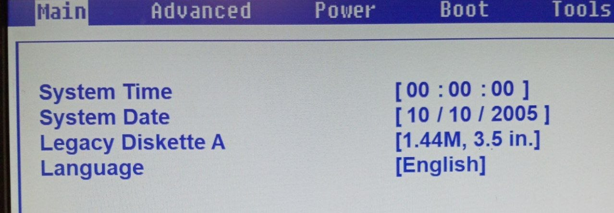
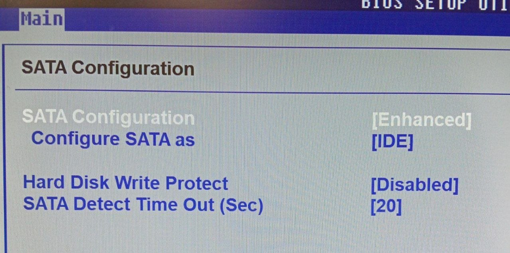
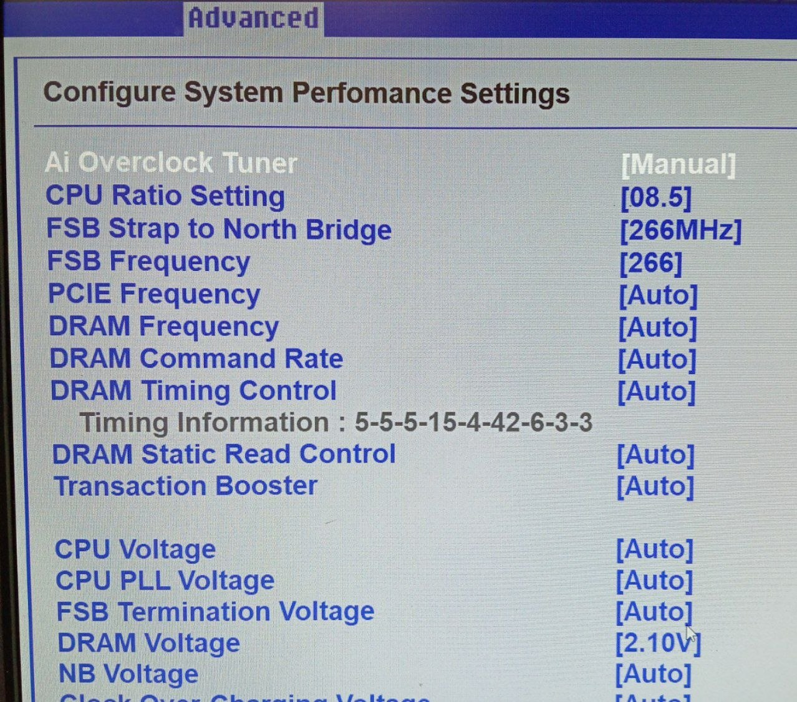
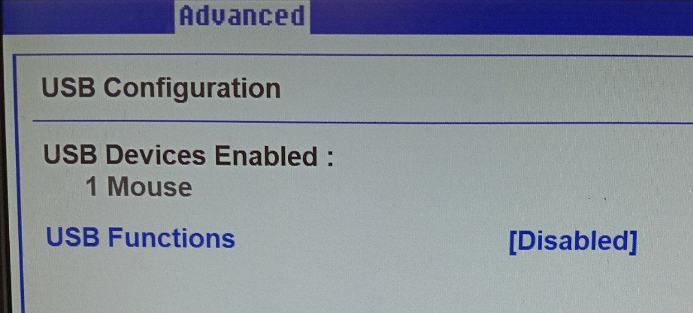
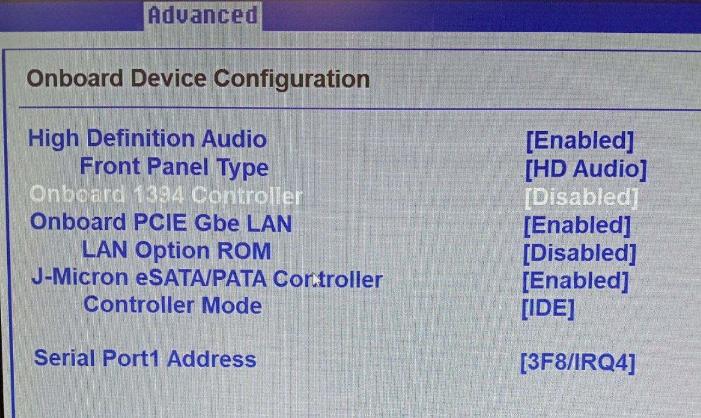
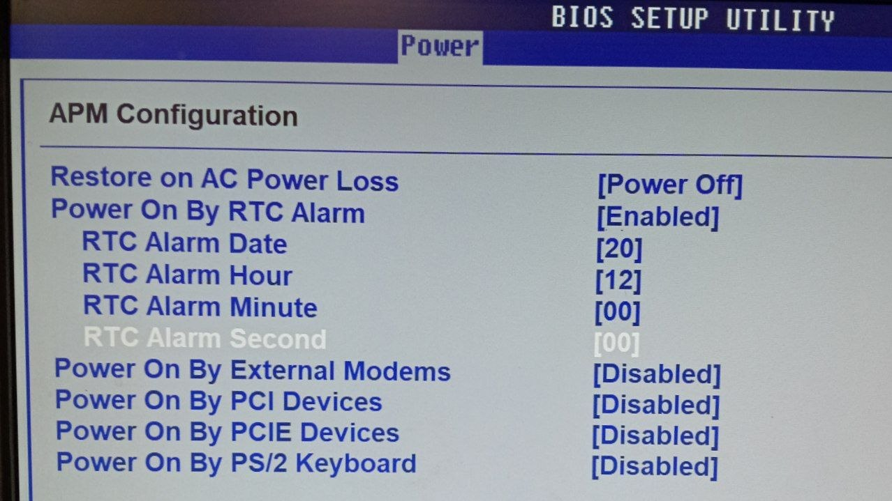
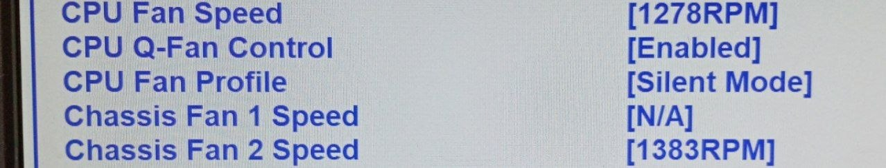
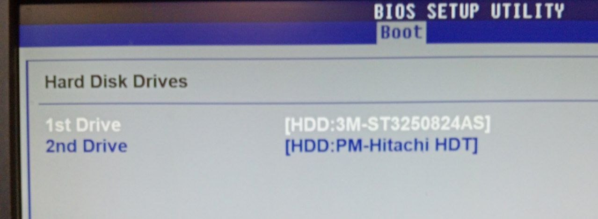
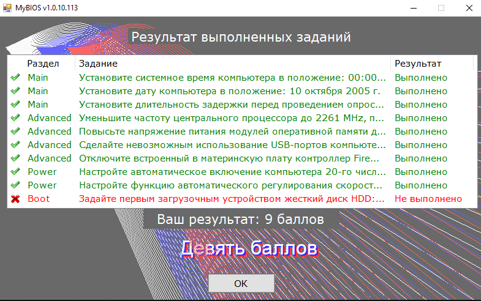

# ЛАБОРАТОРНАЯ РАБОТА НОМЕР 12
## ТЕСТ MyBIOS_1.0.10.113 miao 🪳

---

### >Main

1. установите время компьютера в положение 00:00:00 (HH:MM:SS).

2. установите дату компьютера в положение : 10 октября 2005 г.

3. установите длительность задержки перед проведением опроса устройств , подключенных к SATA портам , равную 20 секундам.

 
---

### >Advanced

1. Уменьшите частоту центрального процессора до 2261 MHz, при этом частота системной шины должна оставаться неизменной , т.е. равной 266 MHz.

2. Повысьте напряжение питания модулей оперативной памятидо 2,1 Вольта.

3. Сделайте невозможным использование USB-портом компьютера .

4. Отключите встроенный в материнскую плату контролер FireWire
 
 

---
### >Power

1. Настройте автоматическое включение компьютера 20-го числа каждого месяца в 12:00:00 (HH:MM:SS).

2. Настройте функцию автоматического регулирования скорости вращения процессорного вентилятора (ASUS Q-Fan) таким образом, что бы вентилятор работал в самом тихом по уровню шума режиме.

---

### >Boot

1. Задайте первым загрузочным устройством жесткий диск HDD:3M-ST3250824AS.

---

## >Результат выполненных заданий 

 

*10 баллов хихихаха

🪳 🪳 🪳
