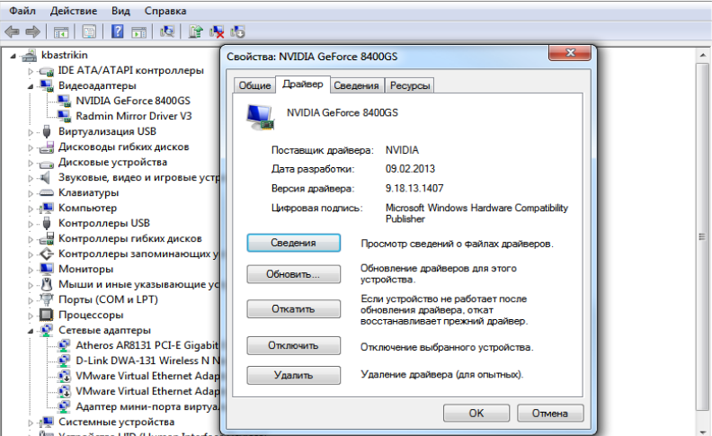

# Лабораторная работа 14 🐡

## Настройка и обновление драйверов 🍊🫧

**Цель:** научиться использовать всевозможные средства поиска и настройки драйверов оборудования компьютера

**ПОДГОТОВИТЬ ОТЧЕТ**

### Теоретические сведения:

**Дра́йвер** — компьютерное программное обеспечение, с помощью которого другое программное обеспечение (операционная система) получает доступ к аппаратному обеспечению некоторого устройства. Обычно с операционными системами поставляются драйверы для ключевых компонентов аппаратного обеспечения, без которых система не сможет работать. Однако для некоторых устройств (таких, как видеокарта или принтер) могут потребоваться специальные драйверы, обычно предоставляемые производителем устройства.

В общем случае драйвер не обязан взаимодействовать с аппаратными устройствами, он может их только имитировать (например, драйвер принтера, который записывает вывод из программ в файл), предоставлять программные сервисы, не связанные с управлением устройствами (например, [/dev/zero](https://ru.wikipedia.org/wiki/dev/zero) в [Unix](https://ru.wikipedia.org/wiki/Unix), который только выдаёт нулевые байты), либо не делать ничего (например, [/dev/null](https://ru.wikipedia.org/wiki/dev/null) в Unix и NUL в [DOS](https://ru.wikipedia.org/wiki/DOS)/[Windows](https://ru.wikipedia.org/wiki/Windows)).

Чтобы определить, какой *драйвер* нам необходим, надо выполнить следующие шаги: правой кнопкой мыши нажмем на иконке **Мой компьютер** (нажимать необходимо именно на значке, а не на ярлыке, для этого можно нажать **Пуск**) и выбрать *меню* **свойство**. Зайдя в свойства системы, выбираем вкладку **оборудование**, затем нажимаем **Диспетчер устройств**. Напротив устройства, для которого не установлен *драйвер* или установлен не корректно будет стоять либо желтый знак вопроса, либо желтый восклицательный знак соответственно. Выбираем данное устройство, жмем правой кнопкой мыши и выбираем **свойства**. В окне **Свойства** выбираем вкладку **Сведения**. Во вкладке **сведения** выбираем в ниспадающем списке **ИД Оборудования**.

Например:

`PCI\VEN_5333&DEV_8811&SUBSYS_00000000&REV_00\3&267A616A&0&40`

*Параметр* VEN является сокращением от слова **Vendor**, то есть производитель, а *значение* этого параметра, ничто иное, как код производителя устройства. Данный код присваивается каждому производителю, чтобы мы могли его однозначно определить. Далее следующий *параметр* это DEV — сокращенно от слова **Device** (устройство). Данный *параметр* является кодом данного устройства.

### Задание на лабораторную работу:

1.  **Выясните ИД оборудования** — видеоадаптер, дисковое устройство, монитор, процессор.

    Для этого перейдите в панель управления компьютером и найдите меню диспетчер устройств. Выберете конкретное оборудование и перейдите в его свойства.

    Выберете сведения об этом оборудовании и выясните его ИД

    Рис. 1. Диспетчер устройств.

    

2.  Выясните версию установленных драйверов (Занесите в отчет)

3.  Используя компьютер, имеющий доступ в интернет проведите поиск новых версий установленного оборудования по его ИД по следующей схеме. (Занесите в отчет)

| № | Оборудование | ID оборудования | Версия драйвера | Новая версия драйвера (Подкрепить скриншотом, что реально нашли) |
|---|---|---|---|---|
| 1 | Видеоадаптер |PCI\VEN_8086&DEV_2E12&SUBSYS_04201028&REV_03| 8.15.10.2702||
| 2 | Звуковое устройство |HDAUDIO\FUNC_01&VEN_11D4&DEV_194A&SUBSYS_10280420&REV_1004|10.0.17763.8641| |
| 3 | Процессор |ACPI\GenuineIntel_-_Intel64_Family_6_Model_23|10.0.17763.7553 ||
| 4 | Дисковое устройство |SCSI\DiskKODAK_____SSD_X100_120GBHAFE|10.0.17763.6054| |
| 5 | Сетевой адаптер |Intel(R) 82567LM-3 Gigabit Network Connection| 2.15.22.6||

### Контрольные вопросы:

**1. Что такое драйвер?**

Это специальная программа-посредник, которая «объясняет» операционной системе, как именно управлять конкретным устройством (видеокартой, принтером, мышью). Без драйвера оборудование не будет работать или будет работать некорректно.

**2. Что такое ИД оборудования и расшифровка параметров?**

*ИД (ID) оборудования* — это уникальный цифробуквенный код (например, `VEN_10EC&DEV_8168`), по которому система опознаёт устройство.

**Расшифровка основных параметров:**

-   *VEN (Vendor ID):* Код производителя (уникальный для каждой фирмы).
-   *DEV (Device ID):* Код конкретной модели устройства.
-   *SUBSYS:* Идентификатор подсистемы (указывает на конкретную реализацию/версию платы).