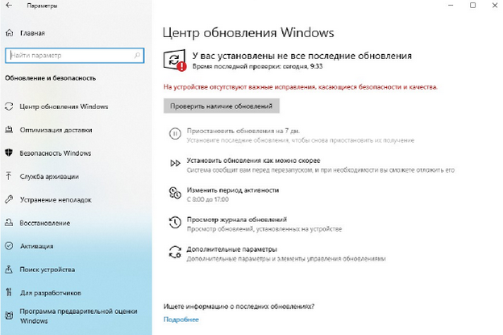

### Лабораторная работа №15

**Установка и настройка центра обновления Windows**

**Цель:** Изучить принципы настройки и обновления ОС Windows

**Теоретические сведения:**

Обновления делятся на важные, рекомендуемые, необязательные и основные.

Это означает следующее:

- *Важные обновления* обеспечивают значительное улучшение защиты, безопасности и надежности компьютера. Они должны устанавливаться сразу после их появления и устанавливаются автоматически с помощью Windows Update.
- *Рекомендуемые обновления* могут касаться некритических проблем и улучшать работу компьютера. Хотя такие обновления не касаются основных аспектов работы компьютера или программ Windows, они часто содержат существенные улучшения. Эти обновления могут установиться автоматически.
- *Необязательные обновления* содержат непосредственно обновления, драйверы и другие программы от Майкрософт, призванные улучшить работу компьютера. Установить их нужно вручную.

В зависимости от **типа обновления Windows Update** обеспечивает:

- *Обновление безопасности*. Распространяемое исправление уязвимостей определенных продуктов в системе безопасности. Уязвимости в безопасности оцениваются на основе их опасности, которая обозначается в бюллетене Майкрософт как критическая, важная, средняя или низкой степени важности.
- *Критические обновления*. Распространяемое исправление уязвимостей определенных программ, направлено на устранение ошибок, не связанных с безопасностью.
- *Пакеты обновлений*. Проверенные сборные наборы исправлений, обновлений безопасности, критических обновлений и обычных обновлений, а также дополнительные исправления ошибок, найденных со времени выхода продукта. Пакеты обновлений могут содержать некоторые изменения в дизайне и функциональности программ.

**Задание на лабораторную работу:**

1.  **Настройте центр обновления Windows 10 (пуск -> параметры->обновление и безопасность)**

2.  Проверьте наличие новых обновлений

*Если центр обновления выдает ошибку, проверьте способ подключения виртуальной машины к интернету*

*Или обратитесь к преподавателю*

3.  Зафиксируйте какие обязательные обновления могут быть установлены
4.  Просмотрите и зафиксируйте необязательные обновления

5.  Дождитесь скачивания и установки хотя бы нескольких обновлений. Зафиксируйте их установку в отчете, для этого обратитесь к журналу обновлений

6.  **Отключение обновлений Windows 10**
    1.  Запустите редактор локальной групповой политики (нажать Win+R, ввести *gpedit.msc*)
    2.  Перейдите к разделу «Конфигурация компьютера» --- «Административные шаблоны» --- «Компоненты Windows» --- «Центр обновления Windows». Найдите пункт «Настройка автоматического обновления» и дважды кликните по нему.

    

    3.  В окне настройки установите «Отключено» для того, чтобы Windows 10 никогда не проверяла и не устанавливала обновления.

    

Закройте редактор, после чего зайдите в Центр обновления Windows и зафиксируйте изменения в центре.

7.  **Установите обновления из папки «Обновления к установке» вручную и выясните тип установленных обновлений**

Для того чтобы скопировать обновления из сетевой папки, на виртуальной машине откройте проводник и в строке пути пропишите `\\kbastrikin`

Для поиска типа установленных обновлений используйте сайт http://www.catalog.update.microsoft.com

И заполните следующую таблицу в отчете:

| Номер обновления | Классификация | Версия | Размер |
| ---------------- | ------------- | ------ | ------ |
|KB5082239|Критические обновления|Windows 10 and later Dynamic Update , Windows Safe OS Dynamic Update |141,3 MB|
|KB5082241|Критические обновления|Windows 10 and later Dynamic Update , Windows Safe OS Dynamic Update |147,1 MB|
|KB5078805|Критические обновления|Windows 10 and later Dynamic Update , Windows Safe OS Dynamic Update | 31,0 MB|

8.  **Настройте центр обновления как службу**
    1.  Перейдите в панель управления -> Администрирование -> Управление компьютером-> Службы и приложения-> Службы

    

    2.  Запустите оснастку «Службы» и найдите службу «Центр обновления» и перейдите в Свойства данной службы

    

    3.  На вкладке Общие установите тип запуска: «Вручную»

    

    4.  На вкладке Восстановление установите параметры согласно скриншоту

    

    5.  Установите параметры перезагрузки ПК

    

    6.  Сохраните параметры настройки службы

9.  Покажите выполненную работу преподавателю
10. Оформите отчет.

11. **Подготовьте контрольные вопросы.**

**Контрольные вопросы:**

1.  Что такое обновление?
2.  Типы обновления Windows.
3.  Центр обновления Windows.

---

### Ответы на контрольные вопросы:

**1. Что такое обновление?**

Обновление — это программный пакет, выпускаемый разработчиком (в данном случае Microsoft), который содержит исправления, улучшения или новые функции для операционной системы или других программных продуктов. Обновления служат для устранения уязвимостей в системе безопасности, исправления обнаруженных ошибок (багов), повышения стабильности и производительности работы компьютера, а также для добавления новых возможностей или поддержки нового оборудования.

**2. Типы обновления Windows.**

Согласно представленному тексту и общей классификации обновлений Windows можно выделить следующие типы:

- **По важности и способу установки:**
    - **Важные обновления:** Обеспечивают значительное улучшение защиты, безопасности и надежности. Устанавливаются автоматически.
    - **Рекомендуемые обновления:** Касаются некритических проблем, улучшают работу компьютера. Часто устанавливаются автоматически.
    - **Необязательные обновления:** Включают обновления, драйверы и другие программы, призванные улучшить работу. Устанавливаются вручную.

- **По типу контента (что предоставляет Центр обновления Windows):**
    - **Обновления безопасности:** Исправления уязвимостей в системе безопасности. Опасность уязвимости оценивается как критическая, важная, средняя или низкая.
    - **Критические обновления:** Исправления ошибок в определенных программах, не связанных с безопасностью.
    - **Пакеты обновлений (Service Packs):** Проверенные сборные наборы, включающие исправления, обновления безопасности, критические и обычные обновления, а также некоторые изменения в дизайне и функциональности.

**3. Центр обновления Windows.**

Центр обновления Windows (Windows Update) — это встроенный компонент операционной системы Windows, который представляет собой службу, отвечающую за автоматическое или ручное получение, загрузку и установку обновлений от Microsoft. Он обеспечивает централизованный механизм для поддержания системы в актуальном состоянии, позволяя пользователю:
- Проверять наличие новых обновлений.
- Просматривать доступные важные, рекомендуемые и необязательные обновления.
- Выбирать обновления для установки.
- Просматривать журнал (историю) установленных обновлений.
- Настраивать параметры автоматической установки.