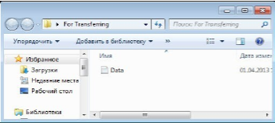

Ниже полный текст лабораторной работы в формате Markdown, после которого даны ответы на контрольные вопросы.

---

# Лабораторная работа №17

**Перенос данных из Windows 7 в Windows 10**

> В этой лабораторной работе вы будете использовать Windows 7 и Windows 10 на виртуальной машине.

**Подготовить ОТЧЕТ**

> **Рекомендуемое оборудование**
>
> Для этого упражнения требуется следующее оборудование:

- Компьютер, работающий под управлением Windows 7 Professional и Windows 10 Pro.

1. **(WINDOWS 7)**

Откройте сеанс на компьютере и создайте папку с именем «Для переноса» (For transferring).

Затем в Блокноте создайте файл с текстом «Со старого ПК» и сохраните его в папке "For Transfering" (Для переноса). Присвойте файлу имя "Data" (Данные).

Создайте на Рабочем столе папку с именем "Перенос" (Файлы данных для переноса).

2. Выберите Пуск > Все программы > Стандартные > Служебные > Средство переноса данных Windows.

Откроется окно «Перенос файлов и данных Windows».

Нажмите кнопку **Далее**.

Откроется окно «Выберите способ переноса файлов и параметров на новый компьютер».

Выберите Внешний диск или USB-устройство флэш-памяти.

Откроется окно «Какой компьютер сейчас используется?».

Выберите **Это мой исходный компьютер**. Появится окно «Проверка возможности переноса...».

Появится окно «Выберите данные, переносимые с этого компьютера».

Снимите флажки со всех учётных записей и щёлкните **Настройка** для той учётной записи, под которой вы работаете.

Когда откроется окно настройки для вашей учётной записи, щёлкните **Дополнительно**.

Найдите папку "For Transferring" (Для переноса). Отсюда будут переноситься файлы.

Выберите файл **Data** (Данные) и нажмите кнопку **Сохранить**. Появится окно «Выберите данные, переносимые с этого компьютера».

Каков размер файла, который вы будете переносить?

Нажмите кнопку **Далее**.

Появится окно «Сохранение файлов и параметров для переноса».

Так как вы просто переносите файлы обратно на тот же самый компьютер, вводить пароль не требуется.

Нажмите кнопку **Сохранить**.

На Рабочем столе найдите ранее созданную папку "Перенос" (Файлы данных для переноса) и нажмите кнопку **Сохранить**.

Появится окно «Данные файлы и параметры сохранены для переноса».

Нажмите кнопку **Далее**.

Появится окно «Файл переноса готов».

Нажмите кнопку **Далее**.

Появится окно «Работа средства переноса данных Windows на этом компьютере завершена».

Нажмите кнопку **Закрыть**.

3. Запустите Виртуальную машину под управлением ОС Windows 10. Прежде чем выполнять какие либо действия, необходимо установить утилиты виртуальной машины. Для этого следуйте скриншотам.

Устанавливаем и перезагружаемся. Думаю поставить сами сможете)))) >:(.

4. Копируем папку Перенос из ОС windows 7 в windows 10

5. В Windows 10 нет средства переноса как в Windows 7. Поэтому, из папки отчеты скопировать папку migwiz на windows 10

Копируем папку migwiz и переносим ее в Windows 10 на рабочий стол.

Открываем папку и запускаем

Процесс переноса данных завершен.

**Контрольные вопросы**

1. Все ли файлы были успешно перенесены?
2. Какие способы миграции(переноса) данных вы можете назвать?

---

### Ответы на контрольные вопросы

**1. Все ли файлы были успешно перенесены?**

В рамках данной лабораторной работы перенос был выполнен успешно. Созданный в Windows 7 файл `Data` из папки `For Transferring` был упакован средством переноса данных в папку `Перенос` на рабочем столе, затем эта папка была скопирована в Windows 10, и процесс импорта данных через утилиту `migwiz` был завершён без ошибок. Таким образом, целевой файл был успешно перенесён.

**2. Какие способы миграции (переноса) данных вы можете назвать?**

Можно назвать следующие способы миграции данных:

- **Средство переноса данных Windows (Windows Easy Transfer)** — использовалось в лабораторной работе для Windows 7 и перенесённое (`migwiz`) в Windows 10.
- **Перенос вручную на внешнем носителе** — копирование файлов на USB-флешку, внешний жёсткий диск, карту памяти.
- **По локальной сети** — общий доступ к папкам, передача через домашнюю группу, прямое соединение Ethernet или Wi-Fi.
- **Облачные сервисы** — синхронизация через OneDrive, Google Диск, Яндекс.Диск, Dropbox и другие.
- **Программы для резервного копирования и восстановления** — создание образа системы или резервной копии данных (например, встроенное средство архивации Windows, Acronis, Macrium Reflect).
- **Перенос профиля пользователя** — специальные утилиты типа User Profile Wizard, Transwiz, PCmover.
- **Прямое копирование через общий сетевой кабель (Ethernet)** с настройкой IP-адресов и общего доступа.
- **Использование функции «История файлов» или «Резервное копирование и восстановление» (Windows 7)** для последующего восстановления на новой системе.
- **Клонирование диска** (для полного переноса системы) с помощью специальных программ (Clonezilla, Macrium Reflect и др.).