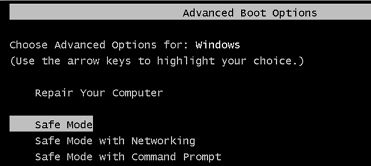

# Лабораторная работа №18

**Восстановление работы системы через безопасный режим**

**Цель:** Изучить принцип восстановления работы ОС Windows в безопасном режиме.

**Теоретические сведения:**

**Безопасный режим** — это способ загрузки операционной системы, при котором загружаются самые минимальные компоненты. Даже фоновой картинки на Рабочем столе не будет.

*Безопасный режим* хорош тем, что не дает загружаться приложениям, прописанным в автозагрузке. Поэтому его наиболее часто используют когда компьютер заражен вирусами. Вот небольшой перечень того, что можно делать в безопасном режиме:

- Проверка операционной системы на вирусы. В этом режиме не загружается то, что находится в автозагрузке. А именно там любят прописываться вирусы. Поэтому в нём можно загрузиться и проверить компьютер на вирусы, которые в обычном режиме блокируют и не дают это сделать антивирусам. Так же в нём можно установить их и проверить.
- Восстановить компьютер. В Windows есть *Средство восстановления системы*, которое лучше запустить именно в этом режиме в том случае, когда компьютер стал нестабильно работать.
- Установить и обновить драйвера. В безопасном режиме драйвера загружаются самые минимальные. И если компьютер работает с глюками и проблема кроется в них, то этот режим может помочь с этой проблемой.
- Проверить работу компьютера. Бывает такое, что в нормальном режиме комп тупит, а в безопасном всё хорошо. Тогда дело в программной части и нужно разбираться с ПО. Если же в безопасном режиме проблемы те же, то, скорее всего, дело в аппаратной части.

**Задание на лабораторную работу:**

1. На виртуальной машине загрузитесь в Windows 7 в обычном режиме.
2. Запустите конфигурацию системы msconfig и на вкладке загрузка установите в качестве параметра загрузки Безопасный режим.

3. Нажмите Применить и ОК. На вопрос системы выберите «Выход без перезагрузки».

4. Зайдите в меню создания точки восстановления системы. Для этого откройте меню ПУСК и в строке поиска начните набирать «Создание точки».

5. Откроется меню «Свойства системы», на вкладке Защита системы -> Параметры защиты нажмите Создать.

6. Создайте точку восстановления системы. Введите в названии точки восстановления системы Вашу фамилию и номер группы.

Нажмите Создать и дождитесь окончания Создания точки восстановления системы.

7. Проверьте успешность созданной Вами точки Восстановления системы. Для этого зайдите в меню восстановление системы. Откройте меню ПУСК и в строке поиска начните набирать «Восстановление».

8. Откроется средство «Восстановление системы».

9. Нажмите Далее. Откроются созданные Вами точки восстановления системы. Убедитесь в том что Ваша точка восстановления системы присутствует. И нажмите Отмена.

10. Перезагрузите Windows 7 на виртуальной машине. Загрузка в безопасный режим будет осуществляться автоматически.
11. В безопасном режиме Windows 7 откройте меню «Восстановления системы» (см. Пункт 7).
12. В списке точек восстановления системы установите галочку «Показать другие точки восстановления». Сколько точек восстановления было создано системой автоматически? **(В отчет)**
13. Выберите вашу точку восстановления системы и нажмите «Поиск затрагиваемых программ».

14. Просмотрите список затрагиваемых программ. Какие программы будут удалены после применения точки восстановления системы? **(В отчет)**

15. Закройте список затрагиваемых программ и просмотрите тот же список, но для самой старой точки восстановления. Какие отличия в затрагиваемых программах имеются по сравнению с новой точкой восстановления? **(В отчет)**
16. Вернитесь к списку точек восстановления, выберите точку созданную Вами и нажмите Далее, а затем Готово.
17. На вопрос системы «Продолжить?» нажмите Да.

18. Начнется восстановление системы.

19. После перезагрузки Вы заново попадете в Безопасный режим ОС. Успешное восстановление системы будет сопровождаться сообщением. 

**Запишите в отчет заметку об успешном или не успешном восстановлении системы.**

20. В msconfig на вкладке «Загрузка» в Параметрах Загрузки снимите галочку с безопасного режима и перезагрузите Windows 7 в нормальный режим работы.

**Контрольные вопросы:**

1. Что такое безопасный режим Windows?
2. Параметры запуска Безопасного режима.
3. **Отличия безопасного режима от чистой загрузки ОС. ОТВЕТИТЬ 100%**

---

### Ответы на контрольные вопросы

**1. Что такое безопасный режим Windows?**
Безопасный режим — это специальный диагностический режим запуска операционной системы Windows. В этом режиме загружается минимально необходимый набор драйверов, системных служб и компонентов. При запуске в безопасном режиме не загружаются программы из автозагрузки, отключаются многие второстепенные службы, используется стандартный VGA-драйвер с низким разрешением экрана, а также не применяются многие настройки оформления (вплоть до отсутствия фонового рисунка рабочего стола). Основное назначение этого режима — устранение неполадок в работе системы, удаление вредоносного ПО и восстановление системы в случаях, когда нормальная загрузка Windows невозможна из-за сбоев драйверов, программ или вирусной активности.

**2. Параметры запуска Безопасного режима.**
Существует несколько вариантов запуска безопасного режима:
- **Безопасный режим** (Safe Mode) — стандартный вариант. Загружается базовый графический интерфейс (проводник Windows) только с самыми критически важными системными службами и драйверами. Сеть не работает.
- **Безопасный режим с загрузкой сетевых драйверов** (Safe Mode with Networking) — аналогичен стандартному безопасному режиму, но дополнительно загружаются драйверы и службы, необходимые для работы сети. Это позволяет скачать обновления, антивирусные базы или драйверы из интернета прямо во время диагностики.
- **Безопасный режим с поддержкой командной строки** (Safe Mode with Command Prompt) — вместо стандартного графического интерфейса Windows (explorer.exe) после входа в систему запускается интерпретатор командной строки (cmd.exe). Этот вариант используют администраторы для выполнения консольных команд в случаях, когда графическая оболочка повреждена или мешает восстановлению.
Помимо вариантов самого безопасного режима, меню расширенных вариантов загрузки Windows также позволяет активировать ведение журнала загрузки, включить видеорежим с низким разрешением и другие отладочные режимы, которые не являются полноценным безопасным режимом, но также служат для диагностики.

**3. Отличия безопасного режима от чистой загрузки ОС (100%).**
Безопасный режим и режим чистой загрузки (clean boot) — это два принципиально разных метода диагностики Windows, и их главное отличие заключается в **механизме и глубине** отключения компонентов:

- **Безопасный режим** — это встроенный *аппаратно-низкоуровневый* режим запуска всей операционной системы. Система сама принудительно блокирует запуск подавляющего большинства сторонних драйверов (включая драйверы видеоадаптеров, звука и периферии), всех программ из автозагрузки (даже тех, что не имеют интерфейса) и загружает только стандартные драйверы, критически необходимые для функционирования мыши, клавиатуры и базового видео. Минимально необходимые системные службы также запускаются в ограниченном наборе, определенном самой Windows. **Безопасный режим нельзя настроить штатными методами — список загружаемого фиксирован.**

- **Чистая загрузка (clean boot)** — это *программный пользовательский* метод, реализуемый через утилиту конфигурации системы (msconfig). При чистой загрузке ядро Windows и все аппаратные драйверы (включая проблемные сторонние) загружаются в **полном объеме**, как при обычном запуске. Отключение касается **только сторонних служб и автозагружаемых приложений**, причем выполняет это сам пользователь вручную, снимая галочки. Штатные системные службы Microsoft при этом остаются включенными.

**Сводная таблица отличий:**

| Характеристика | Безопасный режим (Safe Mode) | Чистая загрузка (Clean Boot) |
| :--- | :--- | :--- |
| **Уровень ограничения** | Аппаратно-низкоуровневый, принудительный | Программно-пользовательский, настраиваемый |
| **Загрузка сторонних драйверов** | **Нет** (кроме критически важных, например, контроллеров диска) | **Да**, все установленные драйверы загружаются |
| **Службы Microsoft** | Только минимально необходимый набор | Загружаются все (по умолчанию) |
| **Сторонние службы и автозагрузка** | Заблокированы все | Отключены пользователем выборочно или полностью |
| **Способ включения** | Клавиша F8 при загрузке или настройка в msconfig на вкладке «Загрузка» | Настройка в msconfig на вкладках «Службы» и «Автозагрузка» |
| **Основная цель** | Устранение проблем, блокирующих саму загрузку ОС (вирусы, сбойные драйверы) | Выявление конфликта конкретной сторонней программы или службы при нормально загруженном ядре и драйверах |