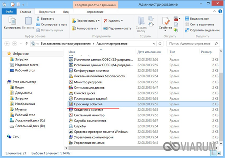

Вот содержимое файла, переписанное в Markdown, и ответы на контрольные вопросы.

***

**Лабораторная работа №19**

**Работа с журналами событий Windows**

**Цель:** Изучить принцип работы журналов событий ОС Windows.

**Теоретические сведения:**

Даже когда пользователь ПК не совершает никаких действий, операционная система продолжает считывать и записывать множество данных. Наиболее важные события отслеживаются и автоматически записываются в особый лог, который в Windows называется Журналом событий. Но для чего нужен такой мониторинг? Ни для кого не является секретом, что в работе операционной системы и установленных программ могут возникать сбои. Чтобы администраторы могли находить причины таких ошибок, система должна их регистрировать, что собственно она и делает.

Итак, основным предназначением Журнала событий в Windows 7/10 является сбор данных, которые могут пригодиться при устранении неисправностей в работе системы, программного обеспечения и оборудования. Впрочем, заносятся в него не только ошибки, но также и предупреждения, и вполне удачные операции, например, установка новой программы или подключение к сети.

Физически Журнал событий представляет собой набор файлов в формате **EVTX**, хранящихся в системной папке *%SystemRoot%/System32/Winevt/Logs*.

Хотя эти файлы содержат текстовые данные, открыть их Блокнотом или другим текстовым редактором не получится, поскольку они имеют бинарный формат. Тогда как посмотреть Журнал событий в Windows 7/10, спросите вы? Очень просто, для этого в системе предусмотрена специальная штатная утилита **eventvwr**.

Запустить утилиту можно из классической Панели управления, перейдя по цепочке *Администрирование -- Просмотр событий* или выполнив в окошке Run (Win+R) команду **eventvwr.msc**.

В левой колонке окна утилиты можно видеть отсортированные по разделам журналы, в средней отображается список событий выбранной категории, в правой — список доступных действий с выбранным журналом, внизу располагается панель подробных сведений о конкретной записи. Всего разделов четыре: настраиваемые события, журналы Windows, журналы приложений и служб, а также подписки.

Наибольший интерес представляет раздел «Журналы Windows», именно с ним чаще всего приходится работать, выясняя причины неполадок в работе системы и программ. Журнал системных событий включает три основные и две дополнительные категории. Основные это «Система», «Приложения» и «Безопасность», дополнительные — «Установка» и «Перенаправленные события».

Категория «Система» содержит события, сгенерированные системными компонентами — драйверами и модулями Windows.

Ветка «Приложения» включает записи, созданные различными программами. Эти данные могут пригодиться как системным администраторам и разработчикам программного обеспечения, так и обычным пользователям, желающим установить причину отказа той или иной программы.

Третья категория событий «Безопасность» содержит сведения, связанные с безопасностью системы. К ним относятся входы пользователей в аккаунты, управление учётными записями, изменение разрешений и прав доступа к файлам и папкам, запуск и остановка процессов и так далее.

На жестком диске файлы журнала занимают сравнительно немного места, тем не менее, у пользователя может возникнуть необходимость их очистить. Сделать это можно разными способами: с помощью оснастки **eventvwr**, командной строки и **PowerShell**. Для выборочной очистки вполне подойдет ручной способ. Нужно зайти в журнал событий, кликнуть ПКМ по очищаемому журналу в левой колонке и выбрать в меню опцию «Очистить журнал».

Если вы хотите полностью удалить все записи журнала, удобнее будет воспользоваться запущенной от имени администратора командной строкой. 

**Задание на лабораторную работу:**

1. На виртуальной машине загрузитесь в Windows 7 или 10 в обычном режиме.
2. Запустить утилиту журнала событий можно из классической Панели управления, перейдя по цепочке *Администрирование — Просмотр событий* или выполнив в окошке Run (Win+R) команду **eventvwr.msc**

3. **Изучите структуру журнала Windows.**
4. Так как число событий в журнале может исчисляться тысячами и даже десятками тысяч, в eventvwr предусмотрена возможность поиска и фильтрации событий по свойствам — важности, времени, источнику, имени компьютера и пользователя, коду и так далее.

   **Установите фильтр для журнала система как показано на скриншоте, для этого** Выберите слева *Журналы Windows — Система*, справа нажмите «Фильтр текущего журнала» или «Создание настраиваемого представления»

   **[Сколько событий записано в журнал после применения фильтра? (В отчет)]**

5. **Сохраните фильтр. Для этого** справа нажмите «Сохранить фильтр в настраиваемом....». Настройте сохранение как показано на скриншоте и нажмите Ок.

   Сохраненный фильтр появится в панели слева.

6. **[Самостоятельно:] Создайте фильтр для журнала «безопасность»**

   Дата: Последние 30 дней

   Уровень события: Предупреждения, сведения

   Сохраните фильтр с именем своей группы с пометкой безопасность (например, 2ИСП9-1 Безопасность)

7. После применения фильтра к журналу «Безопасность» привяжите задачу к событию по следующей схеме:

| №ПК | № События |
| --- | --------- |
| 1   | 2         |
| 2   | 4         |
| 3   | 8         |
| 4   | 10        |
| 6   | 1         |
| 7   | 3         |
| 9   | 5         |
| 10  | 7         |
| 11  | 9         |
| 12  | 11        |

   Для привязки задачи к событию — выделите событие и справа на панели Действия выберите «Привязать задачу к событию».

   Далее настройте задачу, следуя указаниям скриншотов (в Windows 7 выбираем «Отобразить сообщение», в Windows 10 выбираем «Запустить программу»).

   В windows 7 выбираем Отобразить сообщение. В Windows 10 выбираем Запустить программу.

 

   [Обязательно установите галочку «Открыть окно Свойство при нажатии кнопки готово».]

   На вкладке Общие установите необходимые параметры.

   

   На вкладке «Параметры» установите необходимые параметры.

8. Очистите журнал «Установка».

9. Командой **services.msc** откройте оснастку «Службы», справа найдите «Журнал событий Windows», кликните по нему дважды, в открывшемся окошке свойств настройте службу:
   *   Вкладка Общие — Тип запуска — Вручную
   *   Вкладка Восстановление (настройте согласно скриншоту).

   
   

10. **Подготовьте и сдайте отчет. Вопросы устно.**

**Контрольные вопросы:**

1. Что такое журналы события Windows?
2. Физическое расположение журнала Windows.
3. Основные и дополнительные категории журнала Windows.

***

### Ответы на контрольные вопросы

**1. Что такое журналы события Windows?**

Журналы событий Windows — это централизованная служба операционной системы, предназначенная для сбора и хранения данных о значимых событиях, происходящих в процессе работы системы, установленного программного обеспечения и оборудования. Сюда относятся записи об ошибках (сбоях), предупреждениях, а также информационные сообщения об успешно выполненных операциях (например, установка программы, подключение к сети). Эти данные необходимы администраторам и разработчикам для диагностики и устранения неисправностей, мониторинга безопасности и анализа работы системы.

**2. Физическое расположение журнала Windows**

Физически Журнал событий представляет собой набор файлов в бинарном формате **EVTX**. Эти файлы хранятся в системной папке:
`%SystemRoot%\System32\Winevt\Logs`
(обычно это `C:\Windows\System32\Winevt\Logs`). Открыть эти файлы напрямую текстовым редактором (например, Блокнотом) невозможно из-за их бинарной структуры.

**3. Основные и дополнительные категории журнала Windows**

В разделе «Журналы Windows» системные события разделены на основные и дополнительные категории.

*   **Основные категории:**
    *   **Система:** Содержит события, сгенерированные системными компонентами Windows, такими как драйверы и системные модули.
    *   **Приложения:** Включает записи, созданные различными установленными программами.
    *   **Безопасность:** Содержит сведения, связанные с безопасностью системы: входы пользователей в аккаунты, управление учётными записями, изменение разрешений и прав доступа к файлам и папкам, запуск и остановка процессов и т.д.

*   **Дополнительные категории:**
    *   **Установка:** Содержит события, связанные с установкой и удалением программ и компонентов системы.
    *   **Перенаправленные события:** Содержит события, которые были перенаправлены с других компьютеров.