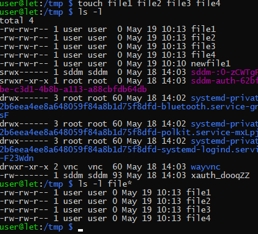
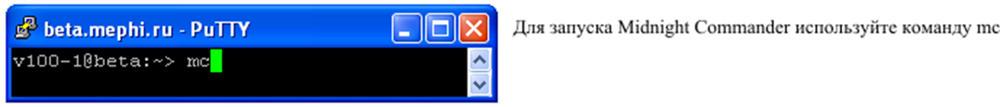
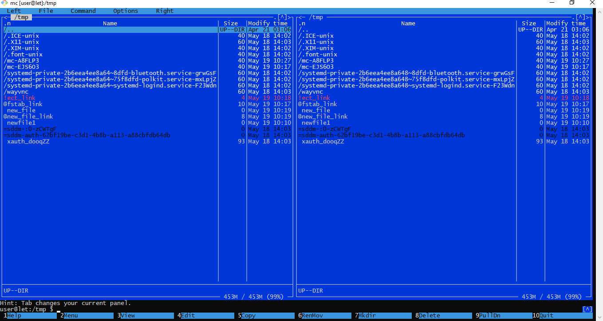

# Лабораторная работа: Управление процессами в ОС(34)

## Цель работы
Изучить средства управления процессами в операционной системе, освоить команды для просмотра процессов, изменения их приоритетов и завершения.

## Теоретические сведения

Процесс — это программа, находящаяся в состоянии выполнения. Каждый процесс имеет уникальный идентификатор (PID). В ОС Linux управление процессами осуществляется через системные вызовы и команды оболочки.

### Основные команды для работы с процессами

- `ps` — вывод информации о текущих процессах.
- `top` — интерактивный просмотр процессов в реальном времени.
- `kill` — отправка сигнала процессу (например, для завершения).
- `nice` и `renice` — изменение приоритета выполнения процесса.
- `jobs`, `bg`, `fg` — управление фоновыми и foreground-задачами.

### Приоритеты процессов

Приоритет процесса определяется значением nice (от -20 до 19). Чем меньше число, тем выше приоритет. Обычный пользователь может только повышать nice (уменьшать приоритет), а суперпользователь — изменять в обе стороны.

## Ход работы

### Задание 1. Просмотр процессов

1. Выполните команду `ps aux` — выведите список всех процессов.
2. Выполните `ps -ef` — другой формат вывода.
3. Используйте `ps -u <username>` для фильтрации по пользователю.
4. Запишите PID процесса `init` (или `systemd`).

### Задание 2. Динамическое наблюдение

1. Запустите `top`. Обратите внимание на загрузку CPU, памяти и список процессов.
2. Нажмите `P` — сортировка по использованию CPU, `M` — по памяти, `q` — выход.
3. Запустите `htop` (если установлен).

### Задание 3. Запуск и завершение процессов

1. Запустите в фоновом режиме команду `sleep 300 &`.
2. Узнайте PID запущенного процесса.
3. Завершите его командой `kill <PID>`.
4. Запустите `sleep 200` и приостановьте его комбинацией `Ctrl+Z`.
5. Посмотрите список задач командой `jobs`.
6. Возобновите выполнение в фоне с помощью `bg`.
7. Переведите процесс на передний план командой `fg`.

### Задание 4. Изменение приоритета

1. Запустите `nice -n 10 sleep 500 &`.
2. Проверьте его nice-значение командой `ps -l <PID>`.
3. Измените приоритет через `renice 15 <PID>`.
4. Запустите процесс без указания nice и затем понизьте приоритет.

### Задание 5. Настройка разрешений 

- Создайте каталог `papka` в корне файловой системы. Внутри каталога создайте текстовый файл с именем `file1` со следующим содержимым — `LINUX THE BEST`.
- Внутри каталога `papka` создайте текстовый файл с именем `cat`.
- Объедините файлы `file1` и `cat` в файл `Copy`.
- Файлу `Copy` выдайте следующие разрешения:

| Пользователь | Вид разрешений |
|--------------|----------------|
| users        | rwx             |
| groups       | rwx             |
| others       | --x             |

## Контрольные вопросы

1. **Что такое PID и PPID?**  
   PID (Process ID) — уникальный идентификатор процесса. PPID (Parent Process ID) — идентификатор родительского процесса, который породил данный процесс.

2. **Как посмотреть все процессы, запущенные от имени текущего пользователя?**  
   С помощью команды `ps -u $USER` или `ps aux | grep $USER`.

3. **Какой сигнал отправляет команда `kill` по умолчанию?**  
   По умолчанию `kill` отправляет сигнал `SIGTERM` (15), который запрашивает корректное завершение процесса.

4. **Как запустить программу с пониженным приоритетом?**  
   Использовать команду `nice -n <значение> <команда>`, например `nice -n 15 ./myprogram`.

5. **Как изменить приоритет уже работающего процесса?**  
   Командой `renice <новое_значение> -p <PID>`.

6. **Что означают права доступа `rwx--x--x` для файла?**  
   Владелец имеет полные права (чтение, запись, выполнение), группа — только выполнение, остальные пользователи — только выполнение.

7. **Как объединить два текстовых файла в один в Linux?**  
   Командой `cat file1 cat > Copy` (как указано в задании) или `cat file1 file2 > result`.

## Заключение

В ходе лабораторной работы были изучены основные команды управления процессами в Linux, получены навыки просмотра процессов, изменения их приоритетов, запуска в фоновом режиме и завершения. Также освоена настройка прав доступа к файлам.

---

# Лабораторная работа: Работа с файлами и каталогами в ОС GNU/Linux в программе Midnight Commander

## Цель занятия

Ознакомиться с программой Midnight Commander, имеющейся в операционной системе GNU/Linux, и предназначенной для работы с файлами и каталогами.

Изучаются следующие основные вопросы:

1. знакомство с программой Midnight Commander;
2. настройка отображения файлов и каталогов;
3. сортировка объектов при отображении;
4. просмотр и редактирование файлов, создание каталогов;
5. копирование файлов и каталогов;
6. перемещение файлов и каталогов;
7. удаление файлов и каталогов;
8. создание символических ссылок;
9. оценка занятого и свободного пространства;
10. подключение к FTP-серверу;
11. подключение к SFTP-серверу по SSH;
12. использование встроенной командной строки.

## Задание

Практическое занятие проводится на компьютерах с установленной свободно-распространяемой и бесплатной операционной системой Canonical GNU/Linux Ubuntu 12.04 LTS или Debian 7 с окружением рабочего стола GNOME.

## Подготовка оборудования к работе

Попросите преподавателя включить компьютер и авторизуйтесь в системе с помощью полученных учетных данных (логина и пароля).

### 1. Запуск программы Midnight Commander

Откройте окно терминала сочетанием клавиш `<Ctrl+Alt+T>` или из меню `Applications -> Accessories -> Terminal`.

Выполните команду `mc` (англ. midnight commander).

Разверните окно программы на весь экран. Ознакомьтесь с внешним видом окна программы и основными управляющими элементами.

Отчет оформляйте в редакторе LibreOffice Writer (доступен в меню `Applications -> Office -> LibreOffice Writer`). Сохраните в отчет вид окна программы Midnight Commander.

### 2. Настройка отображения файлов и каталогов

В окне программы Midnight Commander выполните последовательно следующие действия.

- **Просмотрите каталог в виде дерева.** Для этого в выпадающем меню **Right** выберите **Tree** (или сочетание клавиш `<F9>`, `<R>`, `<T>`) и просмотрите структуру каталога `/etc`. Сохраните экранный снимок окна в отчет.

- **Получите информацию о выбранном объекте.** Для этого в выпадающем меню **Right** выберите **Info** (или сочетание клавиш `<F9>`, `<R>`, `<Ctrl+x>`, `<i>`), на левой панели выберите каталог или файл. В правой части появится информация о выбранном объекте. Сохраните экранный снимок окна в отчет.

- **Выполните быстрый просмотр содержимого файла.** Для этого в выпадающем меню **Right** выберите **Quick View** (или сочетание клавиш `<F9>`, `<R>`, `<Ctrl+x>`, `<q>`), на левой панели выберите последовательно каталог и файл (например, `/etc/fstab`). В правой части появится содержимое выбранного объекта. Сохраните экранный снимок окна в отчет.

- **Переключите режим отображения правой панели на файловый листинг.** Для этого в выпадающем меню **Right** выберите **File listing** (или сочетание клавиш `<F9>`, `<R>`, `<g>`). Сохраните экранный снимок окна в отчет.

### 3. Сортировка объектов при отображении

- **Выполните сортировку объектов по размеру.** Для этого в выпадающем меню **Right** выберите **Sort order** (или сочетание клавиш `<F9>`, `<R>`, `<S>`), в открывшемся окне выберите **Size** левой кнопкой мыши или клавишей `<Space>` (или клавишей `<S>`) и нажмите **OK** (или клавишу `<Enter>`). Перейдите в каталог `/etc` и опуститесь в самый низ списка выводимых объектов. В нижней части списка должен быть файл максимального размера. Сохраните экранный снимок окна в отчет.

- **Выполните сортировку объектов по дате изменения.** Для этого в выпадающем меню **Right** выберите **Sort order** (или сочетание клавиш `<F9>`, `<R>`, `<S>`), в открывшемся окне выберите **Modify Time** левой кнопкой мыши или клавишей `<Space>` (или клавишей `<m>`) и нажмите **OK** (или клавишу `<Enter>`). Перейдите в каталог `/etc` и опуститесь в самый низ списка выводимых объектов. В нижней части списка должен быть файл, время изменения которого наиболее близко к текущему. Сохраните экранный снимок окна в отчет.

- **Выполните сортировку объектов по имени.** Для этого в выпадающем меню **Right** выберите **Sort order** (или сочетание клавиш `<F9>`, `<R>`, `<T>`), в открывшемся окне выберите **Name** левой кнопкой мыши или клавишей `<Space>` (или клавишей `<N>`) и нажмите **OK** (или клавишу `<Enter>`). Перейдите в каталог `/etc` и опуститесь в самый низ списка выводимых объектов. В нижней части списка должен быть файл, имя которого начинается на латинскую "z" или близкую к ней букву (в сторону "a").

### 4. Просмотр и редактирование файлов, создание каталогов

- **Для просмотра файла во встроенном просмотрщике** выберите текстовый файл (например, `/etc/fstab`) и выберите из меню **File** пункт **View** (или сочетание клавиш `<F9>`, `<F>`, `<V>`) или нажмите клавишу `<F3>`. Сохраните экранный снимок окна в отчет.

- **Для создания файла** используйте встроенный редактор. Для этого перейдите в домашний каталог и нажмите `<Shift+F4>`, наберите произвольный текст в открывшемся окне редактора, сохраните файл под произвольным именем (например, `newfile`) клавишей `<F2>` и закройте редактор клавишей `<F10>`. Откройте созданный файл в редакторе снова клавишей `<F4>` (или выберите из меню **File** пункт **Edit**). Сохраните экранный снимок окна в отчет. Закройте текстовый редактор клавишей `<F10>`.

- **Создайте в домашнем каталоге каталог `new_dir`.** Для этого нажмите клавишу `<F7>` (или выберите из меню **File** пункт **Mkdir**). В открывшемся окне укажите имя каталога (например, `new_dir`) и нажмите **OK**. Установите курсор на созданный каталог и сохраните экранный снимок окна.

### 5. Копирование файлов и каталогов

Программа Midnight Commander очень удобна для выполнения копирования, перемещения и удаления больших объемов файлов и каталогов. Для этого на одной панели (как правило, левой) открывается исходная папка (или содержащая ее папка), а на второй панели (как правило, правой) открывается папка назначения. При этом обе панели обычно находятся в режиме отображения **File listing**. Переключение между панелями выполняется левой клавишей мыши или клавишей `<Tab>`.

Выполните копирование всего каталога `/etc` в каталог `/tmp`. Для этого на левой панели откройте корневой каталог `/`, а на правой – каталог `/tmp`.

Находясь на левой панели, установите курсор на папку `/etc` и нажмите клавишу `<F5>` (или выберите из меню **File** пункт **Copy**) для копирования этого каталога на правую сторону.

Откроется окно с параметрами копирования. Обратите внимание на возможность сохранения атрибутов файлов (`Preserve attributes`). Установка этой галочки дает результат копирования, аналогичный команде `cp -p` из прошлой работы. После нажатия кнопки **OK** начнется копирование с индикацией процесса. По окончании копирования перейдите на правой панели в скопированный каталог и сохраните снимок экрана в отчет.

### 6. Перемещение файлов и каталогов

Перемещение файлов выполняется аналогично копированию. Откройте на левой и правой панелях каталог `/tmp`. Выполните перемещение только что скопированного каталога `etc` с левой стороны на правую под именем `etc_new`.

Для этого установите на левой панели курсор на папку `etc` и нажмите `<F6>` (или выберите из меню **File** пункт **Rename/Move**) для перемещения этого каталога на правую сторону. В открывшемся окне в строке `to:` укажите новое имя для каталога (например, `/tmp/etc_new`). После нажатия кнопки **OK** будет выполнено переименование каталога. По окончании перемещения перейдите на правой панели в переименованный каталог и сохраните снимок экрана в отчет.

### 7. Удаление файлов и каталогов

Удалите созданный каталог `/tmp/etc_new`. Для этого установите курсор на этот каталог и нажмите клавишу `<F8>` (или выберите из меню **File** пункт **Delete**). В появившемся окне подтверждения выберите пункт **Yes** для подтверждения удаления. В следующем окне выберите пункт **All** для рекурсивного удаления всего каталога. По окончании удаления сделайте экранный снимок окна.

### 8. Поиск файлов и каталогов

Поиск файлов и каталогов выполняется выбором из меню **Command** пункта **Find file** (или сочетанием клавиш `<F9>`, `<C>`, `<F>`). Возможен поиск файлов по имени и по содержимому.

- **Выполните поиск графических файлов с расширением `.png` в домашнем каталоге пользователя.** Для этого перейдите на одной из панелей в домашний каталог пользователя и откройте окно поиска. В поле **File name:** укажите `*.png`, галочку **Search for content** снимите. Нажмите кнопку **OK**. После появления надписи **Finished** в нижней части окна сохраните экранный снимок окна с результатом. Закройте окно с результатами поиска.

- **Выполните поиск текста `clock` в файлах каталога `/etc`.** Для этого откройте каталог `/etc` на одной из панелей и откройте окно поиска. В поле **File name:** укажите `*`. Поставьте галочку **Search for content**, а в поле **Content:** укажите `clock`. Нажмите кнопку **OK**. После появления надписи **Finished** в нижней части окна сохраните экранный снимок окна с результатами поиска.

### 9. Создание символических ссылок

Перейдите в папку `/tmp` на обеих панелях. Выберите любой файл и создайте символическую ссылку на него. Создание символических ссылок выполняется выбором из меню **File** пункта **Symlink** (или сочетанием клавиш `<F9>`, `<F>`, `<S>`). В открывшемся окне в поле **Symbolic link filename:** допишите в конец предлагаемого имени файла слово `_link` и нажмите **OK**. Обратите внимание на появление файла с символом `@` перед его именем. Так обозначаются символические ссылки в программе Midnight Commander. Сохраните экранный снимок окна программы.

Установите курсор на созданную символическую ссылку. При этом путь к файлу, на который она указывает, появится в нижней строке активной панели.

Удалите файл, на который указывает ссылка. Обратите внимание на появление восклицательного знака у символической ссылки. Теперь эта ссылка указывает на несуществующий объект, т.е. является "мертвой".

### 10. Оценка занятого и свободного пространства

Программа Midnight Commander позволяет получать информацию об использовании дискового пространства и о занимаемом каталогами пространстве.

- Использование дискового пространства выводится в правом нижнем углу каждой из панелей в виде *Доступно / Всего (Доля, %)*.

- Пространство, занимаемое каталогами, отображается при выборе в меню **Command** пункта **Show directory sizes** (или сочетания клавиш `<Ctrl>+<Space>`). Перейдите в каталог `/etc`, выберите сортировку по размеру и выведите размеры каталогов. Сохраните экранный снимок окна терминала в отчет.

### 11. Подключение к FTP-серверу

Программа Midnight Commander имеет встроенный FTP-клиент. Выполните подключение к FTP-серверу `ftp://mirror.yandex.ru`. Для этого выберите в меню **Left** пункт **FTP link** (или используйте сочетание клавиш `<F9>`, `<L>`, `
`). В открывшемся окне введите адрес `ftp://mirror.yandex.ru` и нажмите кнопку **OK**. После этого содержимое публичного каталога FTP-сервера появится на активной панели. Сохраните экранный снимок окна в отчет.

### 12. Подключение к SFTP-серверу по SSH

Программа Midnight Commander имеет встроенный SFTP-клиент для подключения по SSH. Выполните подключение к SFTP-серверу `server`. Для этого выберите в меню **Left** пункт **Shell link** (или используйте сочетание клавиш `<F9>`, `<L>`, `<S>`). В открывшемся окне введите адрес `server` и нажмите кнопку **OK**. После этого содержимое корневого каталога SFTP-сервера появится на активной панели. Сохраните экранный снимок окна в отчет.

### 13. Использование встроенной командной строки

В нижней части программы Midnight Commander всегда присутствует приглашение командной строки. Оно может использоваться для выполнения команд.

Выполните отдельную команду и просмотрите результат ее работы. Введите команду `date`. Нажмите `<Ctrl+O>` для временного скрытия окна Midnight Commander. Обратите внимание на вывод текущей даты над приглашением командной строки. Сохраните экранный снимок окна в отчет. Нажмите `<Ctrl+O>` для возвращения в окно Midnight Commander.

---

## Контрольные вопросы и ответы на них

### Вопросы из первой части (по файловой системе Linux)

**1. Какую команду необходимо использовать для вывода текущего каталога?**  
`pwd`

**2. Какую команду необходимо использовать для вывода содержимого каталога?**  
`ls`

**3. Какую команду необходимо использовать для смены текущего каталога?**  
`cd <путь_к_каталогу>`

**4. Какую команду необходимо использовать для создания нового каталога?**  
`mkdir <имя_каталога>`

**5. Какую команду необходимо использовать для удаления каталога?**  
`rmdir <имя_каталога>` (для пустого) или `rm -r <имя_каталога>` (для непустого)

**6. Какие команды необходимо использовать для создания пустого файла?**  
`touch <имя_файла>`, или `> <имя_файла>`, или `echo "" > <имя_файла>`

**7. Как обозначается оператор перенаправления вывода?**  
`>` (перезапись) и `>>` (добавление в конец)

**8. Какую команду необходимо использовать для копирования объектов?**  
`cp <источник> <назначение>`

**9. Какую команду необходимо использовать для перемещения объектов?**  
`mv <источник> <назначение>`

**10. Какую команду необходимо использовать для удаления объектов?**  
`rm <файл>` (для файлов) или `rm -r <каталог>` (для каталогов)

**11. Какую команду необходимо использовать для поиска объектов?**  
`find <путь> -name "<имя>"` или `locate <имя>`

**12. Какую команду необходимо использовать для создания символических ссылок?**  
`ln -s <целевой_файл> <имя_ссылки>`

**13. Какую команду необходимо использовать для получения занимаемого каталогом дискового пространства?**  
`du <имя_каталога>`

**14. Какую команду необходимо использовать для отображения занимаемого каталогом дискового пространства в наглядном виде?**  
`du -h <имя_каталога>` или `du -sh <имя_каталога>`

**15. Какую команду необходимо использовать для получения информации об использовании дискового пространства?**  
`df -h`

---

# Лабораторная работа №36(35)

## Midnight Commander. Основные функции.

## Введение

**Midnight Commander** — это двухпанельный файловый менеджер с текстовым интерфейсом. Каждая панель отображает содержимое одной директории (т.е., фактически, панель — это каталог).

Midnight Commander позволяет создавать и удалять директории и файлы в любой из двух панелей, а также осуществлять копирование и перемещение файлов и каталогов из одной панели в другую.

Midnight Commander имеет удобный встроенный текстовый редактор, который позволяет создавать и редактировать текстовые файлы.

## Внешний вид Midnight Commander

В нашем распоряжении остается и командная строка со всеми ее возможностями. Мы можем погасить панели Midnight Commander или снова включить их сочетанием клавиш «Ctrl»+»O» (не ноль!).

## Выход из Midnight Commander

Если вы закончили работу, то не забудьте после выхода из Midnight Commander выйти из Linux командой logout.

## Создание каталога

Каталог можно создать в активной панели, то есть в той, в которой находится подсветка.

## Удаление каталога или файла

Из активной панели можно удалять каталоги и файлы совершенно аналогичным способом. Для примера удалим только что созданный каталог newcat.

## Создание текстового файла

Текстовый файл создается в активной панели.

## Копирование и перемещение файлов

В рассмотренных примерах активной была левая панель, в которой отображался наш домашний каталог. В домашнем каталоге мы создали файл newfile.txt. Теперь скопируем его в каталог myproverbs.

После упражнения в копировании удалите файл newfile.txt из каталога myproverbs.

## Задание 1

Результат предъявите преподавателю.

## Задание 2

Результат предъявите преподавателю, после чего удалите из домашней директории все каталоги и файлы.

## Ответы на контрольные вопросы

### 1. Что такое Midnight Commander и для чего он используется?

**Midnight Commander (mc)** — это двухпанельный файловый менеджер с текстовым (псевдографическим) интерфейсом для Unix-подобных операционных систем (Linux, BSD, macOS и др.).

Он используется для:
- просмотра содержимого каталогов в двух панелях одновременно;
- создания, удаления, копирования, перемещения и переименования файлов и каталогов;
- редактирования текстовых файлов со встроенным редактором;
- просмотра файлов;
- работы с командной строкой без закрытия файлового менеджера;
- подключения к FTP и SFTP серверам;
- поиска файлов по имени и содержимому;
- оценки занятого дискового пространства.

### 2. Опишите назначения каждой из функциональных клавиш F1-F10 менеджера.

| Клавиша | Назначение |
|---------|------------|
| **F1**  | Вызов справки (Help) — открывает встроенную документацию по Midnight Commander. |
| **F2**  | Пользовательское меню (User menu) — открывает меню с настраиваемыми пользователем командами. |
| **F3**  | Просмотр файла (View) — открывает выделенный файл во встроенном просмотрщике (только для чтения). |
| **F4**  | Редактирование файла (Edit) — открывает выделенный файл во встроенном редакторе. |
| **F5**  | Копирование (Copy) — копирует выделенный файл/каталог из активной панели в неактивную (или с указанием пути). |
| **F6**  | Перемещение / переименование (Move/Rename) — перемещает выделенный объект или переименовывает его. |
| **F7**  | Создание каталога (Mkdir) — создаёт новый каталог в активной панели. |
| **F8**  | Удаление (Delete) — удаляет выделенный файл или каталог (с подтверждением). |
| **F9**  | Активация верхнего меню — открывает основное меню программы (Left, File, Command, Options, Right). |
| **F10** | Выход из Midnight Commander — закрывает программу и возвращает в командную строку терминала. |

---

### Вопросы по Midnight Commander 

**1. Какие действия необходимо выполнить для запуска программы Midnight Commander?**  
Открыть терминал (`<Ctrl+Alt+T>` или через меню), затем выполнить команду `mc`.

**2. Какие действия необходимо выполнить для просмотра содержимого каталога в виде дерева?**  
В меню **Right** выбрать **Tree** (или `<F9>`, `<R>`, `<T>`).

**3. Какие действия необходимо выполнить для просмотра информации о выбранном объекте?**  
В меню **Right** выбрать **Info** (или `<F9>`, `<R>`, `<Ctrl+x>`, `<i>`), затем на левой панели выбрать объект.

**4. Какие действия необходимо выполнить для быстрого просмотра содержимого файла?**  
В меню **Right** выбрать **Quick View** (или `<F9>`, `<R>`, `<Ctrl+x>`, `<q>`), затем на левой панели выбрать файл.

**5. Какие действия необходимо выполнить для переключения активной панели для отображения файлового листинга?**  
В меню **Right** выбрать **File listing** (или `<F9>`, `<R>`, `<g>`).

**6. Какие действия необходимо выполнить для сортировки объектов по размеру?**  
В меню **Right** выбрать **Sort order** (или `<F9>`, `<R>`, `<S>`), затем выбрать **Size** (`<Space>` или `<S>`), нажать **OK**.

**7. Какие действия необходимо выполнить для сортировки объектов по дате изменения?**  
В меню **Right** выбрать **Sort order** (или `<F9>`, `<R>`, `<S>`), затем выбрать **Modify Time** (`<Space>` или `<m>`), нажать **OK**.

**8. Какие действия необходимо выполнить для сортировки объектов по имени?**  
В меню **Right** выбрать **Sort order** (или `<F9>`, `<R>`, `<T>`), затем выбрать **Name** (`<Space>` или `<N>`), нажать **OK**.

**9. Какие действия необходимо выполнить для просмотра файла во встроенном просмотрщике?**  
Выбрать файл, затем в меню **File** выбрать **View** (или `<F9>`, `<F>`, `<V>`, или просто нажать `<F3>`).

**10. Какие действия необходимо выполнить для создания нового файла?**  
Перейти в нужный каталог, нажать `<Shift+F4>`, набрать текст, сохранить `<F2>`, закрыть `<F10>`.

**11. Какие действия необходимо выполнить для редактирования файла во встроенном редакторе?**  
Выбрать файл, нажать `<F4>` (или меню **File** -> **Edit**).

**12. Какие действия необходимо выполнить для создания нового каталога?**  
Нажать `<F7>` (или меню **File** -> **Mkdir**), ввести имя, нажать **OK**.

**13. Какие действия необходимо выполнить для копирования объектов с одной панели на другую?**  
На исходной панели выделить объект, нажать `<F5>` (или меню **File** -> **Copy**), в окне указать назначение, нажать **OK**.

**14. Какие действия необходимо выполнить для перемещения или переименования объектов с одной панели на другую?**  
На исходной панели выделить объект, нажать `<F6>` (или меню **File** -> **Rename/Move**), указать новое имя/путь, нажать **OK**.

**15. Какие действия необходимо выполнить для удаления объектов?**  
Выделить объект, нажать `<F8>` (или меню **File** -> **Delete**), подтвердить удаление.

**16. Какие действия необходимо выполнить для поиска объекта по имени?**  
Меню **Command** -> **Find file** (или `<F9>`, `<C>`, `<F>`), в поле **File name** указать имя (например, `*.png`), снять галочку **Search for content**, нажать **OK**.

**17. Какие действия необходимо выполнить для поиска текста внутри файлов?**  
Меню **Command** -> **Find file**, в поле **File name** указать `*`, поставить галочку **Search for content**, в поле **Content** указать искомый текст, нажать **OK**.

**18. Какие действия необходимо выполнить для создания символической ссылки?**  
Выделить объект, меню **File** -> **Symlink** (или `<F9>`, `<F>`, `<S>`), в поле **Symbolic link filename** дописать имя ссылки, нажать **OK**.

**19. Какие действия необходимо выполнить для получения объема каталогов?**  
Меню **Command** -> **Show directory sizes** (или `<Ctrl>+<Space>`).

**20. Какие действия необходимо выполнить для подключения к FTP-серверу?**  
Меню **Left** -> **FTP link** (или `<F9>`, `<L>`, `
`), ввести адрес FTP-сервера, нажать **OK**.

**21. Какие действия необходимо выполнить для подключения к SFTP-серверу по SSH?**  
Меню **Left** -> **Shell link** (или `<F9>`, `<L>`, `<S>`), ввести адрес сервера, нажать **OK**.

**22. Какие действия необходимо выполнить для просмотра результата выполнения команды во встроенной командной строке?**  
В командной строке внизу ввести команду (например, `date`), нажать `<Ctrl+O>` для временного скрытия панелей и просмотра результата, затем `<Ctrl+O>` для возврата.

