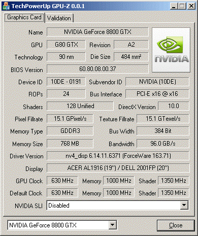
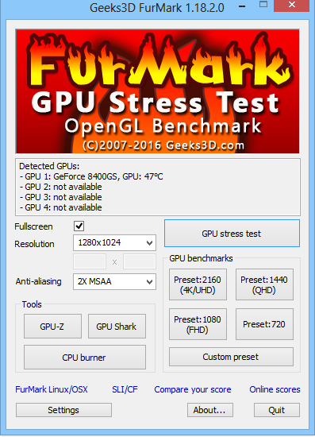
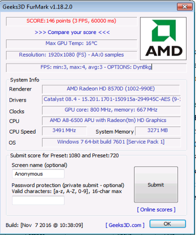
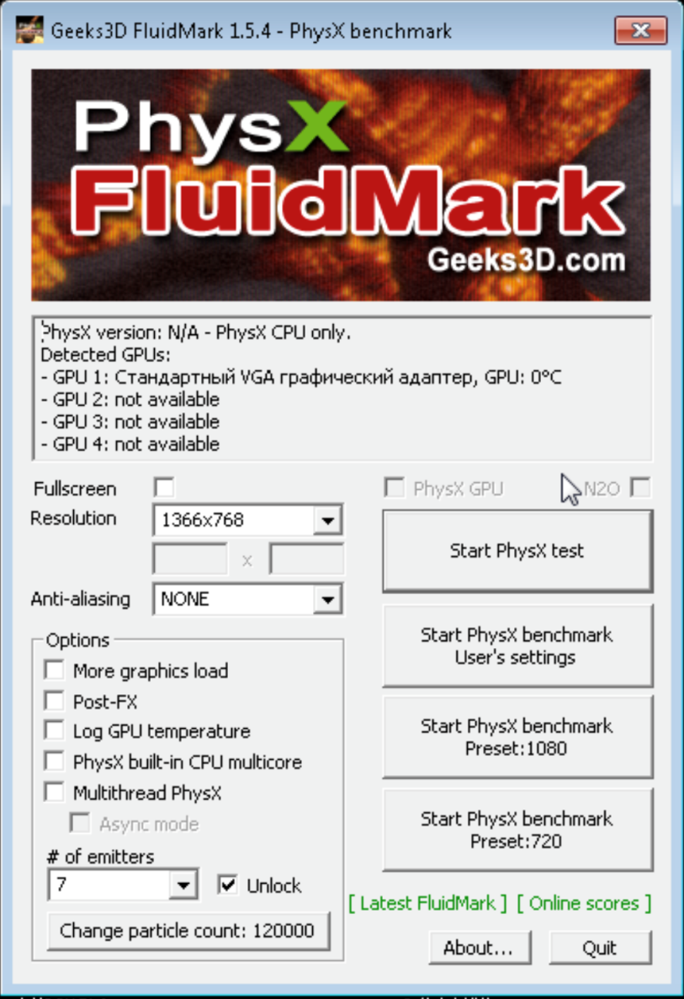
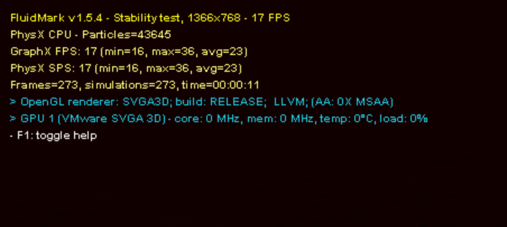

## Лабораторная работа № 6

### Определение основных характеристик и тестирование видеосистемы ПК.

`Тема программы`: Видеосистема  персонального компьютера.

`Цель работы`: Изучить современные видеокарты на графических процессорах NVIDIA, AMD (ATI) и технологии объединения видеокарт.

`Время выполнения`: 1 часа

`Оборудование`: учебный персональный компьютер.

`Программное обеспечение`: операционная система, презентация, тестовые программы.

### Теоретические основы

Для выполнения данной лабораторной работы выбрали 2 утилиты GPU-Z v0.6.0 и FurMark v1.10.2. GPU-Z выдает лишь информацию о видеокарте, а FurMark проводит тестирование.

GPU-Z - это программа для вывода информации о графическом адаптере, которая поддерживает и карты NVIDIA, и ATI. Она поможет узнать, какая модель видеокарты, определить интерфейс подключения, расскажет о том, какой используется графический процессор (версия BIOS, номер ревизии чипа, частота в 2D, 3D-режимах и при разгоне, сведения о поддержке DirectX). Кроме этого, GPU-Z предоставляет информацию о видеопамяти, а именно ее тип, объем, разрядность шины.

GPU-Z поддерживает и карты NVIDIA, и ATI. Она поможет узнать, какая у вас модель видеокарты, определить интерфейс подключения, расскажет о том, какой используется графический процессор (версия BIOS, номер ревизии чипа, частота в 2D, 3D-режимах и при разгоне, сведения о поддержке DirectX). Кроме этого, GPU-Z предоставляет информацию о видеопамяти, а именно ее тип, объем, разрядность шины. 

### Порядок выполнения работы

1.	Скачать программу по тестированию видеокарты (напримерGPU-Z или другую ), установить на компьютер.

2. Используя программу GPU-Z, определяем все параметры тестируемой видеокарты и фиксируем в тетради 

-	имя графического адаптера
-	Технологию выполнения
-	версию BIOS
-	Поддерживаемый DirectX
-	MemorySize
-	Версия драйвера
-	тип памяти
-	Версию драйвера
-	GPU Clock

3.	 Проведем тестирование этой же видеокарты с помощью программы FurMark v1.10.1
При запуске FurMark мы видим окно настройки параметров тестирования, где можно настроить режим тестирования. 

4.	Настройте  тест как представлено на рисунке ниже. 

5.	После запуска теста, проведите тестирование с бубликом (глазное яблоко) и дождитесь окончание тестирования. 

    P.S. если по истечении 10 минут тест не 
        завершится, занесите результат указанный
    в самом тесте (левый верхний угол) и
    завершите тест самостоятельно, нажатием
    клавишей ESC

    Запишите результат тестирования в FPS (минимальное, среднее, максимальное).

6.	Запустите тест еще раз, нажатием клавиши пробел отключите бублик (глазное яблоко) и пройдите тестирование еще раз. Запишите результат тестирования в FPS (минимальное, среднее, максимальное).

    P.S. если по истечении 10 минут тест не завершится, занесите результат указанный в самом тесте (левый верхний угол) и завершите тест самостоятельно, нажатием клавишей ESC

7.  Установите программу FluidMark

8. Установите следующие параметры

Запустите тест. В процессе теста в левом верхнем углу будет отображаться информация о прохождении теста.  

Запишите информации о FPS после 5 минут прохождения теста. Так же запищите температуру видеочипа.

9. Сделайте вывод о качестве установленного  видеоадаптера .
Содержание отчета.

### Отчет должен содержать:

-	цель работы; 

-	индивидуальное задание; 

-	описание выполнения индивидуального задания;

-	ответы на контрольные вопросы;

-	выводы.

----------------------
## РЕШЕНИЕ ИНДИВИДУАЛЬНЫХ ЗАДАНИЙ >>>
### ЗАДАНИЕ 1  (GPU-Z)

|параметры|вывод|
|---------|--------|
|имя графического адаптера|Intel(R) HD Graphics|
|Технологию выполнения|22 nm|
|версию BIOS| Unknown :(|
|Поддерживаемый DirectX|11.0|
|MemorySize|N\A :(|
|Версия драйвера|10.18.10.4252 / Win10 64|
|тип памяти|DDR3|
|GPU Clock|650 MHz|

### ЗАДАНИЕ 2  (FurMark)

|первый запуск|второй запуск|
|---|---|
|min:1  max:4  avg:2|min:2  max:128  avg:123|

### ЗАДАНИЕ 3   (FluidMark)

|параметры|вывод|
|---|---|
|FPS|17 (min=3 max=12 avg=4)|
|temp GPU|Unknown :(|

### ВЫВОД
 В ходе лабораторной работы были изучены характеристики видеосистемы ПК с помощью программ GPU-Z, FurMark и FluidMark. Установлено, что используется встроенный графический адаптер Intel HD Graphics с невысокими техническими параметрами.

Результаты тестирования показали очень низкую производительность (низкие значения FPS), что свидетельствует о слабой вычислительной мощности видеокарты и ее непригодности для ресурсоёмких задач и современных игр. Также отсутствуют некоторые данные (температура, объем памяти), что ограничивает полный анализ.

Таким образом, установленный видеоадаптер подходит только для базовых задач (офисные приложения, просмотр видео), но не обеспечивает высокой графической производительности.

Кратко говоря ... все как-то очень плоховато , но теперь мы можем прекрасно и просто проверить характеристики видеосистемы ПК.

-------------------------

#### Контрольные вопросы

##### 1. Какие другие программы используют для тестирования видеокарт?

- 3DMark — самый популярный бенчмарк для оценки игровой производительности.

- FurMark — «волосатый бублик», используется для экстремального стресс-тестирования и проверки системы охлаждения.

- MSI Afterburner — для мониторинга показателей (температура, частоты) в реальном времени.

- Superposition Benchmark — современный тест на движке UNIGINE для проверки стабильности под высокой нагрузкой.

- OCCT — отличный инструмент для поиска ошибок видеопамяти и чипа.

##### 2. Какие программы используют для тестирования мониторов?

- AIDA64 (вкладка Monitor Diagnostics) — содержит набор шаблонов для проверки фокуса, градиентов и цветопередачи.

- TFT Monitor Test — классическая утилита для поиска битых пикселей и проверки скорости матрицы.

- PassMark MonitorTest — профессиональный софт для калибровки и оценки качества изображения.

- EIZO Monitor Test (онлайн или десктоп) — удобный набор тестов для проверки равномерности подсветки и гаммы.

-------------------------------
