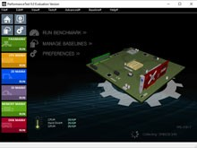

# Практическая работа №8
## Тестирование персонального компьютера с помощью утилиты Passmark Perfomance Test

```Цель```: Провести финальное тестирование стабильности системы для последующей разработки технического задания по внедрению компьютерной системы.

#### Теоретические сведения:
```PerformanceTest``` - набор тестов, позволяющих оценить общую производительность вашего ПК по сравнению с другими компьютерами. В программу входят двадцать семь стандартных тестов в семи группах, плюс еще пять для пользовательских тестов.
Среди стандартных можно отметить тесты процессоров, 2D и 3D графики, дисковых накопителей, памяти, CD/DVD-приводов и многих других составляющих компьютера.

 

##### В задачу утилиты входит:
• Выяснение того, работает ли ваш ПК на том уровне, на котором он должен работать;

• Сравнение производительности вашего компьютера с производительностью машин подобной и/или более крутой конфигурации;

• Объективные, независимые измерения помогут вам сделать правильное решение при покупке;

• Использование самых последних испытаний для создания ваших собственных сценариев эталонного тестирования

##### Стандартные наборы тестов:
• Тестирование ЦП Математические операции: сжатие, шифрование, MMX/SSE, инструкции 3DNow! и др.;

• Тестирование 2D-графики: черчение/рисование, битовые карты/битовые матрицы/побитовое отображение, шрифты, текст и элементы графического пользовательского интерфейса;

• Тестирование 3D-графики: трехмерная графика уровня DirectX 8.1, DirectX 9 и анимация;

• Тестирование диска: чтение, запись и поиск файлов на диске;

• Тестирование памяти: ассигнование и доступ к скорости памяти и оценка эффективности;

• Тестирование CD и DVD: проверка скорости CD/DVD драйверов.

• Усовершенствованные настраиваемые тестирования (доступны только в зарегистрированной версии):

• Усовершенствованный тест для диска;

• Усовершенствованные тесты для CD/DVD;

• Усовершенствованный тест 3D -графики;

• Усовершенствованный тест организации работы в сети (для Ethernet, интернета и беспроводной связи);

• Усовершенствованный тест для памяти;

• Усовершенствованный тест мультипрограммной работы.


##### Порядок выполнения работы:

1.	В программе Perfomance Test есть 6 видов тестов:
Passmark, CPUmark, 2Dmark, 3Dmark, Memory Mark, Disk mark.
Каждый вид теста разделяется на подвид. Допустим CPUMark включает в себя еще 9 подвидов тестов, 2DMark 7 подвидов  и так далее.

2.	Вам необходимо провести все подвиды каждого из теста и заполнить результаты в виде таблички.


|Название теста	|Результат	|World average|	World Maximum|
|---|---|---|---|
|||||
			

3.	Сделайте сравнение представленных в следующей табличке тестов с тестами проведенными в программе Aida64Extreme

|Название теста	|Aida64	|Perfomance Test |
|---|---|---|
|Чтение из памяти / Memory read uncached|||	
|Задержка памяти / Memory Latency|||		
|CPU AES / Encryption|||		
|Integer MAth / CPU PhotoWorxx|||		

4.	Проверьте температуру процессора и запишите ее

5.	Проведите сразу полный тест CPUmark.

6.	Проверьте температуру процессора после теста и запишите ее.

7.	 Сделайте вывод по проделанной работе, а именно дайте окончательную, субъективную оценку, существующей 
 компьютерной системы, опираясь на результаты всех проделанных тестов, как в текущей практической работе, так и в предыдущих работах.
 
 Результат оценки выполните для каждого устройства.

|Устройство|Оценка (от 1 до 10)|
|Жесткий диск||	
|Процессор ||	
|ОЗУ	||
|Видеоадаптер	||
|Температурные показатели системы	||
|Общая оценка системы (исходя из верхних показателей)	||


Вопросы:
1.	Как вы считаете для каких целей может быть использована тестируемая Вами компьютерная система?

Цели использования: Система подходит для базового обучения, работы с офисными программами, поиска информации в интернете, программирования на начальном уровне и выполнения лабораторных работ.

2.	На ваш взгляд, какие бы параметры компьютерной системы можно было бы улучшить? Укажите пример.

```Улучшение параметров```: Главное — переход на SSD-накопитель и увеличение оперативной памяти.

```Пример```: Замена медленного HDD на SSD позволит системе загружаться за 15 секунд вместо 2 минут, что критично для учебного процесса.

3.	Предложите свой вариант компьютерной системы для образовательного процесса в кабинете 403. Напишите полные характеристики с указанием стоимости каждого устройства.

```Процессор```: Intel Core i3-12100 (4 ядра, 3.3 ГГц) — 11 000 руб.

```Материнская плата```: MSI PRO H610M-E — 7 500 руб.

```Оперативная память```: 16 ГБ DDR4 (8х2) Kingston FURY — 4 000 руб.

```Накопитель```: 500 ГБ SSD M.2 Samsung 980 — 6 500 руб.

```Корпус с БП```: AeroCool VX Plus 500W — 4 500 руб.

```Монитор```: 23.8" Xiaomi Desktop Monitor (IPS, Full HD) — 9 000 руб.

```Клавиатура и мышь```: Комплект Logitech MK220 — 2 500 руб.

```Итого```: 45 000 руб. :(


