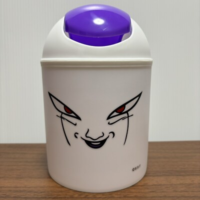

| вид тестирования| результат |
|-----------------|-----------|
|beta testing|отдал друзьям. друзья радоваться.|
|automated testing|автоматически отбирает мусор и нагло копит его (как плюшкин)|
|validation|везде. под водой. на небе . на земле . ведро и на космосе ведро |
|verification|ведро обязательно из пластика ? а мусорный пакет ? а мусор?|
|security testing|попробовал откусить . не понравилось |
|negative testing| потыкал . побил . одел на голову  |
|stress testing| сел . сломалось . грустно |
|documentation testing| а как пользоваться |
|UT testing|  с кришкой |
|entry point testing|новый красивый вчера купленный|
|black box testing|а что это вообще такое|
|functional testing|собирает ли мусор ? а как копит ? где он храниться ? оно бездонное ? а что делать если накопится мусор ?|
|usability testing|удобно ли хранить мусор емае|
|compatibility testing|места харнения : в офисе по столом , на кухне под раковиной , под столом дома , на улице у подъезда .|
|performance testing|какой срок годности . как много выдержит мусора |
|component testing|отдельно ведро . отдельно пакет (и там и там мусор хранится потрясюще)|
|intigration testing|собрали. пакет не улетит ли ?????|

